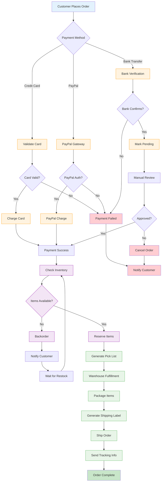
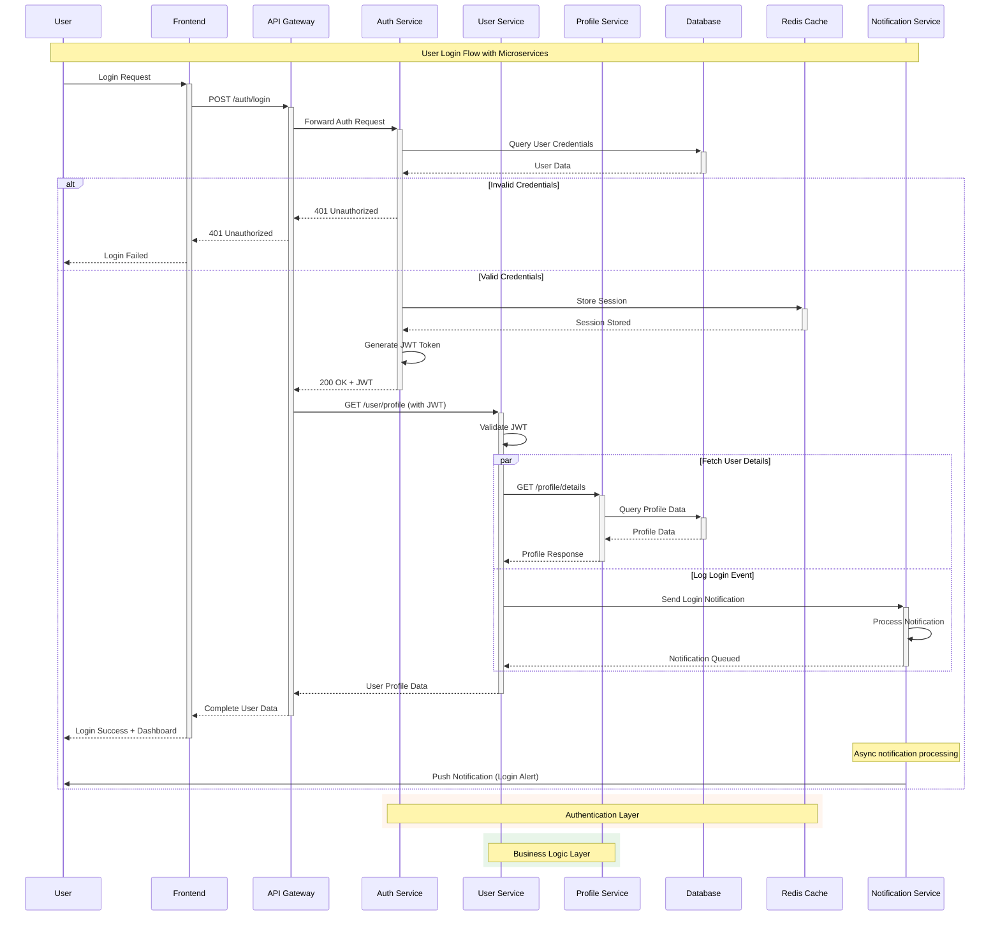
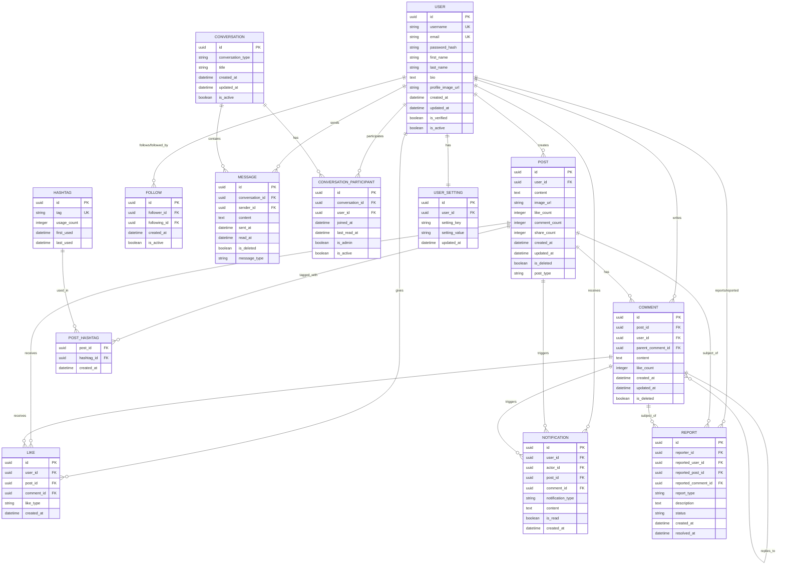
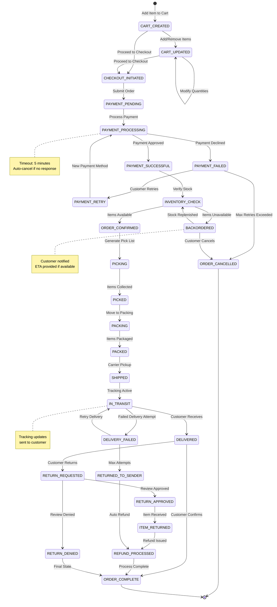
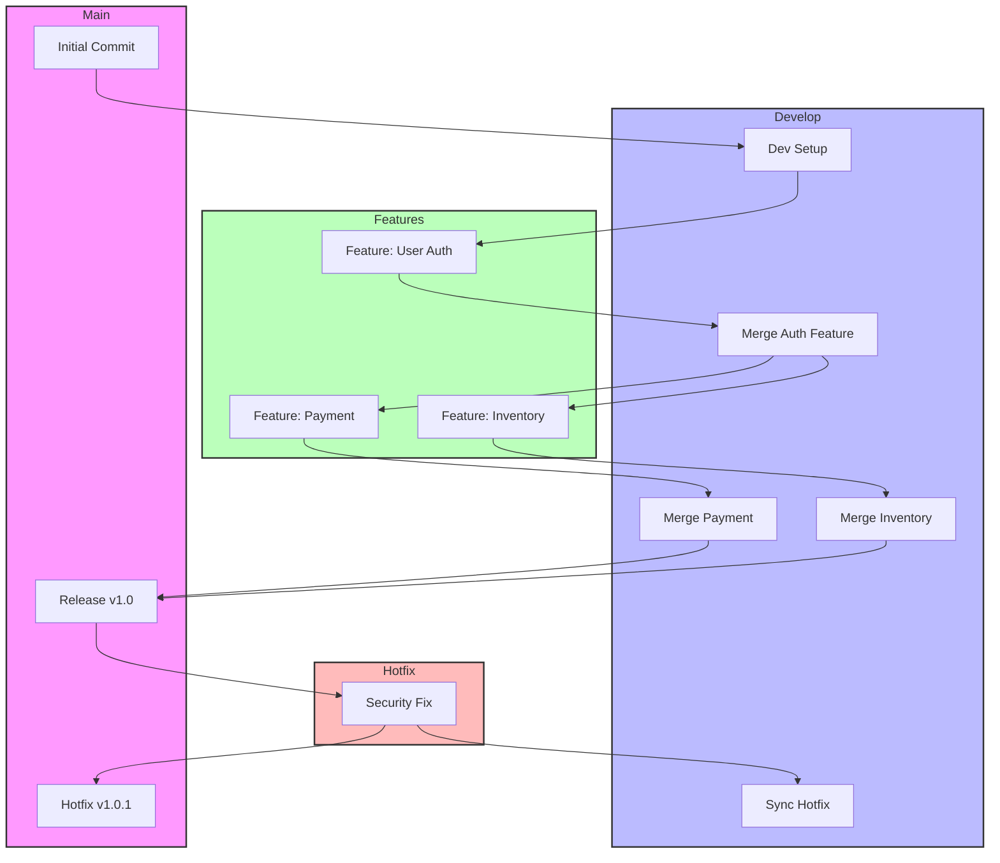

## Advanced Techniques Shown:

### 1. **Flowchart (E-commerce Order Processing)**

- Multiple decision branches with complex logic
- Parallel processing paths
- Custom styling with classes and colors
- Subgraph organization
- Error handling flows

### 2. **Sequence Diagram (Microservices Authentication)**

- Multiple services interaction
- Parallel execution blocks (`par`/`and`)
- Alternative flows (`alt`/`else`)
- Colored background sections (`rect`)
- Async operation handling

### 3. **Class Diagram (Order Management System)**

- Abstract classes and inheritance
- Multiple relationship types (composition, aggregation)
- Enumerations with values
- Method visibility modifiers
- Complex many-to-many relationships

### 4. **ERD (Social Media Platform)**

- Self-referencing relationships
- Junction tables for many-to-many
- Multiple foreign keys
- Various data types
- Complex cardinalities

### 5. **State Diagram (Order State Machine)**

- Complex state transitions
- Multiple exit conditions
- Notes and timeouts
- Parallel state handling
- Error recovery paths

### 6. **Git Flow Diagram**

- Branch management
- Merge strategies
- Hotfix workflows
- Release management

## Pro Tips for Complex Diagrams:

1. **Break down complexity** - Use subgraphs and sections
2. **Consistent naming** - Use clear, descriptive identifiers
3. **Color coding** - Group related elements with colors
4. **Documentation** - Add notes for complex logic
5. **Validation** - Test diagrams in multiple renderers

# Complex Mermaid Examples

## 1. Advanced Flowchart - E-commerce Order Processing



## 2. Complex Sequence Diagram - Microservices Authentication



## 3. Advanced Class Diagram - Order Management System

```mermaid
classDiagram
    class User {
        <<abstract>>
        -id: UUID
        -email: String
        -password: String
        -createdAt: DateTime
        +authenticate(): Boolean
        +updateProfile(): void
    }

    class Customer {
        -loyaltyPoints: Integer
        -preferredPayment: PaymentMethod
        -shippingAddresses: List~Address~
        +placeOrder(items: List~Product~): Order
        +viewOrderHistory(): List~Order~
        +addToWishlist(product: Product): void
    }

    class Admin {
        -permissions: List~Permission~
        -department: String
        +manageInventory(): void
        +processRefunds(): void
        +generateReports(): Report
    }

    class Order {
        -id: UUID
        -status: OrderStatus
        -totalAmount: Decimal
        -orderDate: DateTime
        -shippingAddress: Address
        -items: List~OrderItem~
        +calculateTotal(): Decimal
        +updateStatus(status: OrderStatus): void
        +cancel(): Boolean
    }

    class OrderItem {
        -quantity: Integer
        -unitPrice: Decimal
        -discount: Decimal
        +getSubtotal(): Decimal
    }

    class Product {
        -id: UUID
        -name: String
        -description: String
        -price: Decimal
        -category: Category
        -inventory: Inventory
        +updatePrice(newPrice: Decimal): void
        +checkAvailability(): Boolean
    }

    class Category {
        -id: UUID
        -name: String
        -parentCategory: Category
        -subcategories: List~Category~
        +getFullPath(): String
    }

    class Inventory {
        -stockLevel: Integer
        -reservedQuantity: Integer
        -reorderPoint: Integer
        +reserve(quantity: Integer): Boolean
        +release(quantity: Integer): void
        +needsReorder(): Boolean
    }

    class Payment {
        -id: UUID
        -amount: Decimal
        -method: PaymentMethod
        -status: PaymentStatus
        -processedAt: DateTime
        +process(): Boolean
        +refund(amount: Decimal): Boolean
    }

    class Address {
        -street: String
        -city: String
        -state: String
        -zipCode: String
        -country: String
        +validate(): Boolean
        +format(): String
    }

    User <|-- Customer
    User <|-- Admin

    Customer "1" -- "many" Order : places
    Order "1" -- "many" OrderItem : contains
    OrderItem "many" -- "1" Product : references
    Product "many" -- "1" Category : belongs_to
    Product "1" -- "1" Inventory : has
    Order "1" -- "many" Payment : has_payments
    Customer "1" -- "many" Address : has_addresses
    Order "many" -- "1" Address : ships_to

    <<enumeration>> OrderStatus
    OrderStatus : PENDING
    OrderStatus : CONFIRMED
    OrderStatus : PROCESSING
    OrderStatus : SHIPPED
    OrderStatus : DELIVERED
    OrderStatus : CANCELLED

    <<enumeration>> PaymentMethod
    PaymentMethod : CREDIT_CARD
    PaymentMethod : PAYPAL
    PaymentMethod : BANK_TRANSFER
    PaymentMethod : APPLE_PAY

    <<enumeration>> PaymentStatus
    PaymentStatus : PENDING
    PaymentStatus : COMPLETED
    PaymentStatus : FAILED
    PaymentStatus : REFUNDED
```

## 4. Complex Entity Relationship Diagram - Social Media Platform



## 5. Advanced State Diagram - Order State Machine



## 6. Complex Git Flow Diagram



## Key Features Demonstrated:

### Flowchart Features:

- Subgraphs and clustering
- Multiple decision points
- Parallel processing paths
- Custom styling and classes
- Complex conditional logic

### Sequence Diagram Features:

- Multiple participants
- Parallel execution (par/and)
- Alternative flows (alt/else)
- Notes and annotations
- Colored backgrounds (rect)
- Async operations

### Class Diagram Features:

- Abstract classes
- Inheritance relationships
- Composition and aggregation
- Enumerations
- Method visibility modifiers
- Complex relationships

### ERD Features:

- Multiple relationship types
- Self-referencing relationships
- Junction tables
- Various cardinalities
- Comprehensive attribute types
- Foreign key relationships

### State Diagram Features:

- Complex state transitions
- Parallel states
- Notes and annotations
- Multiple end states
- Conditional transitions
- Timeout handling
