```mermaid
%%{init: {'theme': 'default', 'themeVariables': {'fontSize': '40px', 'nodePadding': '10px', 'nodeBorderRadius': '14px'}, 'flowchart': {'rankSpacing': 200, 'nodeSpacing': 120}}}%%
graph TB
    B[👤 Personal] --> B1[📋 Personal Details]
    B --> B2[📝 Registration Details]
    B --> B3[👨‍👩‍👧‍👦 Family Details]
    B --> B4[🎓 Qualifications]
    B --> B5[💼 Experience]
    B --> B6[🛠️ Skills]
    B --> B7[🏥 Medical Details]
```

# 👤 My Profile
    

Inside the Profile section, an employee can view and add details in the following areas:

- [Personal](#personal)  
- [Employment](#employment)  
- [Academics](#academics)  
- [Mentor](#mentor)  
- [Documents](#documents)  
- [Professional](#professional)
    
---

## 📊 Main Sections

```mermaid
%%{init: {
    'theme': 'default',
    'themeVariables': {
        'fontSize': '32px',
        'fontFamily': 'arial',
        'primaryColor': '#4CAF50',
        'primaryTextColor': '#fff',
        'primaryBorderColor': '#388E3C',
        'lineColor': '#388E3C',
        'secondaryColor': '#2196F3',
        'tertiaryColor': '#FF9800',
        'nodeBorderRadius': '16px',
        'nodePadding': '32px'
    },
    'flowchart': {
        'rankSpacing': 300,
        'nodeSpacing': 160,
        'curve': 'basis',
        'padding': 60
    }
}}%%
graph TB
    A[👤 My Profile] --> B[👤 Personal]
    A --> C[💼 Employment]
    A --> D[📚 Academics]
    A --> E[👨‍🏫 Mentor]
    A --> F[📎 Documents]
    A --> G[🎯 Professional]
    style A fill:#4CAF50,stroke:#388E3C,color:#fff,stroke-width:2px
    style B fill:#2196F3,stroke:#1976D2,color:#fff
    style C fill:#2196F3,stroke:#1976D2,color:#fff
    style D fill:#2196F3,stroke:#1976D2,color:#fff
    style E fill:#2196F3,stroke:#1976D2,color:#fff
    style F fill:#2196F3,stroke:#1976D2,color:#fff
    style G fill:#2196F3,stroke:#1976D2,color:#fff
```

---

### 👤 Personal

The Personal tab under the My Profile section enables users to view, update, and manage their personal and professional background information. The section is organized into several sub-sections, each designed to maintain specific categories of user data. Authorized users can add, edit, or view the data depending on access rights.

Each sub-section is explained in detail below:

Each sub-section is explained in detail below:

### 📋 1. Personal Details

This section contains the user's basic personal information. Users can:

*   View and edit their Full Name, Gender, Date of Birth, and Marital Status.  
      
    
*   Update Permanent and Current Address fields.  
      
    
*   Maintain other personal identification data relevant to their profile.  
      
    

### 📝 2. Registration Details

This section records the user's professional registration information. It  includes:

*   Key Skills – Primary areas of expertise.  
      
    
*   Educational Background – High-level academic qualifications.  
      
    
*   Total Experience – Overall years of professional experience.
      
    

### 👨‍👩‍👧‍👦 3. Family Details

This section allows the user to maintain information about immediate family members. Users can:

*   Add or view Name, Relationship, Age, and Contact Information for each family member.  
      
    
*   Maintain multiple entries depending on the number of dependents or family records.  
      
    

### 🎓 4. Qualifications

This section captures academic achievements. Users can:

*   Add or view Graduation, Post-Graduation, and other Higher Education Degrees.
    
*   Specify details such as Institution Name, Year of Passing, Specialization, and Grade/Percentage.  
      
      
    

### 💼 5. Experience

This section tracks the user's previous employment history. It includes:

*   Designation – Role/title held in previous positions.  
      
    
*   Duration – Start and end dates of employment.  
      
    
*   Organization Name – Name of the previous employer.  
      
    
*   Additional details such as job responsibilities or remarks may also be included.  
      
    

### 🛠️ 6. Skills

This section lists the individual's competencies and skill sets. Users can:

*   Add or view specific Technical, Functional, or Soft Skills.  
      
    
*   Indicate Proficiency Levels or experience duration for each skill (if supported).  
      
    

### 🏥 7. Medical Details

This section maintains health-related records. Users can:

*   View existing Medical History, Allergies, Health Conditions, or any Disability Information stored in the system.  
      
    
*   This information is particularly useful for HR and emergency response purposes.
    
---

### 💼 Employment 
 
Inside the My profile > Employment tab the user can view, edit, or add information in these areas:

```mermaid
%%{init: {'theme': 'default', 'themeVariables': {'fontSize': '28px', 'nodePadding': '28px', 'nodeBorderRadius': '14px'}, 'flowchart': {'rankSpacing': 200, 'nodeSpacing': 120}}}%%
graph TB
    C[💼 Employment] --> C1[Employment Details]
    C --> C2[Attendance]
    C --> C3[Biometric Details]
    C --> C4[Leaves]
    C --> C5[Salary Structure]
    C --> C6[Payslips]
    C --> C7[Known Languages]
    C --> C8[Career Timeline]
```
    

1.  Employment Details: Employees can view information such as employee code, employment type, date of joining, salary structure, manager, and more.  
      
    
2.  Attendance:  Employees can select a start and end date to view their attendance records for that period.  
      
    
3.  Biometric Details: Employee can view their complete biometric attendance records by selecting a specific month and year, including daily check‑in and check‑out times as well as total hours worked.  
      
    
4.  Leaves: Employee can review all of their submitted leave requests past and pending in one place, seeing details such as leave type, dates, duration, and current approval status
      
    
5.  Salary Structure: Employee can examine their detailed salary breakdown for the current financial year, with clear visibility into basic pay, allowances, deductions, and net pay.  
      
    
6.  Payslips: Employee can access any of their payslips by choosing a pay period date.  
      
    
7.  Known Languages: Employee can list and update the languages they know, indicating whether they can read, write, or speak each language by simply ticking the appropriate proficiencies.  
      
    
8.  Career Timeline: Employee can track their entire journey since joining including promotions, department transfers, completed training sessions, and performance reviews in a chronological timeline.
    
---

### 📚 Academics 
(under My Profile > Academics tab)

This section is only accessible to teaching staff 
    

```mermaid
%%{init: {'theme': 'default', 'themeVariables': {'fontSize': '20px', 'nodePadding': '18px', 'nodeBorderRadius': '1px'}, 'flowchart': {'rankSpacing': 100, 'nodeSpacing': 20}}}%%
graph TB
    D[📚 Academics] --> D1[My Courses]
    D --> D2[Feedback]
```

1.  My Courses: Displays all the courses assigned to the employee for teaching. Users can view, edit, or add course-related details.  
      
    
2.  Feedback: (To be discussed)  
      
---    

### 👨‍🏫 Mentor 
(under My Profile > Mentor)

This section is only accessible to teaching staff

```mermaid
%%{init: {'theme': 'default', 'themeVariables': {'fontSize': '18px', 'nodePadding': '20px', 'nodeBorderRadius': '14px'}, 'flowchart': {'rankSpacing': 100, 'nodeSpacing': 20}}}%%
graph TB
    E[👨‍🏫 Mentor] --> E1[Proctee Data]
    E --> E2[Meeting]
```

1.  Proctee Data:  (To be discussed) 
    
2.  Meeting: (To be discussed)
    
---
### 📎 Documents
(under My Profile > Documents)

```mermaid
%%{init: {'theme': 'default', 'themeVariables': {'fontSize': '28px', 'nodePadding': '28px', 'nodeBorderRadius': '14px'}, 'flowchart': {'rankSpacing': 200, 'nodeSpacing': 120}}}%%
graph TB
    F[📎 Documents] --> F1[Personal ID Proofs]
    F --> F2[Educational Certificates]
    F --> F3[Employment Contracts]
    F --> F4[Medical Reports]
    F --> F5[Profile Photo]
    F --> F6[Medical Information]
```

Employees can upload and manage the following types of documents:
    

1.  Personal Identification Proofs
    
2.  Educational Certificates
    
3.  Employment Contracts
    
4.  Medical Reports
    
5.  Profile Photo
    
6.  Medical Information

--- 

### 🎯 Professional 
(under My Profile > Documents)

```mermaid
%%{init: {'theme': 'default', 'themeVariables': {'fontSize': '28px', 'nodePadding': '28px', 'nodeBorderRadius': '14px'}, 'flowchart': {'rankSpacing': 200, 'nodeSpacing': 120}}}%%
graph TB
    G[🎯 Professional] --> G1[Publications]
    G --> G2[Conferences]
    G --> G3[Book Chapter]
    G --> G4[Memberships]
    G --> G5[Grants]
    G --> G6[Patents]
    G --> G7[Research Profiles]
```

Here, employees can view and upload their professional contributions, including:
    

1.  Publications
    
2.  Conferences
    
3.  Book Chapter
    
4.  Memberships
    
5.  Grants
    
6.  Patents
    
7.  Research Profiles
