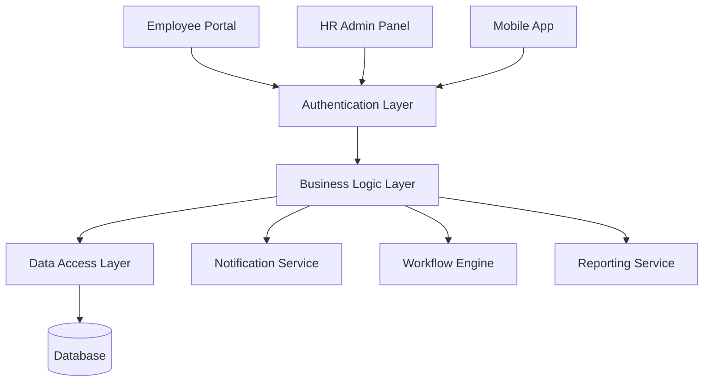
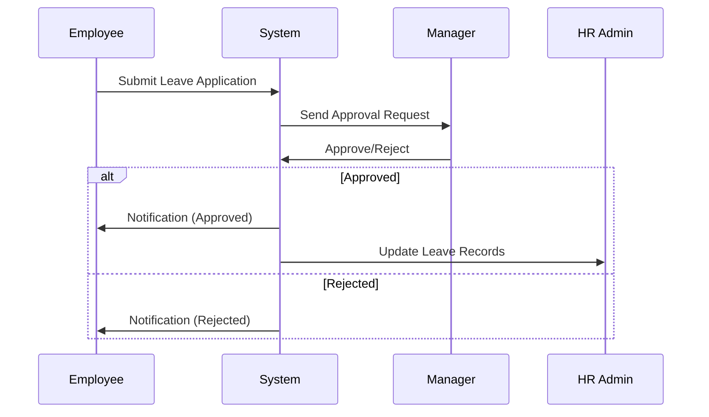

# Acharya ERP Documentation - GitHub Wiki Structure

## 📁 Wiki Page Organization

### Home.md
```markdown
# Acharya ERP System Documentation

Welcome to the comprehensive documentation for Acharya ERP system.

## 🚀 Quick Start
- [Getting Started Guide](Getting-Started)
- [System Architecture](System-Architecture)
- [User Roles & Permissions](User-Roles-and-Permissions)

## 📚 Modules
- [👥 Employee Module](Employee-Module)
- [🎓 Student Module](Student-Module)
- [📖 Academics Module](Academics-Module)
- [🏢 Institute Module](Institute-Module)

## 🔧 Technical Documentation
- [API Reference](API-Reference)
- [Database Schema](Database-Schema)
- [Deployment Guide](Deployment-Guide)

## 📊 Visual Resources
- [System Diagrams](System-Diagrams)
- [Workflow Charts](Workflow-Charts)
- [User Journey Maps](User-Journey-Maps)
```

### Employee-Module.md
```markdown
# 👥 Employee Module

## Overview
The Employee Module provides comprehensive workforce management capabilities including self-service portal, HR administration, and analytics.

## 📋 Table of Contents
1. [Module Architecture](#module-architecture)
2. [My Menu Features](#my-menu-features)
3. [HR Support Functions](#hr-support-functions)
4. [API Endpoints](#api-endpoints)
5. [Database Schema](#database-schema)

## Module Architecture



## My Menu Features

### 1. 👤 My Profile
**Purpose:** Centralized employee information management

**Sub-modules:**
- **Personal Information**
  - Basic details (name, address, contact)
  - Family information
  - Emergency contacts
- **Employment Details**
  - Job information
  - Salary structure
  - Attendance records
- **Academic Records** _(Teaching staff only)_
  - Course assignments
  - Research activities

**User Flow:**
```
Employee Login → My Menu → My Profile → Select Tab → View/Edit → Save Changes
```

**API Endpoints:**
- `GET /api/v1/employee/profile` - Get profile data
- `PUT /api/v1/employee/profile` - Update profile
- `POST /api/v1/employee/profile/photo` - Upload photo

### 2. 📅 Leave Management

**Purpose:** Streamlined leave application and approval process

**Features:**
- Multi-level approval workflow
- Leave balance tracking
- Calendar integration
- Document attachment support

**Leave Application Flow:**


**Database Tables:**
- `employee_leaves`
- `leave_types`
- `leave_approvals`
- `leave_balances`

### 3. 🔧 Service Requests

**Categories:**
- Human Resources
- IT Support
- Maintenance
- Facilities
- Transport

**Request Lifecycle:**
1. **Submission** - Employee fills request form
2. **Assignment** - Auto-assigned to department
3. **Processing** - Department handles request
4. **Resolution** - Request closed with feedback

### 4. ✅ Task Management

**Features:**
- Personal task creation
- Department-level assignments
- Progress tracking
- Deadline management

**Task Types:**
- Personal tasks
- Faculty-level tasks
- Project milestones
- Administrative duties

## HR Support Functions

### Employee Master
- Comprehensive employee directory
- Advanced search and filtering
- Export capabilities
- Bulk operations

### Recruitment Portal
**Workflow:**
```
Job Application → Screening → Interview Scheduling → Feedback Collection → Offer Generation → Onboarding
```

### Attendance Management
- Biometric integration
- Real-time tracking
- Exception handling
- Report generation

### Analytics Dashboard
- Department-wise metrics
- Attendance trends
- Leave patterns
- Performance indicators

## Database Schema

### Core Tables

#### employees
```sql
CREATE TABLE employees (
    id INT PRIMARY KEY AUTO_INCREMENT,
    employee_code VARCHAR(20) UNIQUE,
    first_name VARCHAR(50),
    last_name VARCHAR(50),
    email VARCHAR(100) UNIQUE,
    phone VARCHAR(15),
    department_id INT,
    designation_id INT,
    manager_id INT,
    join_date DATE,
    status ENUM('active', 'inactive', 'relieved'),
    created_at TIMESTAMP,
    updated_at TIMESTAMP,
    
    FOREIGN KEY (department_id) REFERENCES departments(id),
    FOREIGN KEY (designation_id) REFERENCES designations(id),
    FOREIGN KEY (manager_id) REFERENCES employees(id)
);
```

#### leave_applications
```sql
CREATE TABLE leave_applications (
    id INT PRIMARY KEY AUTO_INCREMENT,
    employee_id INT,
    leave_type_id INT,
    start_date DATE,
    end_date DATE,
    total_days INT,
    reason TEXT,
    status ENUM('pending', 'approved', 'rejected', 'cancelled'),
    applied_date TIMESTAMP,
    approved_by INT,
    approved_date TIMESTAMP,
    
    FOREIGN KEY (employee_id) REFERENCES employees(id),
    FOREIGN KEY (leave_type_id) REFERENCES leave_types(id),
    FOREIGN KEY (approved_by) REFERENCES employees(id)
);
```

## API Reference

### Authentication
All API requests require authentication using JWT tokens.

```http
POST /api/v1/auth/login
Content-Type: application/json

{
    "email": "employee@acharya.edu",
    "password": "password123"
}
```

### Employee Endpoints

#### Get Employee Profile
```http
GET /api/v1/employee/profile
Authorization: Bearer {jwt_token}
```

**Response:**
```json
{
    "success": true,
    "data": {
        "id": 1,
        "employee_code": "EMP001",
        "name": "John Doe",
        "email": "john@acharya.edu",
        "department": "Computer Science",
        "designation": "Assistant Professor"
    }
}
```

#### Apply for Leave
```http
POST /api/v1/employee/leave/apply
Authorization: Bearer {jwt_token}
Content-Type: application/json

{
    "leave_type_id": 1,
    "start_date": "2024-12-20",
    "end_date": "2024-12-22",
    "reason": "Personal work"
}
```

### Error Handling
All API endpoints return consistent error responses:

```json
{
    "success": false,
    "error": {
        "code": "VALIDATION_ERROR",
        "message": "Invalid date range",
        "details": {
            "start_date": "Start date cannot be in the past"
        }
    }
}
```

## Configuration

### Environment Variables
```bash
# Database Configuration
DB_HOST=localhost
DB_PORT=3306
DB_NAME=acharya_erp
DB_USER=erp_user
DB_PASS=secure_password

# JWT Configuration
JWT_SECRET=your_jwt_secret_key
JWT_EXPIRY=24h

# Email Configuration
SMTP_HOST=smtp.gmail.com
SMTP_PORT=587
SMTP_USER=notifications@acharya.edu
SMTP_PASS=email_password
```

## Best Practices

### For Developers
1. **Follow RESTful conventions** for API design
2. **Use database transactions** for multi-table operations
3. **Implement proper error handling** with meaningful messages
4. **Add logging** for all critical operations
5. **Write unit tests** for business logic

### For Users
1. **Regular profile updates** to maintain accuracy
2. **Timely leave applications** following company policy
3. **Proper documentation** for service requests
4. **Secure password practices** for account safety

## Troubleshooting

### Common Issues

#### Leave Application Not Submitting
**Symptoms:** Form submission fails with validation error
**Solution:** 
1. Check if leave balance is sufficient
2. Verify date format (YYYY-MM-DD)
3. Ensure reason field is not empty

#### Profile Photo Upload Fails
**Symptoms:** Image upload returns error
**Solution:**
1. Check file size (max 2MB)
2. Ensure file format is JPG/PNG
3. Verify image dimensions (max 1024x1024)

## Support

For technical issues:
- **Email:** erp-support@acharya.edu
- **Phone:** +91-80-1234-5678
- **GitHub Issues:** [Report Bug](https://github.com/acharya/erp/issues)

## Version History

| Version | Date | Changes |
|---------|------|---------|
| 2.1.0 | Dec 2024 | Added task management, improved UI |
| 2.0.0 | Sep 2024 | Major restructuring, new HR features |
| 1.5.0 | Jun 2024 | Mobile app integration |
| 1.0.0 | Jan 2024 | Initial release |
```

---

## 🔗 Related Pages
- [Student Module](Student-Module)
- [API Authentication](API-Authentication)
- [Database Setup](Database-Setup)
- [Deployment Guide](Deployment-Guide)
