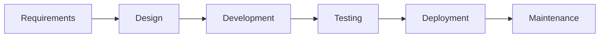
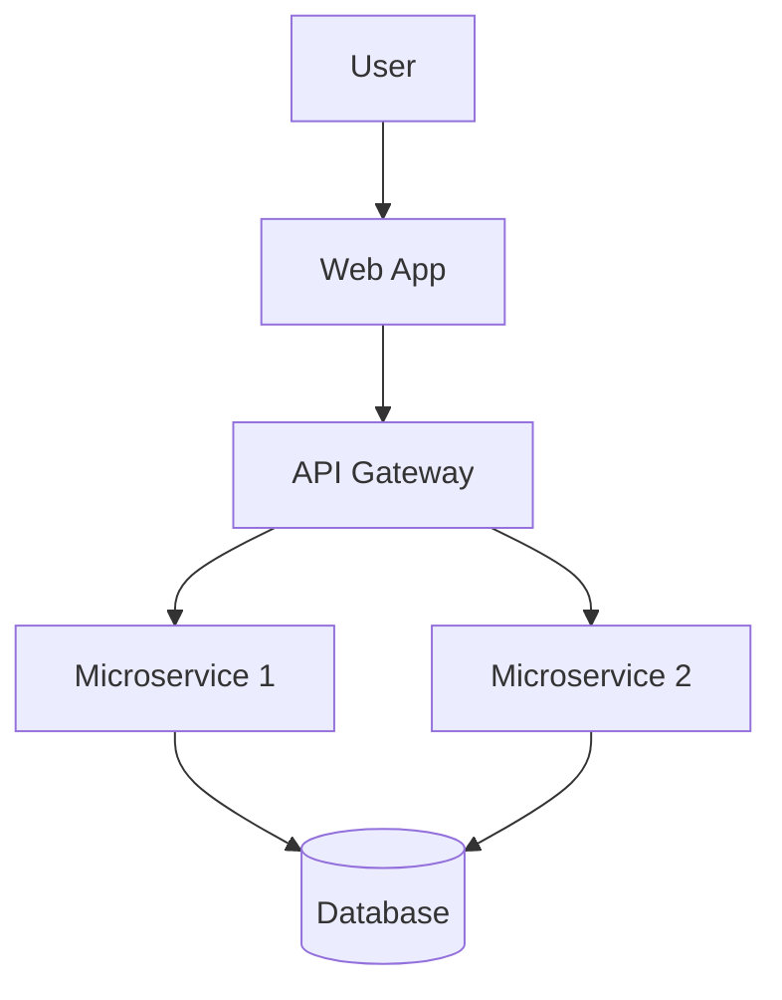
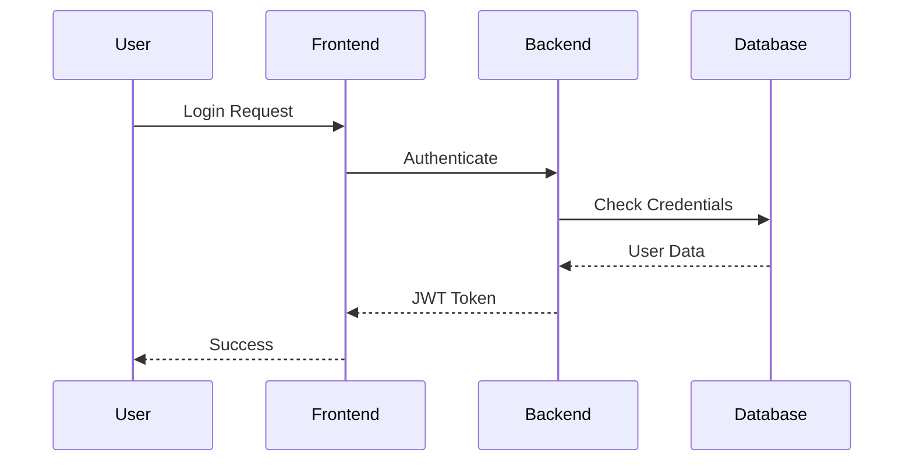
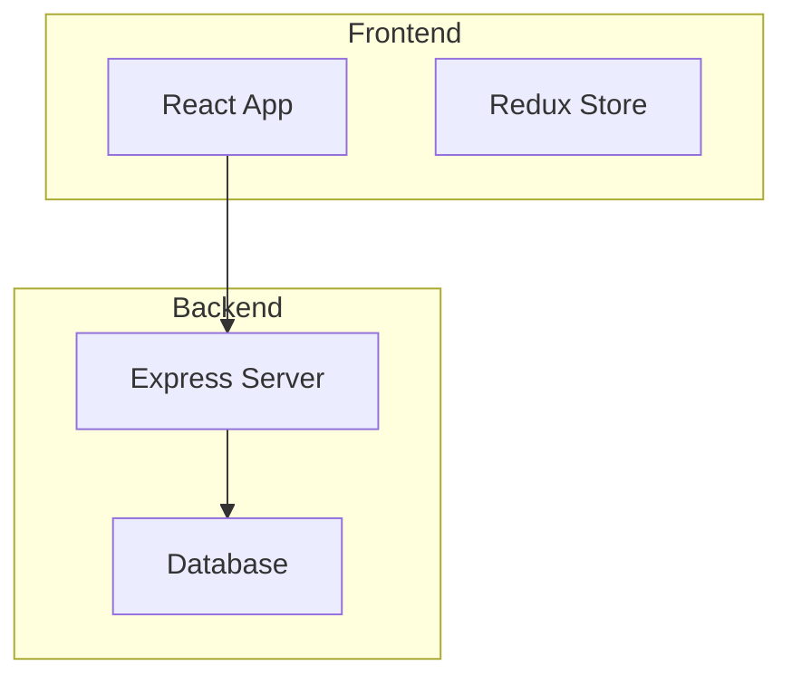
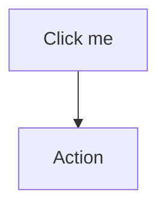

## What is Mermaid?

Mermaid is a diagramming and charting tool that renders markdown-inspired text definitions to create diagrams dynamically. It's widely supported in platforms like GitHub, GitLab, Notion, and many documentation tools.

## Basic Syntax Structure

All Mermaid diagrams start with a diagram type declaration, followed by the diagram definition:

```
graph TD
    A --> B
```

## Common Diagram Types

### 1. Flowcharts

Use `graph` or `flowchart` with direction:

- `TD` (Top Down)
- `LR` (Left Right)
- `BT` (Bottom Top)
- `RL` (Right Left)

### 2. Sequence Diagrams

Show interactions between participants over time:

```
sequenceDiagram
    Alice->>Bob: Hello Bob, how are you?
    Bob-->>Alice: Great!
```

### 3. Class Diagrams

Represent object-oriented structures:

```
classDiagram
    class Animal {
        +String name
        +makeSound()
    }
```

### 4. Entity Relationship Diagrams

Show database relationships:

```
erDiagram
    CUSTOMER ||--o{ ORDER : places
```

Let me create a comprehensive example that demonstrates multiple diagram types:## Key Concepts and Syntax

### Node Shapes

- `A` - Rectangle (default)
- `A[Text]` - Rectangle with text
- `A(Text)` - Rounded rectangle
- `A((Text))` - Circle
- `A{Text}` - Diamond (decision)
- `A[[Text]]` - Subroutine
- `A[(Text)]` - Cylinder (database)

### Connections

- `-->` - Arrow
- `---` - Line
- `-.->` - Dotted arrow
- `==>` - Thick arrow
- `--text-->` - Arrow with text

### Styling

- `style nodeId fill:#color` - Fill color
- `style nodeId stroke:#color` - Border color
- `classDef className fill:#color` - Define reusable styles

## Practical Examples

### Project Workflow



### System Architecture



### Sequence Diagram



## Best Practices

1. **Keep it simple** - Don't overcrowd diagrams
2. **Use meaningful labels** - Make nodes descriptive
3. **Consistent styling** - Use colors purposefully
4. **Direction matters** - Choose the right flow direction
5. **Group related elements** - Use subgraphs for complex diagrams

## Advanced Features

### Subgraphs



### Click Events (in supported environments)



## Getting Started Tips

1. Start with simple flowcharts to understand the basics
2. Practice with different node shapes and connection types
3. Experiment with styling to make diagrams visually appealing
4. Use online Mermaid editors for real-time preview
5. Check platform-specific features (GitHub, GitLab, etc.)

Mermaid is incredibly versatile and once you learn the basic syntax patterns, you can create complex diagrams quickly. The key is to think about your diagram structure first, then translate it into Mermaid syntax.
