# 📚 Course Assignment

> **Comprehensive course allocation and scheduling system for academic program management**

The **Course Assignment** module provides a centralized platform for assigning courses to specific semesters within academic programs. This system ensures proper course distribution, resource allocation, and academic planning across different institutes and academic years.

---

## 🎯 Overview

This module enables authorized users to assign courses to specific semesters of programs for particular institutes and academic years. It manages course scheduling, teaching hours allocation, and academic credit distribution while ensuring optimal resource utilization and learning outcomes.

---

## 🏗️ Module Structure

The Course Assignment system manages comprehensive course allocation with detailed scheduling and assessment parameters:

---

## 📋 Assignment Configuration

### **Primary Assignment Parameters:**
- **Institute Selection:** Choose the specific institute for course assignment
- **Academic Year:** Select the academic year for the assignment
- **Program Selection:** Choose the academic program
- **Semester Assignment:** Assign course to specific semester

### **Teaching Hours Allocation:**
- **Lecture Hours:** Number of lecture sessions per week
- **Tutorial Hours:** Number of tutorial sessions per week
- **Practical Hours:** Number of practical/lab sessions per week
- **Total Weekly Hours:** Combined teaching time per week

### **Assessment Structure:**
- **Course Category:** Classification of the course (Core, Elective, etc.)
- **Course Type:** Type of course (Theory, Practical, etc.)
- **Credit Allocation:** Number of academic credits assigned
- **CIE Marks:** Continuous Internal Evaluation marks
- **SEE Marks:** Semester End Examination marks

---

## 🎯 Key Features

### **Course-Semester Mapping:**
- **Semester Assignment:** Link courses to specific semesters
- **Program Integration:** Ensure course fits program curriculum
- **Prerequisite Management:** Handle course dependencies
- **Progression Tracking:** Monitor student progress through semesters

### **Teaching Schedule Management:**
- **Weekly Distribution:** Plan teaching hours across the week
- **Session Types:** Balance lectures, tutorials, and practicals
- **Time Optimization:** Maximize learning efficiency
- **Resource Planning:** Align with available facilities

### **Assessment Framework:**
- **Credit System:** Standardized credit allocation
- **Evaluation Methods:** CIE and SEE mark distribution
- **Grading Structure:** Clear assessment criteria
- **Performance Tracking:** Monitor student achievement

---

## 🔄 Workflow Process

```mermaid
%%{init: {'theme': 'default', 'themeVariables': {'fontSize': '14px', 'nodePadding': '15px', 'nodeBorderRadius': '6px'}, 'flowchart': {'rankSpacing': 60, 'nodeSpacing': 30}}}%%
graph LR
    A[📋 Course Selection] --> B[🏫 Institute Assignment]
    B --> C[📅 Academic Year Setup]
    C --> D[🎓 Program Mapping]
    D --> E[📖 Semester Assignment]
    E --> F[⏰ Hours Allocation]
    F --> G[📊 Assessment Setup]
    H --> I[🚀 Assignment Activation]
    
    style A fill:#e1f5fe
    style E fill:#f3e5f5
    style H fill:#e8f5e8
```

---

## 📊 Data Management

### **Assignment Records Include:**
- **Basic Information**
  - Institute and academic year
  - Program and semester details
  - Course identification

- **Scheduling Details**
  - Teaching hours distribution
  - Session type allocation
  - Weekly time planning

- **Assessment Data**
  - Credit allocation
  - CIE and SEE marks
  - Course category and type

---
## 📈 Assessment Framework

### **Continuous Internal Evaluation (CIE):**
- **Weightage:** Typically 40-50% of total marks
- **Components:** Assignments, quizzes, projects, presentations
- **Frequency:** Regular assessment throughout semester
- **Purpose:** Monitor continuous learning progress

### **Semester End Examination (SEE):**
- **Weightage:** Typically 50-60% of total marks
- **Format:** Comprehensive end-semester examination
- **Duration:** Standard examination period
- **Purpose:** Evaluate overall course understanding

---
