# 📚 Course Master

> **Comprehensive course content management system for academic curriculum development**

The **Course Master** module provides a centralized platform for managing course objectives, outcomes, and syllabus content. This system handles all aspects of course content development and curriculum management across different programs and specializations.

---

## 🎯 Overview

This module enables authorized users to define, manage, and organize course objectives, learning outcomes, and detailed syllabus content. It serves as the foundation for curriculum development and academic content management, ensuring consistency and quality across all courses.

---

## 🏗️ Module Structure

The Course Master system is organized into **three main tabs**, each handling specific course content management:

```mermaid
%%{init: {'theme': 'default', 'themeVariables': {'fontSize': '14px', 'nodePadding': '15px', 'nodeBorderRadius': '6px'}, 'flowchart': {'rankSpacing': 50, 'nodeSpacing': 25, 'curve': 'basis'}}}%%
graph TB
    A[📚 Course Master] --> B[🎯 Course Objective]
    A --> C[📈 Course Outcome]
    A --> D[📖 Course Syllabus]
```

---

## 📋 Tab Functions

### 1. 🎯 **Course Objective**
> **Define and manage course learning objectives**

**Objective Configuration:**
- **Course Selection:** Choose the specific course for objective definition
- **Objective Definition:** Add detailed learning objectives for the course
- **Multiple Objectives:** Support for adding multiple objectives per course
- **View Objectives:** Access objectives through eye icon for each course entry

**Objective Management:**
- **Add Objectives:** Create new learning objectives for courses
- **Update Objectives:** Modify existing objective content
- **View Objectives:** Review objectives through intuitive interface
- **Objective Tracking:** Monitor objective completion and achievement

**Best Practices:**
- **Clear and Specific:** Write objectives that are measurable and achievable
- **Student-Centered:** Focus on what students will learn and accomplish
- **Action-Oriented:** Use action verbs to describe expected outcomes
- **Comprehensive Coverage:** Ensure objectives cover all course aspects

---

### 2. 📈 **Course Outcome**
> **Define and manage course learning outcomes with taxonomy**

**Outcome Configuration:**
- **Course Selection:** Choose the specific course for outcome definition
- **Outcome Definition:** Add detailed learning outcomes for the course
- **Taxonomy Selection:** Select appropriate taxonomy level (Create, Analyze, Evaluate, Apply, Understand, Remember)
- **Multiple Outcomes:** Support for adding multiple outcomes per course
- **View Outcomes:** Access outcomes through eye icon for each course entry

**Taxonomy Levels:**
- **Remember:** Recall facts and basic concepts
- **Understand:** Explain ideas and concepts
- **Apply:** Use information in new situations
- **Analyze:** Draw connections among ideas
- **Evaluate:** Justify a stand or decision
- **Create:** Produce new or original work

**Outcome Management:**
- **Add Outcomes:** Create new learning outcomes with taxonomy
- **Update Outcomes:** Modify existing outcome content and taxonomy
- **View Outcomes:** Review outcomes through intuitive interface
- **Taxonomy Alignment:** Ensure proper alignment with learning levels

---

### 3. 📖 **Course Syllabus**
> **Create and manage detailed course syllabus with modules**

**Syllabus Configuration:**
- **Course Selection:** Choose the specific course for syllabus creation
- **Module Name:** Define the name of each syllabus module
- **Topic Coverage:** Specify topics covered within each module
- **Teaching-Learning Process:** Describe the instructional methodology
- **Module Duration:** Set the time allocation for each module
- **Multiple Modules:** Support for adding multiple modules per course
- **View Syllabus:** Access syllabus through eye icon for each course entry

**Syllabus Structure:**
- **Module Organization:** Logical grouping of course content
- **Topic Sequencing:** Proper progression of learning topics
- **Time Allocation:** Balanced distribution of teaching hours
- **Methodology Integration:** Incorporation of teaching strategies

**Syllabus Management:**
- **Add Modules:** Create new syllabus modules with detailed content
- **Update Modules:** Modify existing module content and structure
- **View Syllabus:** Review complete syllabus through intuitive interface
- **Content Organization:** Maintain logical flow and progression

---
