# 📚 Course Management

> **Comprehensive course creation and management system for academic institutions**

The **Course Management** module provides a centralized platform for creating, managing, and organizing academic courses within the institution. This system handles all aspects of course administration from initial creation to ongoing maintenance.

---

## 🎯 Overview

This module enables authorized users to create new courses, define course types, establish course categories, and set up course patterns. It serves as the foundation for academic program management and curriculum development.

---

## 🏗️ Module Structure

The Course Management system is organized into **four main tabs**, each handling specific functionality:

```mermaid
%%{init: {'theme': 'default', 'themeVariables': {'fontSize': '14px', 'nodePadding': '15px', 'nodeBorderRadius': '6px'}, 'flowchart': {'rankSpacing': 50, 'nodeSpacing': 25, 'curve': 'basis'}}}%%
graph TB
    A[📚 Course Management] --> B[🏫 New Course]
    A --> C[🏷️ Course Type]
    A --> D[📂 Course Category]
    A --> E[📋 Course Pattern]
    
    B --> B1[Organisation]
    B --> B2[Course Name]
    B --> B3[Course Short Name]
    B --> B4[Course Code]
    B --> B5[Max Hours]
    B --> B6[Category Details]
    
    C --> C1[Course Type Name]
    C --> C2[Course TypeCode]
    
    D --> D1[Category Name]
    D --> D2[Category Type like mandatory or optional]
    D --> D3[Category Code]
    
    E --> E1[Academic Year]
    E --> E2[School]
    E --> E3[Program]
    E --> E4[Course Category]
    E --> E5[% of Credits]
    E --> E6[Credits]
```

---

## 📋 Tab Functions

### 1. 🏫 **New Course**
> **Create and configure new academic courses**

**Key Components:**
- **Organisation:** Select the organizational unit or department
- **Course Name:** Full descriptive name of the course
- **Course Short Name:** Abbreviated course identifier
- **Course Code:** Unique alphanumeric course code
- **Max Hours:** Maximum teaching hours allocated
- **Category Details:** Course classification (e.g., Programme Specific, Common Course)

---

### 2. 🏷️ **Course Type**
> **Define and manage different course classifications**

**Type Configuration:**
- **Course Type Name:** Descriptive name for the course type
- **Course Type Code:** Unique identifier for the course type

**Examples:**
- Lecture (L)
- Practical (P)
- Tutorial (T)

---

### 3. 📂 **Course Category**
> **Organize courses into logical groupings**

**Category Management:**
- **Category Name:** Descriptive name for the category
- **Category Type:** Classification as mandatory or optional
- **Category Code:** Unique identifier for the category

**Category Types:**
- **Mandatory:** Required courses for all students
- **Optional:** Elective courses for student choice

---

### 4. 📋 **Course Pattern**
> **Establish standardized course structures**

**Pattern Configuration:**
- **Academic Year:** Year for which the pattern applies
- **School:** Academic school or faculty
- **Program:** Specific academic program
- **Course Category:** Category within the program
- **% of Credits:** Percentage of total credits allocated
- **Credits:** Number of credit hours assigned

**Pattern Structure:**
> Defines the credits and % of credits for each Program for a specific school and academic year

---
