# ⏰ Time Table Creation

> **Comprehensive timetable management system for academic scheduling and student organization**

The **Time Table Creation** module provides a centralized platform for creating, managing, and organizing academic timetables and student assignments. This system handles all aspects of scheduling from course timetables to faculty assignments.

---

## 🎯 Overview

This module enables authorized users to create detailed timetables, manage student sections, organize batch assignments, and assign courses to faculty members. It serves as the foundation for academic scheduling and resource management across different programs and specializations.

---

## 🏗️ Module Structure

The Time Table Creation system is organized into **four main tabs**, each handling specific functionality:

```mermaid
%%{init: {'theme': 'default', 'themeVariables': {'fontSize': '14px', 'nodePadding': '15px', 'nodeBorderRadius': '6px'}, 'flowchart': {'rankSpacing': 50, 'nodeSpacing': 25, 'curve': 'basis'}}}%%
graph TB
    A[⏰ Time Table Creation] --> B[📅 Course Timetable]
    A --> C[👥 Section Assignment]
    A --> D[📚 Batch Assignment]
    A --> E[👨‍🏫 Course Assignment]
```

---

## 📋 Tab Functions

### 1. 📅 **Course Timetable**
> **Create and manage course schedules for specific academic periods**

**Timetable Configuration:**
- **Academic Year:** Select the academic year for the timetable
- **Institute:** Choose the specific institute
- **Program:** Select the academic program
- **Year/Semester:** Choose the year or semester level
- **Section:** Assign specific student sections
- **Course Duration:** Set the duration of each course session
- **Weekday:** Select the day of the week for classes
- **Timeslot:** Define the specific time slot for the class
- **Interval Type:** Choose the type of session (Lecture, Lab, Tutorial, etc.)

**Interval Types:**
- **Lecture (L):** Traditional classroom teaching sessions
- **Practical (P):** Hands-on laboratory or practical sessions
- **Tutorial (T):** Small group discussion and problem-solving sessions

---

### 2. 👥 **Section Assignment**
> **Manage student section assignments and groupings**

**Section Management:**
- **Academic Year:** Select the academic year for section assignment
- **School:** Choose the academic school
- **Program:** Select the specific academic program
- **Year/Semester:** Choose the year or semester level
- **Student Assignment:** Add students to specific sections
- **Form/Grid Update:** Use form-based entry or update from grid view

**Assignment Methods:**
- **Form Entry:** Individual student assignment through forms
- **Grid Update:** Bulk student assignment through grid interface
- **Student List Management:** Add, remove, or transfer students between sections

---

### 3. 📚 **Batch Assignment**
> **Organize students into batches for specialized programs**

**Batch Configuration:**
- **Academic Year:** Select the academic year for batch assignment
- **School:** Choose the academic school
- **Specialization:** Select the specific specialization
- **Year/Semester:** Choose the year or semester level
- **Student/Guest Assignment:** Add students or guest participants to batches
- **Form/Grid Update:** Use form-based entry or update from grid view

**Batch Types:**
- **Regular Students:** Enrolled students in the specialization
- **Guest Students:** External participants or cross-registered students
- **Special Batches:** Custom groupings for specific requirements

---

### 4. 👨‍🏫 **Course Assignment**
> **Assign courses to faculty members for teaching**

**Faculty Assignment:**
- **Faculty Selection:** Choose the faculty member for course assignment
- **Course Assignment:** Assign specific courses to selected faculty
- **Multiple Course Support:** Assign multiple courses to a single faculty member
- **Assignment Management:** Manage and modify course-faculty assignments

**Assignment Features:**
- **Bulk Assignment:** Assign multiple courses simultaneously
- **Workload Management:** Monitor faculty teaching load
- **Conflict Resolution:** Prevent scheduling conflicts
- **Assignment History:** Track assignment changes and modifications

---
