# ⏰ Time Table Masters

> **Comprehensive master data management system for timetable configuration and academic scheduling**

The **Time Table Masters** module provides a centralized platform for managing all master data required for timetable creation and academic scheduling. This system handles the configuration of sections, batches, intervals, internal types, and time slots across all institutes.

---

## 🎯 Overview

This module enables authorized users to configure and manage all master data elements that form the foundation of the timetable system. It serves as the configuration hub for academic scheduling, ensuring consistency and standardization across all institutes and programs.

---

## 🏗️ Module Structure

The Time Table Masters system is organized into **five main tabs**, each handling specific master data configuration:

```mermaid
%%{init: {'theme': 'default', 'themeVariables': {'fontSize': '14px', 'nodePadding': '15px', 'nodeBorderRadius': '6px'}, 'flowchart': {'rankSpacing': 50, 'nodeSpacing': 25, 'curve': 'basis'}}}%%
graph TB
    A[⏰ Time Table Masters] --> B[👥 Section Master]
    A --> C[📚 Batch Master]
    A --> D[⏱️ Interval Type]
    A --> E[📝 Internal Types]
    A --> F[🕐 Time Slot]
```

---

## 📋 Tab Functions

### 1. 👥 **Section Master**
> **Create and manage student sections across all institutes**

**Section Configuration:**
- **Section Name:** Unique identifier for the section
- **Institute:** Select the institute for the section
- **Volume:** Number of students capacity for the section
- **Remarks:** Additional notes or descriptions

**Key Features:**
- **Add Sections:** Create new sections for any institute
- **Update Sections:** Modify existing section details
- **List Management:** View all sections across institutes
- **Volume Control:** Manage student capacity per section

---

### 2. 📚 **Batch Master**
> **Configure batches for student and guest assignments**

**Batch Configuration:**
- **Batch Name:** Descriptive name for the batch
- **Short Name:** Abbreviated identifier
- **Remarks:** Additional information or notes

**Batch Management:**
- **Add Batches:** Create new batch configurations
- **Update Batches:** Modify existing batch details
- **View Batches:** List all available batches
- **Assignment Support:** Enable student and guest assignments

---

### 3. ⏱️ **Interval Type**
> **Define different types of academic intervals and sessions**

**Interval Configuration:**
- **Interval Name:** Full name of the interval type
- **Short Name:** Abbreviated identifier
- **Show Batch:** Yes/No - Display batch information
- **Show Attendance:** Yes/No - Enable attendance tracking
- **Outside Campus:** Yes/No - Off-campus sessions
- **Allow Multiple Staff:** Yes/No - Multiple faculty support
- **Remarks:** Additional configuration notes

**Common Interval Types:**
- **Lecture:** Traditional classroom teaching
- **Lab:** Practical laboratory sessions
- **Tutorial:** Small group discussions
- **Lunch:** Break periods
- **Seminar:** Specialized sessions

---

### 4. 📝 **Internal Types**
> **Configure examination and assessment types**

**Internal Type Configuration:**
- **Internal Type Name:** Name of the examination type
- **Exam Type:** Classification of the assessment
- **Institute Specific:** Institute-specific configurations

**Common Internal Types:**
- **Internal Assignment 1:** First internal assessment
- **Internal Assignment 2:** Second internal assessment
- **External 1:** First external examination
- **External 2:** Second external examination
- **Project:** Project-based assessments
- **Viva:** Oral examinations

---

### 5. 🕐 **Time Slot**
> **Define time slots for academic scheduling**

**Time Slot Configuration:**
- **Start Time:** Beginning time of the slot
- **End Time:** Ending time of the slot
- **Institute:** Institute-specific time slots
- **Timetable Usage:** Yes/No - Use in timetable creation

**Time Slot Examples:**
- **8:00 AM - 9:30 AM:** Morning session
- **9:45 AM - 11:15 AM:** Late morning session
- **11:30 AM - 1:00 PM:** Pre-lunch session
- **2:00 PM - 3:30 PM:** Afternoon session
- **3:45 PM - 5:15 PM:** Late afternoon session

---

## 🚀 Getting Started

### **To Configure Master Data:**

1. **Navigate to Time Table Masters**
   - Access the module from the main menu
   - Select the appropriate master data tab

2. **Configure Section Master**
   - Create sections for each institute
   - Set appropriate volume limits
   - Add relevant remarks

3. **Setup Batch Master**
   - Define batch names and short names
   - Configure batch-specific settings
   - Add descriptive remarks

4. **Define Interval Types**
   - Create interval types (Lecture, Lab, etc.)
   - Configure display and attendance settings
   - Set multiple staff permissions

5. **Configure Internal Types**
   - Define examination types
   - Set institute-specific configurations
   - Establish assessment patterns

6. **Create Time Slots**
   - Define start and end times
   - Set institute-specific slots
   - Configure timetable usage

---
