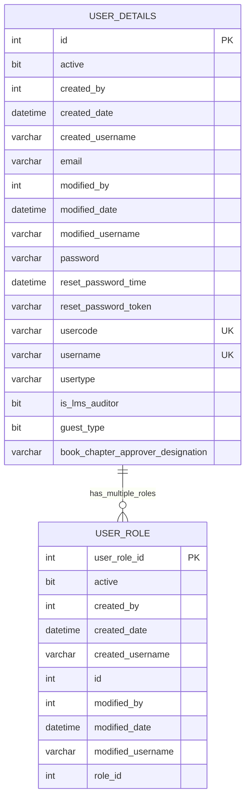
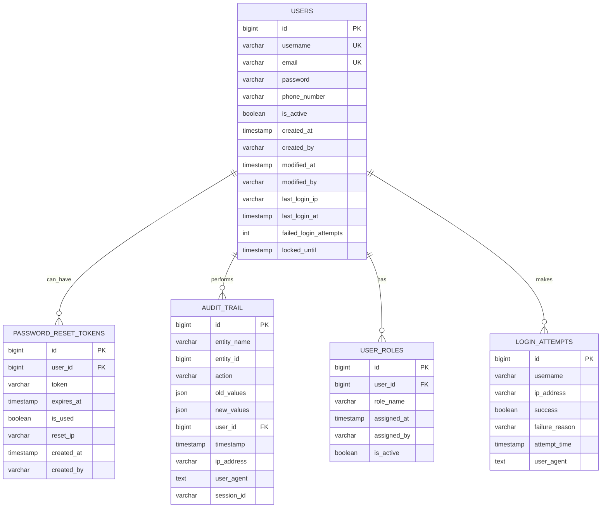

import { Callout } from 'nextra/components';

# Database Design

The authentication module's database design is structured to ensure security, integrity, and scalability for all user authentication and authorization workflows. It covers both the current and proposed schemas, highlighting improvements such as normalized user data, robust password reset mechanisms, comprehensive audit trails, and detailed tracking of login attempts. The design enforces referential integrity, supports compliance and analytics, and incorporates automation for operational excellence. This approach provides a strong foundation for secure, maintainable, and extensible authentication services.

---

## Entity Relationship Diagram

### Current Schema



<Callout type="error">
  - No formal foreign key relationships are defined in the current schema.
</Callout>
<Callout type="info">- The diagram above illustrates logical relationships only.</Callout>
<Callout type="info">
  - `USER_ROLE.id` logically references `USER_DETAILS.id` but is not enforced by constraints.
</Callout>
---

## Proposed Design

### Enhanced Entity Relationship Diagram



---

## Database Schema Details

### Users Table

**Purpose:** Stores core user information and authentication data.

```sql
CREATE TABLE USERS (
    id BIGINT PRIMARY KEY AUTO_INCREMENT,
    username VARCHAR(100) NOT NULL UNIQUE,
    email VARCHAR(255) NOT NULL UNIQUE,
    password VARCHAR(255) NOT NULL,
    phone_number VARCHAR(20),
    is_active BOOLEAN DEFAULT TRUE,
    created_at TIMESTAMP DEFAULT CURRENT_TIMESTAMP,
    created_by VARCHAR(100),
    modified_at TIMESTAMP DEFAULT CURRENT_TIMESTAMP ON UPDATE CURRENT_TIMESTAMP,
    modified_by VARCHAR(100),
    last_login_ip VARCHAR(45),
    last_login_at TIMESTAMP NULL,
    failed_login_attempts INT DEFAULT 0,
    locked_until TIMESTAMP NULL,

    -- Performance Indexes
    INDEX idx_users_username (username),
    INDEX idx_users_email (email),
    INDEX idx_users_active (is_active),
    INDEX idx_users_last_login (last_login_at)
);
```

---

### Password Reset Tokens Table

**Purpose:** Provides a secure password reset mechanism with expiration and tracking.

```sql
CREATE TABLE PASSWORD_RESET_TOKENS (
    id BIGINT PRIMARY KEY AUTO_INCREMENT,
    user_id BIGINT NOT NULL,
    token VARCHAR(255) NOT NULL,
    expires_at TIMESTAMP NOT NULL,
    is_used BOOLEAN DEFAULT FALSE,
    reset_ip VARCHAR(45),
    created_at TIMESTAMP DEFAULT CURRENT_TIMESTAMP,
    created_by VARCHAR(100),

    -- Referential Integrity
    FOREIGN KEY (user_id) REFERENCES USERS(id) ON DELETE CASCADE,

    -- Performance Indexes
    INDEX idx_password_reset_token (token),
    INDEX idx_password_reset_user_id (user_id),
    INDEX idx_password_reset_expires (expires_at),
    INDEX idx_password_reset_used (is_used)
);
```

---

### User Roles Table

**Purpose:** Manages role assignment and auditing for user access control.

```sql
CREATE TABLE USER_ROLES (
    id BIGINT PRIMARY KEY AUTO_INCREMENT,
    user_id BIGINT NOT NULL,
    role_name VARCHAR(100) NOT NULL,
    assigned_at TIMESTAMP DEFAULT CURRENT_TIMESTAMP,
    assigned_by VARCHAR(100),
    is_active BOOLEAN DEFAULT TRUE,

    -- Referential Integrity
    FOREIGN KEY (user_id) REFERENCES USERS(id) ON DELETE CASCADE,

    -- Business Logic Constraints
    UNIQUE KEY uk_user_role_active (user_id, role_name, is_active),

    -- Performance Indexes
    INDEX idx_user_roles_user_id (user_id),
    INDEX idx_user_roles_role_name (role_name),
    INDEX idx_user_roles_active (is_active),
    INDEX idx_user_roles_assigned_at (assigned_at)
);
```

---

### Login Attempts Table

**Purpose:** Enables comprehensive authentication monitoring and security analysis.

```sql
CREATE TABLE LOGIN_ATTEMPTS (
    id BIGINT PRIMARY KEY AUTO_INCREMENT,
    username VARCHAR(100),
    ip_address VARCHAR(45),
    success BOOLEAN,
    failure_reason VARCHAR(255),
    attempt_time TIMESTAMP DEFAULT CURRENT_TIMESTAMP,
    user_agent TEXT,

    -- Security & Performance Indexes
    INDEX idx_login_attempts_username (username),
    INDEX idx_login_attempts_ip (ip_address),
    INDEX idx_login_attempts_time (attempt_time),
    INDEX idx_login_attempts_success (success),
    INDEX idx_login_attempts_username_time (username, attempt_time),
    INDEX idx_login_attempts_ip_time (ip_address, attempt_time)
);
```

---

### Audit Trail Table

**Purpose:** Captures all significant system and user actions for compliance and forensics.

```sql
CREATE TABLE AUDIT_TRAIL (
    id BIGINT PRIMARY KEY AUTO_INCREMENT,
    entity_name VARCHAR(100) NOT NULL,
    entity_id BIGINT NOT NULL,
    action VARCHAR(50) NOT NULL,
    old_values JSON,
    new_values JSON,
    user_id BIGINT,
    timestamp TIMESTAMP DEFAULT CURRENT_TIMESTAMP,
    ip_address VARCHAR(45),
    user_agent TEXT,
    session_id VARCHAR(255),

    -- Referential Integrity (nullable for system actions)
    FOREIGN KEY (user_id) REFERENCES USERS(id) ON DELETE SET NULL,

    -- Audit & Performance Indexes
    INDEX idx_audit_trail_entity (entity_name, entity_id),
    INDEX idx_audit_trail_user_id (user_id),
    INDEX idx_audit_trail_timestamp (timestamp),
    INDEX idx_audit_trail_action (action),
    INDEX idx_audit_trail_session (session_id),
    INDEX idx_audit_trail_entity_time (entity_name, timestamp)
);
```

---

### Database Automation

**Purpose:** Ensures data consistency and maintenance through triggers and scheduled events.

```sql
-- Automatic timestamp updates
DELIMITER //
CREATE TRIGGER tr_users_modified_at
    BEFORE UPDATE ON USERS
    FOR EACH ROW
BEGIN
    SET NEW.modified_at = CURRENT_TIMESTAMP;
END//
DELIMITER ;

-- Automatic cleanup of expired tokens
DELIMITER //
CREATE EVENT ev_cleanup_expired_tokens
ON SCHEDULE EVERY 1 HOUR
DO
BEGIN
    DELETE FROM PASSWORD_RESET_TOKENS
    WHERE expires_at < NOW() AND is_used = TRUE;
END//
DELIMITER ;
```

---

## Key Benefits and Improvements

### 🔐 Security Enhancements

- **Token-based password reset:** Secure, expiring tokens for password resets.
- **IP tracking:** Monitors reset requests for abuse and forensic analysis.
- **Single-use tokens:** Prevents replay attacks with `is_used` flag.

### 🛡️ Account Protection

- **Brute-force protection:** Failed attempt tracking and intelligent account lockout.
- **Login monitoring:** Comprehensive logging of authentication attempts.
- **IP-based analysis:** Detects suspicious login patterns and potential threats.

### 🔍 Authentication & Audit

- **Last login tracking:** Provides users with visibility into recent authentications.
- **Session management:** Tracks active sessions and device fingerprints.
- **Complete audit trail:** JSON capture of before/after values, user attribution, and forensic details.

### 🗄️ Data Integrity

- **Foreign key constraints:** Enforced referential integrity across all related entities.
- **Cascade protection:** Prevents orphaned data and maintains consistency.
- **Optimized data types:** Scalable IDs, precise timestamps, and flexible JSON fields.

### 📊 Compliance & Analytics

- **Regulatory compliance:** GDPR, SOX, and security standards ready.
- **Monitoring & analytics:** Deep insight into usage, security, and incident response.

### ⚡ Operational Excellence

- **Performance:** Strategic indexing, partitioning-ready, and efficient audit logging.
- **User experience:** Clear feedback, account status transparency, and login history.
- **Simplified management:** Role clarity, assignment tracking, and streamlined enable/disable functionality.
