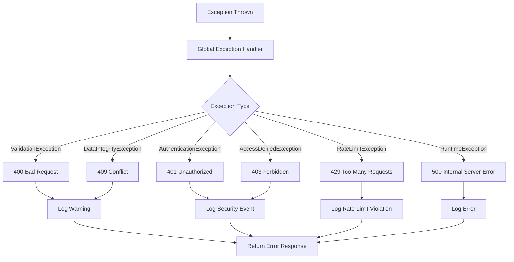

import { Callout } from 'nextra/components';

# Error Handling & Response Codes

This document describes the standardized approach to error handling and response codes within the authentication system. It outlines the HTTP status codes used for various scenarios, the taxonomy of error types, and the global exception handling mechanism. The goal is to provide clear, consistent, and actionable feedback to clients and developers, ensuring robust and predictable API behavior.

<Callout type="error">
  **Note:** The current system has limited exception handling and may not provide detailed or
  consistent error responses for all scenarios.
</Callout>

## HTTP Status Codes

| Status Code                   | Usage                   | Example Scenarios                   |
| ----------------------------- | ----------------------- | ----------------------------------- |
| **200 OK**                    | Successful operations   | Login, password reset success       |
| **400 Bad Request**           | Client input errors     | Invalid JSON, validation failures   |
| **401 Unauthorized**          | Authentication failures | Invalid credentials, expired tokens |
| **403 Forbidden**             | Authorization failures  | Insufficient permissions            |
| **404 Not Found**             | Resource not found      | Invalid endpoints                   |
| **409 Conflict**              | Resource conflicts      | Username already exists             |
| **429 Too Many Requests**     | Rate limiting           | Exceeded request limits             |
| **500 Internal Server Error** | Server errors           | Database/system errors              |

---

## Global Exception Handling

