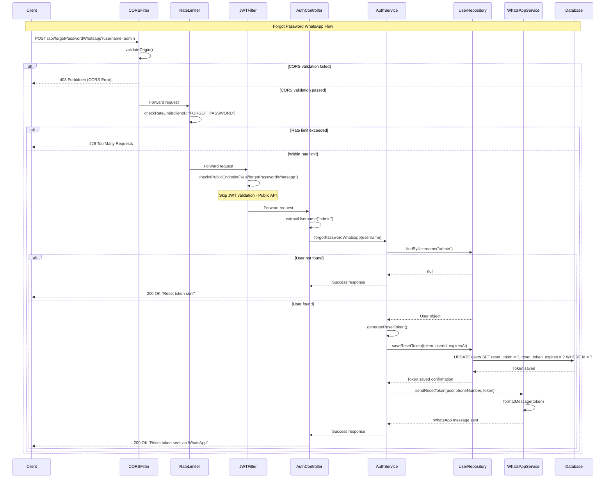

# Forgot Password Flow

## API Request

```http
POST /api/forgotPasswordWhatsapp?username=admin
```

## API Response (Success)

```http
HTTP/1.1 200 OK
Content-Type: application/json
```

```json
{
  "success": true,
  "status": 200,
  "data": "otp sent successfully to: 1234567890"
}
```

## Sequence Diagram



---

## Flow Description

1. **Request Initiation:** Client sends POST request to `/api/forgotPasswordWhatsapp` with username.
2. **CORS Validation:** Validates origin and headers.
3. **Rate Limiting:** Checks request frequency per client/IP.
4. **JWT Filter Bypass:** Public endpoint, skips JWT validation.
5. **Controller Processing:** Extracts username from query parameter.
6. **Service Layer:** Finds user, generates reset token, stores in DB.
7. **WhatsApp Integration:** Sends reset token via WhatsApp Business API.
8. **Response:** Returns success message.
