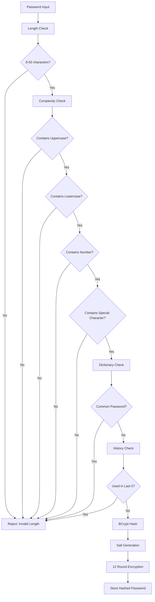

import { Callout } from 'nextra/components';

# Password Security Policy

This document outlines the password security standards and validation process for the authentication system. It details the required password complexity, validation flow, and enforcement mechanisms designed to protect user accounts from common attacks. The policy ensures that all passwords meet strict criteria for length, character diversity, and resistance to reuse, providing robust defense against brute-force and dictionary attacks.

<Callout type="error">
  **Note:** The current system does not fully enforce this password security policy.
</Callout>

## Password Validation Flow

---

## Password Requirements

| Requirement            | Rule             | Validation            |
| ---------------------- | ---------------- | --------------------- |
| **Minimum Length**     | 8 characters     | Regex validation      |
| **Maximum Length**     | 50 characters    | Prevent DoS attacks   |
| **Uppercase**          | At least 1       | Character class check |
| **Lowercase**          | At least 1       | Character class check |
| **Numbers**            | At least 1       | Numeric validation    |
| **Special Characters** | At least 1       | Symbol validation     |
| **Dictionary Words**   | Not allowed      | Common password list  |
| **History**            | Last 5 passwords | Hash comparison       |
