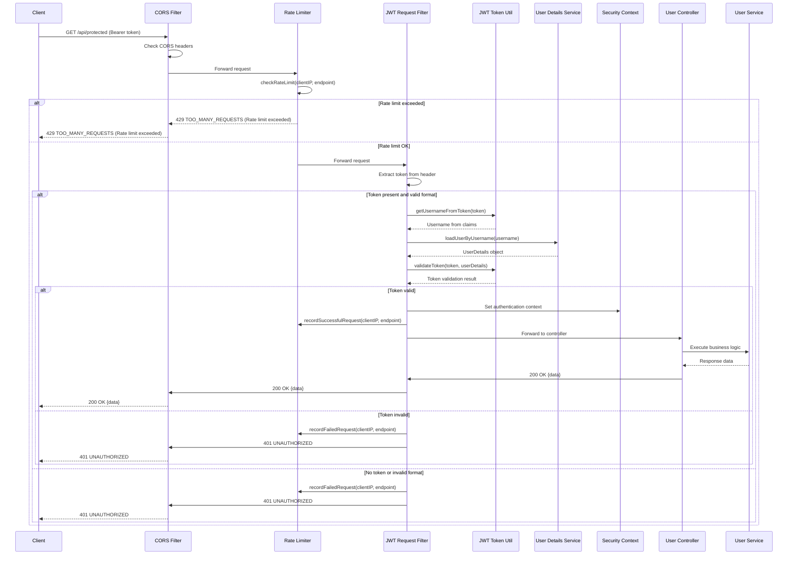

# Protected API Access Flow

## API Request

```http
POST /api/findRoles/1
Content-Type: application/json
Authorization: Bearer <JWT>
```

## API Response (Success)

```http
HTTP/1.1 200 OK
Content-Type: application/json
```

```json
{
  "success": true,
  "status": 200,
  "data": [
    {
      "role_name": "Super Admin",
      "role_short_name": "SAA",
      "user_role_id": 1,
      "usertype": "staff",
      "role_id": 1
    }
  ]
}
```

## Sequence Diagram



---

## Flow Description

1. **Request Initiation:** Client sends request to protected endpoint with JWT Bearer token.
2. **CORS Validation:** Checks origin and headers.
3. **Rate Limiting:** Validates request frequency per client/IP.
4. **Token Processing:** Extracts and validates JWT.
5. **User Authentication:** Loads user details and sets security context.
6. **Authorization:** Grants or denies access based on token validity.
7. **Business Logic:** Executes controller/service operations.
8. **Response:** Returns data or error message.

   - Validate token against user context
   - Set security context for authenticated user

9. **Authorization Decision**: Grant access for valid tokens or return 401 for invalid/missing tokens
10. **Business Logic**: Execute controller and service layer operations with authenticated context
11. **Response**: Return requested data or error message with appropriate HTTP status
