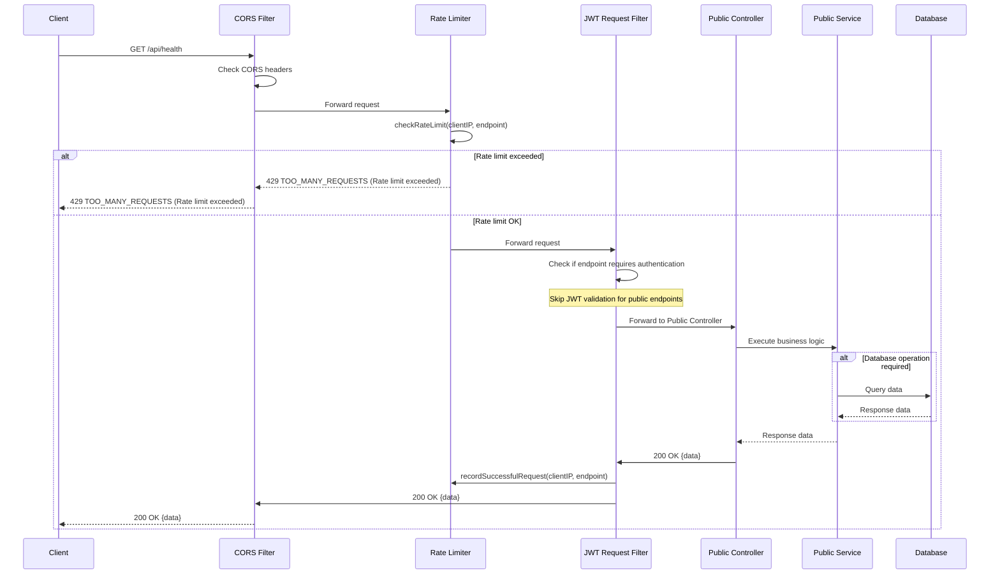

# Public API Access Flow

## API Request

```http
GET /api/health
Content-Type: application/json
```

## API Response (Success)

```http
HTTP/1.1 200 OK
Content-Type: application/json
```

```json
{
  "success": true,
  "status": 200,
  "data": "Status is UP"
}
```

## Sequence Diagram



---

## Flow Description

1. **Request Initiation:** Client sends request to public endpoint (no JWT required).
2. **CORS Validation:** Validates origin and headers.
3. **Rate Limiting:** Applies to public endpoints to prevent abuse.
4. **JWT Filter Bypass:** Public endpoints skip JWT validation.
5. **Controller Access:** Request flows directly to controller.
6. **Optional Database Operations:** Data retrieval if required.

**Common Public Endpoints:**

- `/api/health` - Health check
- `/api/state` - Application version
- `/api/swagger-ui.html` - API documentation
- `/api/authenticate` - Authentication
- `/api/resetPassword` - Password reset
