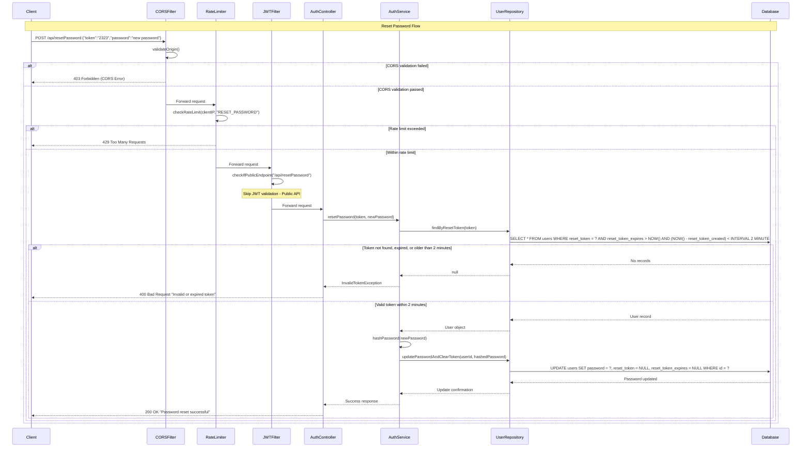

# Reset Password Flow

## API Request

```http
POST /api/resetPassword
Content-Type: application/json
```

```json
{
  "token": "123456",
  "password": "new password"
}
```

## API Response (Success)

```http
HTTP/1.1 200 OK
Content-Type: application/json
```

```json
{
  "success": true,
  "status": 200,
  "data": {
    "message": "password reset Successfully !!"
  }
}
```

## Sequence Diagram



---

## Flow Description

1. **Request Initiation:** Client sends POST request to `/api/resetPassword` with reset token and new password.
2. **CORS Validation:** Validates origin and headers.
3. **Rate Limiting:** Checks request frequency per client/IP.
4. **JWT Filter Bypass:** Public endpoint, skips JWT validation.
5. **Controller Processing:** Extracts token and new password.
6. **Service Layer:** Validates token, hashes new password, updates user record.
7. **Response:** Returns success or error message.
8. **JWT Filter Bypass**: he JWT Request Filter recognizes /api/resetPassword as a public endpoint and skips token validation
9. **Controller Processing**: Request flows to AuthController which extracts token and new password from request body
10. **Service Layer Processing**: AuthController delegates to AuthService for business logic execution
11. **User Lookup**: AuthService queries UserRepository to find user by username
12. **Token Validation**: AuthService queries UserRepository to find user by reset token and check generation time must be within 2 minutes of current time, if fails returns 400 Bad Request with "Invalid or expired token"
13. **Database Update**: Updates user password with hashed value
14. **Response**: Returns 200 OK with message "Password reset successful".
