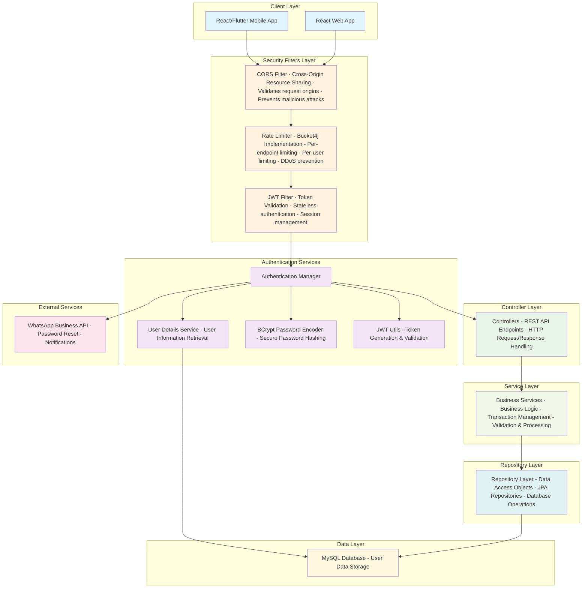

import { Callout } from 'nextra/components';

# System Architecture

---

## Architecture Diagram

This architecture diagram illustrates a secure, layered backend system for a modern web and mobile application.

The flow begins at the Client Layer (React web and mobile apps), passes through robust Security Filters (CORS, rate limiting, JWT authentication), and leverages dedicated Authentication Services for user management and token handling. The Controller and Service Layers manage REST API endpoints and business logic, while the Repository Layer handles data access with JPA repositories. All persistent data is stored in a MySQL Database, and external integrations like the WhatsApp Business API support features such as password resets and notifications. This modular design ensures scalability, maintainability, and strong security throughout the application stack.



---

## System Architecture Explanation

### 1. Client Layer

#### React Web App

**Purpose:**  
Modern, responsive front-end web application providing seamless user experience and efficient interaction with backend services.

**Key Responsibilities:**

- Dynamic user interface rendering and intuitive navigation
- Robust client-side state management
- Secure API communication with backend endpoints
- Real-time form validation and user input handling

**Technology Stack:** React.js, HTML5, CSS3, JavaScript, Material UI

---

#### React/Flutter Mobile App

**Purpose:**  
Cross-platform mobile application delivering native-like performance and access to device capabilities for both iOS and Android users.

**Key Responsibilities:**

- Rich native mobile experience
- Integration with device features (camera, GPS, notifications)
- Offline support and data synchronization
- Consistent cross-platform compatibility

**Technology Stack:** React Native or Flutter

---

### 2. Security Filters Layer

#### CORS Filter (Cross-Origin Resource Sharing)

**Purpose:**  
Enforces strict access control by validating request origins, safeguarding the API from unauthorized domains and cross-site attacks.

**Key Responsibilities:**

- Validation of request origins against an approved domain list
- Prevention of unauthorized cross-origin requests
- Mitigation of CSRF (Cross-Site Request Forgery) attacks
- Management of preflight requests for complex HTTP methods

**Implementation:** Spring Security CORS configuration

<Callout type="error">**Current State:** Allows access from any domain (`*`).</Callout>

<Callout>
  **Recommended:** Restrict access to `acharyerp.acharyaerptech.in` for enhanced security.
</Callout>

---

#### Rate Limiter (Bucket4j Implementation)

**Purpose:**  
Protects the system from abuse, brute-force attacks, and denial-of-service (DDoS) by enforcing granular rate limits.

**Key Responsibilities:**

- Endpoint-specific and user-specific request limiting
- DDoS attack prevention and fair resource allocation
- Graceful degradation under high load

**Technology:** Bucket4j (in-memory)

<Callout type="error">
  **Current State:** 10,000 requests/minute (166/sec), no user/IP-specific limits. Vulnerable to
  abuse and DDoS.
</Callout>

<Callout>
  **Recommended:** Implement user-based and IP-based rate limiting with endpoint-specific policies.
  See [Rate Limiting Strategy](#12-rate-limiting-strategy).
</Callout>

---

#### JWT Filter (JSON Web Token)

**Purpose:**  
Enables stateless authentication and authorization, ensuring secure and scalable session management.

**Key Responsibilities:**

- Validation of JWT tokens on every request
- Extraction of user identity and roles from tokens
- Stateless session management
- Automatic token refresh handling

**Implementation:** Spring Security JWT filter chain

---

### 3. Authentication Services

#### AuthenticationManager

**Purpose:**  
Central orchestrator for all authentication flows, supporting extensibility for multiple authentication strategies.

**Key Responsibilities:**

- Coordination of authentication logic
- Management of login, OAuth, and other authentication strategies
- Handling of authentication failures and redirections
- Integration with external authentication providers

**Implementation:** Spring Security AuthenticationManager

---

#### User Details Service

**Purpose:**  
Provides secure retrieval and management of user information and roles.

**Key Responsibilities:**

- Loading user details from persistent storage
- Managing user roles and permissions
- Supplying user profile information to security context

**Implementation:** Custom UserDetailsService

---

#### BCrypt Password Encoder

**Purpose:**  
Ensures robust password security through strong hashing and salting mechanisms.

**Key Responsibilities:**

- Password encryption using BCrypt algorithm
- Salt generation for enhanced security
- Secure password verification
- Protection against rainbow table and brute-force attacks

**Implementation:**  
Spring Security BCryptPasswordEncoder  
Default password detection and forced change policy  
WhatsApp-based password reset

<Callout type="error">**Current State:** 10 rounds (default).</Callout>

<Callout>**Recommended:** 12-14 rounds for production deployments.</Callout>

---

#### JWT Utils

**Purpose:**  
Manages secure JWT token creation, validation, and lifecycle.

**Key Responsibilities:**

- Generation of JWT tokens with user claims
- Signature verification and expiration handling
- Use of HS512 signature algorithm
- Refresh token management

**Implementation:** Custom JWT utility with JJWT library

<Callout type="error">**Current State:** 100-hour token validity.</Callout>
<Callout type="error">**Risk:** Extended exposure if compromised.</Callout>

<Callout>**Recommended:** Shorter token lifetimes with refresh support.</Callout>

#### JWT Structure Example

```json
{
  "header": {
    "alg": "HS512",
    "typ": "JWT"
  },
  "payload": {
    "userId": 1,
    "userName": "admin",
    "userType": "Staff",
    "iat": 1703097600,
    "exp": 1703457600
  },
  "signature": "encrypted_signature"
}
```

---

### 4. Controller Layer

**Purpose:**  
Defines REST API endpoints, orchestrates HTTP request/response handling, and ensures robust input validation and error management.

**Key Responsibilities:**

- HTTP request mapping and routing
- Data transformation and validation
- Exception handling and error response generation
- API documentation (Swagger/OpenAPI)

**Implementation:** Spring Boot `@RestController` classes

---

### 5. Service Layer

**Purpose:**  
Implements core business logic, transaction management, and integration with external services.

**Key Responsibilities:**

- Enforcement of business rules and workflows
- Transactional data processing
- Validation and orchestration of complex operations
- Integration with external APIs and services

**Implementation:** Spring `@Service` classes

---

### 6. Repository Layer

**Purpose:**  
Abstracts and optimizes all database operations, ensuring data integrity and performance.

**Key Responsibilities:**

- CRUD operations and custom queries
- Entity-to-DTO mapping
- Transaction management and connection pooling

**Implementation:** Spring Data JPA repositories

---

### 7. Data Layer (MySQL Database)

**Purpose:**  
Provides reliable, high-performance storage for all authentication and user data.

**Key Responsibilities:**

- Secure storage of user profiles, credentials, and history
- Data integrity, backup, and recovery
- Performance optimization via indexing and query tuning

**Technology:** MySQL with InnoDB

---

### 8. External Services

#### WhatsApp Business API

**Purpose:**  
Delivers secure, real-time notifications and password reset communications.

**Key Responsibilities:**

- Password reset and verification messages
- Alerts and reminders
- Two-factor authentication (2FA) delivery

**Integration:** HTTP API calls to WhatsApp Business API

---

## Architecture Benefits

### Security

- **Multi-layered defense:** CORS, Rate Limiting, and JWT provide comprehensive protection.
- **Stateless authentication:** JWT tokens eliminate server-side session storage.
- **Strong password handling:** BCrypt ensures passwords are never stored in plain text.

### Scalability

- **Horizontal scaling:** Stateless design enables seamless scaling.
- **Optimized data access:** Repository pattern and caching for high throughput.

### Maintainability

- **Separation of concerns:** Clear boundaries between layers.
- **Dependency injection:** Spring-managed components for modularity.
- **Extensible design:** Components can be independently updated.

### Performance

- **Connection pooling:** Efficient database resource management.
- **Caching strategies:** Multi-level caching for speed.
- **Asynchronous processing:** Non-blocking external service calls.

---

# Request Flow Summary

1. **Client** initiates HTTP request.
2. **CORS Filter** validates request origin.
3. **Rate Limiter** enforces request quotas.
4. **JWT Filter** authenticates and authorizes requests.
5. **Authentication Manager** processes credentials.
6. **Controller** manages HTTP request/response.
7. **Service** executes business logic.
8. **Repository** handles data persistence.
9. **Database** stores and retrieves records.
10. **External Services** deliver notifications and communications.
