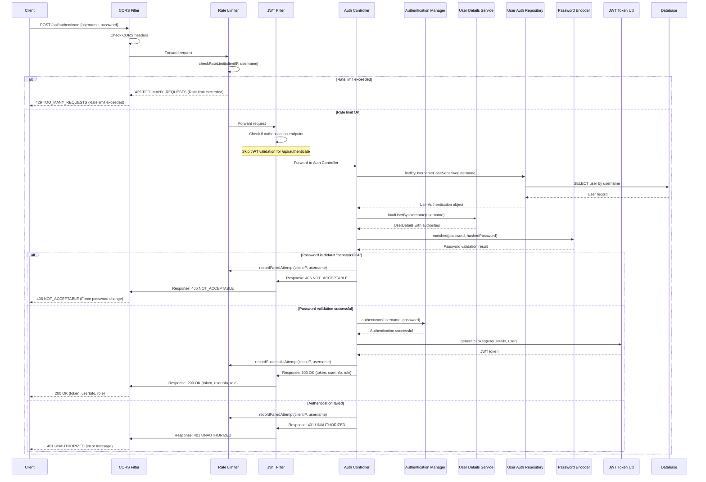

# User Login Flow

### API Request

```http
POST /api/auth/login
Content-Type: application/json
```

```json
{
  "username": "admin",
  "password": "password"
}
```

### API Response (Success)

```http
HTTP/1.1 200 OK
Content-Type: application/json
```

```json
{
  "success": true,
  "status": 200,
  "data": {
    "userName": "admin",
    "userType": "staff",
    "userId": 1,
    "role": "Super Admin",
    "adpStatus": null,
    "book_chapter_approver_designation": null,
    "token": "eyJhbGciOiJIUzUxMiJ9..."
  }
}
```

## Sequence Diagram



---

## Flow Description

1. **Request Initiation:** Client sends POST request to `/api/authenticate` with credentials.
2. **CORS Validation:** Validates request origin and headers.
3. **Rate Limiting:** Checks request frequency per client/IP.
4. **Authentication Processing:**
   - User lookup in database.
   - Password verification using BCrypt.
   - JWT token generation.
5. **Response:** Returns JWT token and user info on success, or error message on failure.
