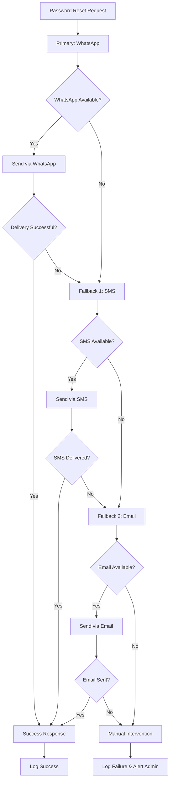

import { Callout } from 'nextra/components';

# WhatsApp Fallback Communication Strategy

This document describes a robust multi-channel fallback strategy for delivering password reset codes and critical notifications to users. The approach prioritizes WhatsApp as the primary channel, with automatic fallback to SMS, then email, and finally manual intervention if all automated methods fail. This ensures high reliability and user accessibility even if one or more channels are unavailable.

<Callout type="error">
  **Note:** The current system only uses WhatsApp for OTP and communication; SMS and email fallback
  are not implemented properly.
</Callout>

## Fallback Flow

---

## Sequential Fallback Chain

1. **WhatsApp:** Primary communication method for password reset.
2. **SMS:** Fallback if WhatsApp is unavailable or fails.
3. **Email:** Final fallback if SMS also fails.
4. **Admin Alert:** Manual intervention if all automated methods fail.

This multi-channel approach ensures high reliability and user accessibility for critical communications.
