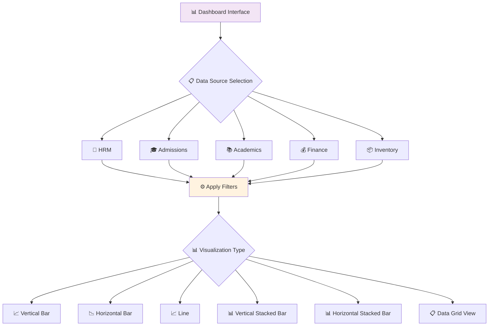

# 📊 Dashboard

> **Comprehensive data visualization and analytics hub for organizational insights**

The **Dashboard** section provides both **graphical** and **grid-based** representations of key metrics across various departments, enabling data-driven decision-making and strategic planning.

---

## 🔄 Dashboard Flow

---

## 🎯 Key Features

### 📈 1. Departmental Overview
Visualizes data from multiple departments, including:

| Department | Description |
|------------|-------------|
| **🏢 HRM** | Human Resource Management metrics |
| **🎓 Admissions** | Student enrollment and admission data |
| **📚 Academics** | Academic performance and curriculum metrics |
| **💰 Finance** | Financial performance and budget tracking |
| **📦 Inventory** | Stock management and supply chain data |

### 📊 2. Customizable Charts
Users can select from a variety of chart types to visualize data effectively:

- **📊 Vertical Bar Charts** - For comparing categories
- **📈 Horizontal Bar Charts** - For ranking and comparison
- **📉 Line Charts** - For trend analysis over time
- **📊 Stacked Bars** - For part-to-whole relationships

### ⚙️ 3. Dynamic Parameters
Multiple filters and parameters allow users to tailor the data view, enabling them to:

✅ **Track trends over time**  
✅ **Compare departmental performance**  
✅ **Identify operational bottlenecks**  
✅ **Discover areas for improvement**

### 📋 4. Data Grid View
In addition to visual charts, the data is also presented in a structured **grid format** for:

- **🔍 Detailed analysis**
- **📤 Export and reporting purposes**
- **📊 Data manipulation and filtering**

---

## 🚀 Benefits

This section empowers leadership, department heads, and analysts with **real-time insights** to support:

- **🎯 Strategic planning**
- **📈 Performance optimization**
- **🔍 Operational efficiency improvements**
- **📊 Data-driven decision making**

---
