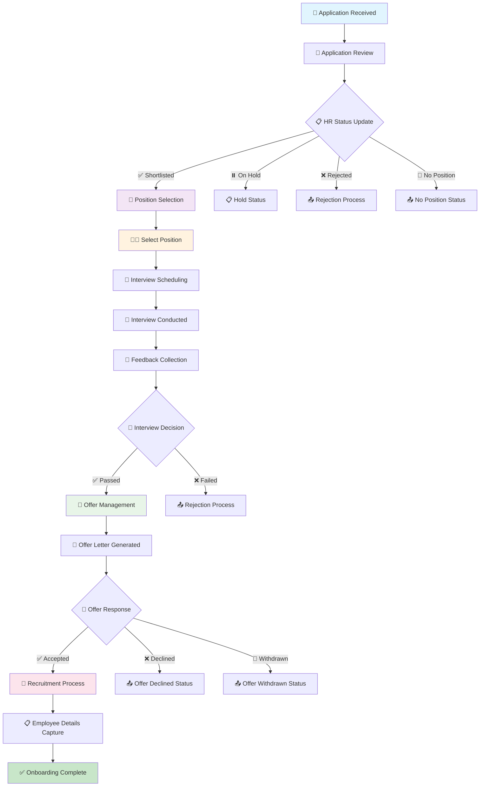

# 💼 Job Portal

> **Centralized recruitment management system for streamlined hiring processes**

The Job Portal module acts as a centralized hub for managing all job applications received through the organization's website. It streamlines the complete recruitment lifecycle—from application review to final onboarding.

---

## 🔄 Recruitment Workflow

---

## 🎯 Key Features & Workflow

### 📋 1. Applicant Management
All applications submitted for open roles are listed here. Users with appropriate HR support access can:

| Action | Description |
|--------|-------------|
| **👀 View Profiles** | Access complete applicant information and documents |
| **📊 Update Status** | Change HR status (Shortlisted, On Hold, Rejected, Offer Declined, Offer withdrawn, No Position) |
| **💬 Add Comments** | Provide internal notes and tracking information |

### 📅 2. Interview Scheduling
Once an applicant is Shortlisted, the system enables comprehensive interview management:

- **👥 Multiple Interviewers** - Select one or more interviewers
- **👥 Position** - Select position of applicant like director, principal, HOD, Professor etc.
- **⏰ Flexible Date** - Configure interview schedules and details
- **📧 Email Notifications** - Email alerts to candidates and interviewers can be sent
- **📋 Interview Details** - Add location, format, and special requirements

### 📝 3. Interview Feedback
After the interview is conducted:

- **👨‍💼 Individual Feedback** - Each interviewer submits detailed remarks
- **💬 HR Comments** - Additional notes and evaluation management
- **📊 Cumulative Assessment** - Combined feedback for final decisions
- **🎯 Evaluation Summary** - Comprehensive candidate assessment

### 💼 4. Offer Management
Upon successful completion of the interview process and selection:

| Component | Description |
|-----------|-------------|
| **📊 Evaluation Summary** | Complete candidate assessment |
| **💰 Salary Breakdown** | Role-specific compensation details |
| **📄 Offer Template** | Pre-formatted offer letter |
| **👨‍💼 Reporting Manager** | Designated supervisor assignment |
| **📅 Joining Date** | Proposed start date specification |

### 👤 5. Recruitment and Onboarding

After the job offer is accepted:

#### **🔄 Recruitment Process:**
1. **➕ Initiate Recruitment** - Click the "+" icon in Recruitment section
2. **📋 Employee Form** - Capture all necessary employee details:
   - **👤 Personal Information**
   - **🏢 Department Assignment**
   - **💼 Designation/Role**
   - **📅 Employment Details**
3. **✅ Completion** - Upon submission, recruitment is marked complete
4. **🎉 Onboarding** - Employee is officially onboarded into the organization

  

---

## 🚀 Benefits

- **⏱️ Streamlined Process** - Reduced time-to-hire
- **📊 Better Tracking** - Complete application lifecycle visibility
- **🤝 Improved Communication** - Email notifications and updates
- **📈 Enhanced Efficiency** - Centralized recruitment management
- **🎯 Quality Hires** - Structured evaluation and feedback system

---
