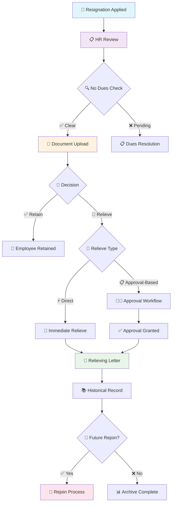

# 👋 Relieving Master

> **Streamlined employee resignation and offboarding management system**

The **Relieving Master** submenu under **HR Support** is used to manage employee resignations and offboarding processes in a streamlined manner, ensuring smooth transitions for both employees and the organization.

---

## 🎯 Key Functions

### 📝 1. Resignation Management
- **📋 Employee List** - Displays a comprehensive list of employees who have applied for resignation
- **📊 Tracking System** - Enables HR to track and process each resignation case efficiently
- **⏰ Timeline Management** - Monitor resignation timelines and deadlines

### 📄 2. No Dues and Documentation
- **✅ No Dues Process** - Allows initiation of the _No Dues_ approval process from a group of people specific for **each employee** (doubt)
- **📁 Document Management** - Provides functionality to upload and manage required exit documents
- **🔍 Compliance Check** - Ensures all organizational requirements are met

### 🔄 3. Relieve or Retain
HR users with access can choose to **retain** an employee or **initiate a relieve** process.

#### **🚪 Relieve Paths:**

| Path Type | Description | Use Case |
|-----------|-------------|----------|
| **📋 Approval-Based Relieve** | Initiates a formal relieve request routed through an approval workflow | Standard resignation processes |
| **⚡ Direct Relieve** | Immediately relieves the employee without requiring approval | Urgent or pre-approved scenarios |

### 📚 4. Relieved Employees History
- **📊 Comprehensive Records** - Maintains detailed records of all relieved employees
- **📄 Relieving Letters** - Displays key details along with downloadable relieving letters
- **🔍 Search & Filter** - Easy access to historical data and documents

### 🔄 5. Rejoin Functionality
- **🔄 Rejoin Process** - Includes an option to initiate a **rejoin process** for previously relieved employees under Relieved History tab
- **📋 Rehiring Support** - Allows for seamless rehiring within the system
- **📊 Employee History** - Access to previous employment records

---

## 🔄 Offboarding Workflow

---

## 🚀 Benefits

This module ensures that the offboarding process is handled with **transparency**, **compliance**, and **efficiency**:

### **🔍 Transparency:**
- **📊 Clear Process Flow** - Visible resignation and offboarding steps
- **📋 Document Tracking** - Complete audit trail of all actions
- **⏰ Timeline Visibility** - Clear deadlines and progress tracking

### **📋 Compliance:**
- **✅ No Dues Verification** - Ensures all obligations are met
- **📄 Document Management** - Proper record keeping and storage
- **🔍 Audit Trail** - Complete history for compliance purposes

### **⚡ Efficiency:**
- **🚀 Streamlined Process** - Reduced processing time
- **🔄 Automated Workflows** - Minimized manual intervention
- **📊 Centralized Management** - Single point of control

---
