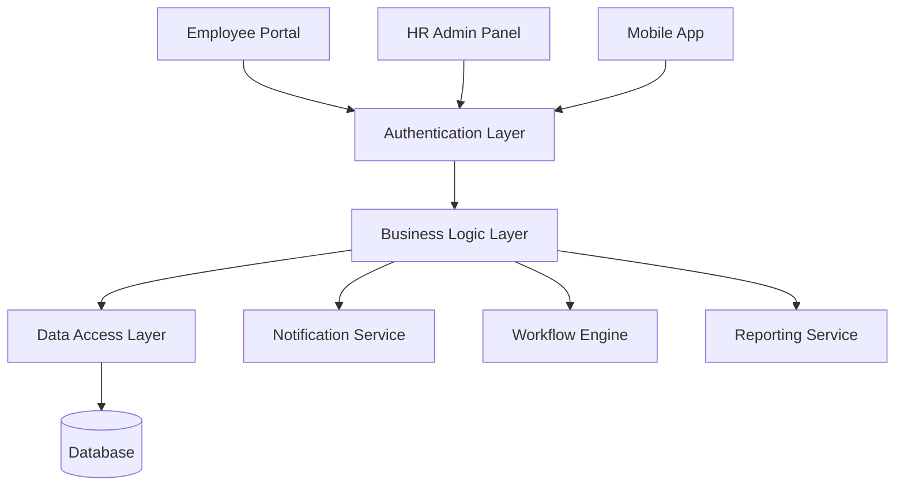

# 👥 Employee Module

## Overview

The Employee Module provides comprehensive workforce management capabilities including self-service portal, HR administration, and analytics.

## 📋 Table of Contents

1. [My Menu Features](#my-menu-features)
   - [My Profile](#my-profile)
   - [Leave Apply](#leave-apply)
   - [Resignation Form](#resignation-form)
   - [Service Request](#service-request)
   - [Refreshment Indent](#refreshment-indent)
   - [Service Render](#service-render)
   - [Plan My Day](#plan-my-day)
   - [Event Booking](#event-booking)
   - [AddOn Report](#addon-report)
   - [Transport Indent](#transport-indent)
   - [Service Render Transport](#service-render-transport)
2. [HR Support](#hr-support)
   - [Employee Master](HRSupport/Employee-Master.md)
   - [Job Portal](HRSupport/Job-Portal.md)
   - [Staff Master](HRSupport/Staff-Master.md)
   - [Relieving Master](HRSupport/Relieving-Master.md)
   - [Holiday Calendar](HRSupport/Holiday-Calendar.md)
   - [Leave History](HRSupport/Leave-History.md)
   - [Initiate Leave](HRSupport/Initiate-Leave.md)
   - [Research Report](HRSupport/Research-Report.md)
   - [Employee Log](HRSupport/Employee-Log.md)
   - [Dashboard](HRSupport/Dashboard.md)
   - [Staff Data](HRSupport/Staff-Data.md)
   - [Staff Data INST](HRSupport/Staff-Data.md)
   - [Increment Initiation](HRSupport/Increment-Initiation.md)
   - [Increment Repo](HRSupport/Increment-Repo.md)
   - [Staff Attendance - INST](HRSupport/Staff-Attendance-INST.md)
   - [Staff Attendance - DEPT](HRSupport/Staff-Attendance-INST.md)
   - [Staff Id Card](HRSupport/Staff_ID-Card.md)
   - [Vacation Leave Window](HRSupport/Vacation-Leave-Window.md)
3. [Approver Functions](#approver-functions)
4. Salary Reports
   - [Salary Sheet](SalaryReports/Salary-Sheet.md)
   - [Consultant Pay Report](SalaryReports/Consultant-Pay-Report.md)
   - [Master Pay Report](SalaryReports/Master-Pay-Report.md)
5. Payroll Activities
   - [Consultant Pay](PayrollActivities/Consultant-Pay.md)
   - [Deductions](PayrollActivities/Deductions.md)
   - [Additional Pay](PayrollActivities/Additional-Pay.md)
6. [API Endpoints](#api-endpoints)
7. [Database Schema](#database-schema)
8. [Module Architecture](#module-architecture)

# My Menu Features

- Within the Employee section of the menu, staff members have access to their services and a Daily Activity shortcut for planning.

## My Profile

Inside the Profile section, an employee can view and add details in the following areas:

- [Personal](#personal)
- [Employment](#employment)
- [Academics](#academics)
- [Mentor](#mentor)
- [Documents](#documents)
- [Professional](#professional)

---

### Personal

The Personal tab under the My Profile section enables users to view, update, and manage their personal and professional background information. The section is organized into several sub-sections, each designed to maintain specific categories of user data. Authorized users can add, edit, or view the data depending on access rights.

Each sub-section is explained in detail below:

### 1\. Personal Details

This section contains the user’s basic personal information. Users can:

- View and edit their Full Name, Gender, Date of Birth, and Marital Status.
- Update Permanent and Current Address fields.
- Maintain other personal identification data relevant to their profile.

### 2\. Registration Details

This section records the user’s professional registration information. It  includes:

- Key Skills – Primary areas of expertise.
- Educational Background – High-level academic qualifications.
- Total Experience – Overall years of professional experience.

### 3\. Family Details

This section allows the user to maintain information about immediate family members. Users can:

- Add or view Name, Relationship, Age, and Contact Information for each family member.
- Maintain multiple entries depending on the number of dependents or family records.

### 4\. Qualifications

This section captures academic achievements. Users can:

- Add or view Graduation, Post-Graduation, and other Higher Education Degrees.
- Specify details such as Institution Name, Year of Passing, Specialization, and Grade/Percentage.

### 5\. Experience

This section tracks the user’s previous employment history. It includes:

- Designation – Role/title held in previous positions.
- Duration – Start and end dates of employment.
- Organization Name – Name of the previous employer.
- Additional details such as job responsibilities or remarks may also be included.

### 6\. Skills

This section lists the individual’s competencies and skill sets. Users can:

- Add or view specific Technical, Functional, or Soft Skills.
- Indicate Proficiency Levels or experience duration for each skill (if supported).

### 7\. Medical Details

This section maintains health-related records. Users can:

- View existing Medical History, Allergies, Health Conditions, or any Disability Information stored in the system.
- This information is particularly useful for HR and emergency response purposes.

---

### Employment

Inside the My profile > Employment tab the user can view, edit, or add information in these areas:

1.  Employment Details: Employees can view information such as employee code, employment type, date of joining, salary structure, manager, and more.
2.  Attendance:  Employees can select a start and end date to view their attendance records for that period.
3.  Biometric Details: Employee can view their complete biometric attendance records by selecting a specific month and year, including daily check‑in and check‑out times as well as total hours worked.
4.  Leaves: Employee can review all of their submitted leave requests past and pending in one place, seeing details such as leave type, dates, duration, and current approval status
5.  Salary Structure: Employee can examine their detailed salary breakdown for the current financial year, with clear visibility into basic pay, allowances, deductions, and net pay.
6.  Payslips: Employee can access any of their payslips by choosing a pay period date.
7.  Known Languages: Employee can list and update the languages they know, indicating whether they can read, write, or speak each language by simply ticking the appropriate proficiencies.
8.  Career Timeline: Employee can track their entire journey since joining including promotions, department transfers, completed training sessions, and performance reviews in a chronological timeline.

---

### Academics (under My Profile > Academics tab):

This section is only accessible to teaching staff 

1.  My Courses: Displays all the courses assigned to the employee for teaching. Users can view, edit, or add course-related details.
2.  Feedback: (To be discussed)  

---

### Mentor (under My Profile > Mentor): 

This section is only accessible to teaching staff

1.  Proctee Data:  (To be discussed) 
2.  Meeting: (To be discussed)

---

### Documents (under My Profile > Documents):

Employees can upload and manage the following types of documents:

1.  Personal Identification Proofs
2.  Educational Certificates
3.  Employment Contracts
4.  Medical Reports
5.  Profile Photo
6.  Medical Information

---

### Professional (under My Profile > Documents):

    Here, employees can view and upload their professional contributions, including:

1.  Publications
2.  Conferences
3.  Book Chapter
4.  Memberships
5.  Grants
6.  Patents
7.  Research Profiles

---

## Leave Apply

In this section under My Menu, employees can apply for leave by clicking the Apply button. This opens a new window with a leave application form. Employees need to fill in the required details such as:

- Leave Category
- Leave Type
- From Date / To Date
- Reason for Leave
- Upload Supporting Document (if required for the selected leave type)

Employees can also view their previously applied leaves along with details such as status, number of days applied, leave reason, and other related information.

Leaves will be approved by the reporting manager.

## Resignation Form:

In this section under My Menu, employees can resign by filling resignation form they have details like expected Relieving date, reason for leaving additional remarks then this resignation is approved by the HR

## Service Request:

In this section under My Menu, employees can request various services provided by  
Acharya:

- Human Resources
- ERP Support
- CPRD
- Maintenance
- System & IT Support
- Housekeeping

By clicking on any of these maintenance options, the user will be redirected to the  
respective service request page, where the employee can submit and generate his or  
her specific service request accordingly.

## Service Render

(to be discused)

In this section under My Menu, employees can view all the service requests (indents) they have raised, along with the current status of each request. This includes both ongoing and previously completed services such as HR support, maintenance, IT support, and other internal service categories available within Acharya.

The page is divided into two tabs: Render and History.

- The Render tab displays all currently active or ongoing service requests that the employee has submitted. These are requests that are still in process or awaiting completion by the respective department.
- The History tab provides a complete list of all previously completed or closed service requests. Employees can refer to this tab to track past service interactions and check the details or outcomes of those requests.

This structured view allows employees to manage and monitor their service requests efficiently and maintain a record of all actions taken.

Doubt 

What is service indent

How employee will data there

## Refreshment Indent

This section outlines the functionality for employees to request refreshments through the My Menu section. The feature is intended for use during events organized within the Acharya campus, where a variety of menu options are available for selection.

#### Key Features

- Employees can place food orders during campus events.
- A range of meal options is provided based on event-specific menus.
- Post-consumption, employees can submit feedback regarding the service quality.

#### Placing a Refreshment Request

To request refreshments, employees must follow these steps:

1.  Navigate to My Menu > Refreshment Request.
2.  Click on the Create button.
3.  Fill in the required information:

- Meal Type (e.g., breakfast, lunch, snacks)
- Quantity
- Date
- Time
- Associated Event Name or ID

5.  Submit the request to complete the order.

#### Viewing Orders

- All refreshment requests are displayed in a tabular format on the page.
- The table includes:

- Order Details
- Order Status
- Event Information
- Meal Specifications

#### Providing Feedback

- After the meal has been served, employees have the option to submit feedback on the service received.
- Feedback can be used to improve future catering and service quality.

## Plan My Day

This section describes the "Task Management" feature available under the "My Menu" section of the application. This feature allows employees to create and manage tasks to improve their productivity and performance. Tasks can be created at both personal and faculty levels.

#### Task Types

1.  Personal Level Task

- These are tasks that an employee creates for themselves.
- Useful for tracking individual work and goals.

3.  Faculty Level Task

- These are tasks associated with a specific department (faculty).
- Employees are assigned tasks through their respective departments and can create related tasks for better tracking and accountability.

#### Creating a Task

To create a task, follow the steps below:

1.  Click on Create button
2.  Fill in the required fields:

3.  Contribution Type
4.  Task Type
5.  Task Title
6.  Start Date
7.  End Date
8.  Task 
9.  Description – Optional field to add additional information or context (limited to 200 characters).

10. Submit the form to create the task.

#### Viewing Tasks

- After creation, tasks are displayed in a grid view.
- The task grid includes:

- Task Name
- Completion Status
- Other task details (as applicable)

#### Updating Task Status

- Users can update the task status by clicking on the current status of the task in the grid.
- This allows users to mark tasks as complete or update progress as needed.

---

## Event Booking

(to be discussed)

The Event Booking feature under the My Menu section allows employees to submit booking requests for official or institutional events. These can include events such as graduation ceremonies, festival celebrations, academic gatherings, and other organizational functions.

Employees initiate a booking request by clicking the Create button, filling in the required event details, and submitting the form for approval. The request is then reviewed and approved by authorized personnel within Acharya.

All submitted bookings can be viewed in a table format, where employees can track the status (e.g., approved/pending), as well as other key information such as event date, time, venue, and more.

### Required Fields for Event Creation

1.  Event Title
2.  Event Sub Title
3.  Guest Name
4.  Description
5.  Start Time
6.  End Time
7.  Is Common
8.  Institute
9.  Room
10. Image Upload

11. Create Button 

Doubts

1.  Only able to see my event booking not other
2.  What isCommon field in creation of event
3.  Who will approve the event booking

4.  AddOn Report (to be discussed):

Employees can view all academic and research-related contributions made by themselves and other employees under this section. The available information includes:

- Publications
- Conferences
- Book Chapters
- Memberships
- Grants
- Patents

For each contribution, employees can see detailed information such as the contribution title, type, submission or approval status, and other related metadata. This section provides transparency and centralized access to institutional academic achievements and recognitions.

## Transport Indent

The Transport Service Request feature allows employees to request official transport for institutional purposes such as academic visits, college events, or external meetings.

To raise a transport request, the employee must click the Create button and fill out the required details. Once submitted, the request will appear in the Transport Indent table, where the employee can track the status and other related information.

### Fields for Raising a Transport Request

1.  Type of Vehicle – Dropdown to select the required vehicle type for the journey.
2.  Reporting Place – Location where the vehicle should report for pickup.
3.  Pickup Time – Scheduled date and time for vehicle pickup.
4.  Approx. Dropping Time – Estimated date and time when the vehicle is expected to drop off the requester.
5.  Duration – (Optional) Duration of the trip or visit.
6.  Reporting Person – Name of the individual who will be present at the reporting location.
7.  Contact Number – Phone number of the reporting person (must be valid).
8.  Place of Visit – Destination or address where the transport service is required.
9.  Purpose – Description of the reason for the travel request (e.g., college visit, seminar, client meeting).

10. Service Transport Render(To be discussed)

# HR Support

# Approver

1.  Staff Leaves

In this section, under the Approver tab, employees with approval authority can view all leave applications submitted by staff members of Acharya. This functionality provides a centralized view for tracking and managing leave requests efficiently.

All information is displayed in a tabular format for easy review and comparison.

Information Displayed in the Table

The leave request table displays important details such as:

- Employee Name
- Employee Code
- Department
- Leave Status
- Leave Reason
- Number of Days Applied
- Leave Type, Applied Date, Remarks, etc.

This table enables approvers to access all relevant leave-related data to support effective decision-making and leave management.

2.  Fee Template

   
In this section, under the Approver tab, employees with approval authority can view and manage all fee templates created by other employees. This functionality supports review, approval, and filtering of fee templates within the system.

All information is presented in a table format for ease of access and decision-making.

Key Functionalities

- Approvers can view all submitted fee templates.
- Approvers can approve templates directly from the table view.
- Templates display detailed information such as:

- Academic Year
- School/Institute
- Term
- Category
- Currency
- Created By
- Approval Status, etc.

- Approved templates are visually marked with a green row in the table for quick identification.
- A filtering option is available, allowing users to narrow down templates based on selected criteria.
- Some fields in the fee template can be edited before approval.
- Once a template is approved, it becomes locked and cannot be modified.

3.  New Staff Approver

   
In this section, under the Approver tab, employees with approval authority can view and manage the details of newly joined staff members. This feature allows authorized personnel to review and approve new joinee information submitted to the system.

All data is displayed in a tabular format, making it easy to review individual records and take appropriate action.

Information Displayed in the Table

The table includes key details such as:

- New Joinee Name
- Staff Code
- School/Institute
- Job Type
- Email
- Designation
- Salary
- CTC (Cost to Company)
- Salary Breakup, etc.

This section ensures proper visibility and control over staff onboarding by allowing designated approvers to verify, validate, and approve new joinee records.

4.  New Staff Approver

   
In this section, under the Approver tab, employees with approval authority can view and manage Staff NOC (No Objection Certificate) requests submitted by other employees. This functionality allows approvers to review all relevant details and take appropriate actions on submitted requests.

All request data is displayed in a structured table format within the New Staff Approver section.

Information Displayed in the Table

The table includes the following key details for each NOC request:

- Employee Name
- Designation
- Department
- Reason for NOC
- Initiated Date
- Requested Date
- Uploaded Document (if applicable)

Authorized employees can review these details and directly approve or reject the NOC requests through the interface.

5.  Scholarship

   
In this section, under the Approver tab, employees with approval authority can view and manage all scholarship-related requests submitted within the system. This interface provides a streamlined workflow for reviewing, verifying, and approving or rejecting scholarship applications.

All requests are presented in a tabular format for efficient evaluation and tracking.

Information Displayed in the Table

Each scholarship request includes the following details:

- Student Name
- Name of the Employee Who Initiated the Request
- Uploaded Supporting Documents
- Requested Scholarship Amount
- Purpose or Reason for the Scholarship

Approval Process

Authorized approvers can:

- Review all submitted information and documents.
- Ensure that the scholarship criteria and documentation requirements are met.
- Approve or reject the request based on the evaluation.

This process ensures transparency, accountability, and standardized handling of all scholarship approvals.

6.  Purchase order (need to discuss)
7.  Store Indent Approve (need to discuss)
8.  Add On Approve (need to discuss)

9.  Change of Course

In this section, under the Approver tab, employees with approval authority can view and manage all Change of Course requests submitted by or on behalf of students. These requests are typically initiated by designated staff members and must undergo a thorough review before approval.

All requests are displayed in a tabular format for clarity and efficient handling.

Information Displayed in the Table

Each course change request includes the following details:

- Student Name
- Mobile Number
- Fee Template (associated with the original and new course)
- Institute or Campus Name
- Name of the Employee Who Initiated the Request
- Supporting Documents (if provided) etc.

### Fee Transfer Management

In addition to reviewing the request, authorized approvers can also manage the fee transfer process, which involves:

- Verifying the fees already paid by the student for the original course.
- Initiating the transfer of applicable fees to the newly selected course or program.

Approval Actions

After reviewing all provided information and ensuring that necessary documentation and formalities are completed, the approver has the ability to:

- Approve the course change request.
- Reject the request if conditions are not met.

This process ensures proper academic and financial handling of course changes while maintaining transparency and accountability.

## Module Architecture

## HELLO
