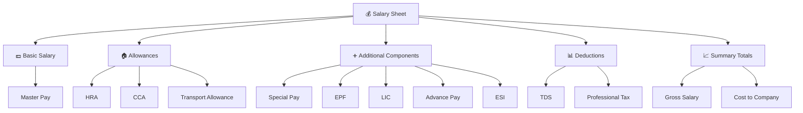

# 💰 Salary Sheet

> **Comprehensive employee compensation breakdown and financial record management system**

The **Salary Sheet** provides a detailed breakdown of employee compensation, filtered by **Month of Pay**, **School**, and **Department**. This centralized financial record includes comprehensive salary components, statutory deductions, and total compensation calculations for each employee.

---

## 🎯 Overview

The Salary Sheet serves as the primary financial document for employee compensation, offering complete transparency into salary structure, allowances, deductions, and total earnings. It enables HR administrators and employees to understand and verify all compensation components in a structured format.

---

## 🏗️ Salary Structure

The Salary Sheet organizes compensation into logical categories for clear understanding and management:

---

## 📋 Salary Components

### **💵 Basic Salary:**
- **Master Pay** – The foundational base pay of the employee before any additions or deductions

---

### **🏠 Allowances:**
- **House Rent Allowance (HRA)** – Compensation for housing expenses
- **City Compensatory Allowance (CCA)** – Additional allowance for city-based living costs
- **Transport Allowance (TA)** – Reimbursement for transportation expenses

---

### **➕ Additional Salary Components:**
- **Special Pay** – Additional compensation for specific roles, responsibilities, or expertise
- **Employee Provident Fund (EPF)** – Retirement savings contribution
- **Life Insurance Corporation (LIC)** – Life insurance premium deductions
- **Advance Pay** – Deductions or adjustments for salary advances taken by employees
- **Employees' State Insurance (ESI)** – Health insurance and social security contribution

---

### **📊 Tax and Statutory Deductions:**
- **Tax Deducted at Source (TDS)** – Income tax withholding as per government regulations
- **Professional Tax (PT)** – State-level professional tax deduction

---

### **📈 Summary Totals:**
- **Gross Salary** – Total earnings before any deductions
- **Cost to Company (CTC)** – Total cost incurred by the employer, inclusive of all benefits and statutory contributions

---

## 🔍 Filtering and Organization

### **Primary Filters:**
- **Month of Pay** – Specific month for salary calculation
- **School** – Academic school or department filter
- **Department** – Organizational department filter

### **Data Organization:**
- **Employee-wise Breakdown** – Individual employee salary details
- **Component-wise Analysis** – Detailed breakdown of each salary component
- **Summary Reports** – Consolidated financial summaries
- **Comparative Analysis** – Month-over-month or department-wise comparisons

---

## 🎯 Key Features

### **Comprehensive Reporting:**
- **Detailed Breakdown** – Complete salary component analysis
- **Filtered Views** – Customizable data filtering options
- **Export Capabilities** – PDF and Excel export functionality
- **Historical Records** – Past salary sheet access and comparison

### **Financial Transparency:**
- **Clear Component Separation** – Distinct categorization of salary elements
- **Deduction Visibility** – Transparent view of all deductions
- **Total Calculations** – Accurate gross and net salary computations
- **Statutory Compliance** – Built-in compliance with tax and labor laws

---