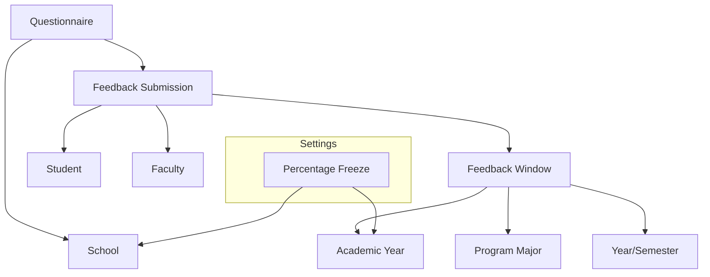

# Feedback Master

The **Feedback Master** in Acharya ERP facilitates the systematic collection and management of faculty feedback from students. This process helps institutions evaluate teaching effectiveness, course content, and overall faculty performance, supporting continuous improvement in academic quality.

---

## Key Components

### 1. Questionnaire

- **Purpose:** Define and manage the set of questions presented to students for faculty feedback.
- **Features:**
  - Create, edit, and view feedback questions.
  - Assign questions to specific schools.
  - Track creator and creation date.
  - Activate or deactivate questions as needed.
- **Fields:**
  - Question (text)
  - School (select)
  - Created By, Created Date, Active Status

---

### 2. Percentage Freeze

- **Purpose:** Set the minimum feedback submission percentage required for each school in a given academic year.
- **Features:**
  - Define and update the feedback freeze percentage.
  - View and manage freeze settings per school and academic year.
  - Activate or deactivate freeze settings.
- **Fields:**
  - Academic Year (select)
  - School (select)
  - Percentage (number)
  - Created Date, Active Status

---

### 3. Feedback Window

- **Purpose:** Configure the time window during which students can submit feedback for a given academic year, school, program, and semester.
- **Features:**
  - Set feedback start and end dates.
  - Assign feedback windows to specific programs and semesters.
  - Edit or deactivate feedback windows as needed.
- **Fields:**
  - Academic Year (select)
  - School (select)
  - Program Major (select)
  - Year/Semester (select)
  - From Date, To Date (date)
  - Active Status

---

## Architecture Diagram

The diagram above illustrates the structure of the Feedback Module:

- **Questionnaire** is linked to schools and forms the basis for feedback submissions.
- **Feedback Submission** connects students and faculty, and is only possible within an active **Feedback Window** (defined by academic year, program, and semester).
- **Percentage Freeze** is a setting that enforces the minimum required feedback submission percentage per school and academic year.
- This architecture ensures that feedback is collected in a controlled, configurable, and auditable manner, supporting institutional quality assurance.

---

## Functional Flow

1. **Define Questionnaire:**  
   Create and manage feedback questions for each school.

2. **Set Percentage Freeze:**  
   Specify the minimum feedback submission percentage required for each school and academic year.

3. **Configure Feedback Window:**  
   Set the period during which students can submit feedback, mapped to academic year, school, program, and semester.

4. **Collect Feedback:**  
   Students submit feedback within the active window, answering the defined questionnaire.

5. **Monitor & Export:**  
   Administrators monitor submission status and export feedback data for analysis.
