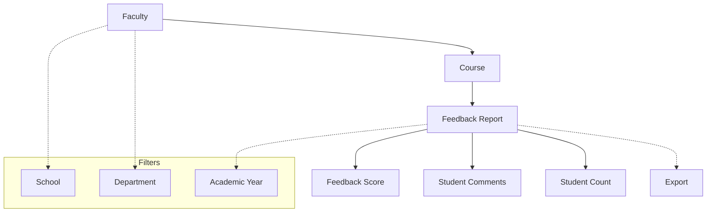

# Feedback View

The **Feedback View** section in Acharya ERP allows administrators and authorized users to review faculty feedback submitted by students. This module provides comprehensive filtering and reporting tools to analyze faculty performance based on student responses.

---

## Key Features

- **Faculty Feedback Reports:** View detailed feedback reports for each faculty member, organized by course.
- **Advanced Filtering:** Filter faculty feedback by school, department, and academic year.
- **Course-wise Analysis:** Drill down to see feedback for each faculty by course.
- **Export:** Export feedback reports for further analysis or record-keeping.

---

## Architecture Diagram

- **Faculty** are linked to one or more **Courses**.
- Each course has a **Feedback Report** containing scores, student comments, and student count.
- Filtering is available by school, department, and academic year.
- Reports can be exported for further analysis.

---

## Functional Flow

1. **Filter Faculty:**  
   Use filters to select the desired school, department, and academic year.

2. **View Feedback Reports:**  
   See a list of faculty members matching the selected filters. For each faculty, view their feedback report broken down by course.

3. **Analyze Feedback:**  
   Review detailed feedback scores, student comments, and summary statistics for each course taught by the faculty.

4. **Export Reports:**  
   Export the feedback data for reporting or institutional review.

---

## Field Specifications

| Field          | Description                               |
| -------------- | ----------------------------------------- |
| School         | School to which the faculty belongs       |
| Department     | Department of the faculty                 |
| Academic Year  | Academic year of the feedback             |
| Faculty Name   | Name of the faculty member                |
| Employee ID    | Unique identifier for the faculty         |
| Course         | Course for which feedback was collected   |
| Feedback Score | Aggregated feedback score for the faculty |
| Student Count  | Number of students who submitted feedback |
| Comments       | Student comments (if enabled)             |

---

This section provides a transparent and data-driven approach to faculty evaluation, supporting continuous improvement in teaching quality.
