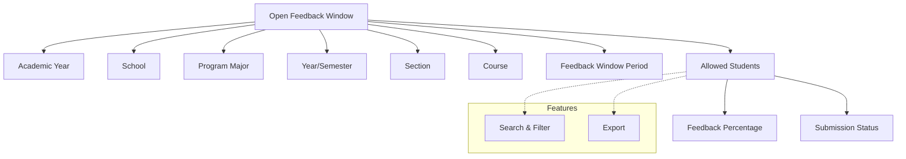

# Manage Feedback Window

This section allows administrators to enable and manage the feedback process for students.

---

## Key Features

- **Allow Feedback:** Open feedback windows for selected academic year, school, program, section, and course.
- **Student Feedback Status:** View the list of students allowed to submit feedback, along with their feedback percentage and submission window.
- **Search & Filter:** Quickly locate students or feedback windows using search and filter tools.
- **Export:** Export feedback status data for reporting or analysis.

---

## Functional Flow

1. **Open Feedback Window:**

   - Select the academic year, school, program major, year/semester, section, and course.
   - Choose the feedback window period.
   - Submit to allow students in the selected group to provide feedback during the specified window.

2. **View Allowed Students:**
   - Access the list of students who are permitted to submit feedback.
   - Review details such as AUID, USN, student name, school, course, semester, feedback percentage, feedback window period, and submission status.
   - Use filters and export options as needed.

---

## Architecture Diagram

### Architecture Explanation

- **Open Feedback Window** is configured for a specific academic year, school, program, year/semester, section, and course.
- **Allowed Students** are determined based on the selected criteria and are linked to a feedback window period.
- For each allowed student, the system tracks feedback percentage and submission status.
- **Features** such as search, filter, and export are available for efficient management and reporting.

---

## Field Specifications

| Field           | Type   | Required | Description                            |
| --------------- | ------ | -------- | -------------------------------------- |
| Academic Year   | Select | Yes      | Academic year for feedback             |
| School          | Select | Yes      | School to which feedback applies       |
| Program Major   | Select | Yes      | Program major of the students          |
| Year/Semester   | Select | Yes      | Year or semester                       |
| Section         | Select | Yes      | Section of the students                |
| Course          | Select | Yes      | Course for which feedback is collected |
| Feedback Window | Select | Yes      | Feedback window period                 |

**Allowed Students Table:**

| Field         | Description                    |
| ------------- | ------------------------------ |
| Academic Year | Academic year                  |
| AUID          | Student's unique ID            |
| USN           | University Serial Number       |
| Student Name  | Name of the student            |
| School        | School name                    |
| Course        | Course name                    |
| Semester      | Semester/Year                  |
| Percentage    | Feedback submission percentage |
| Window Period | Feedback window period         |
| Created By    | User who allowed feedback      |
| Created Date  | Date when feedback was allowed |

---

This module ensures a controlled and transparent process for enabling and tracking student feedback submissions for faculty.
