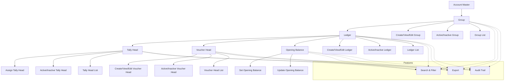

# Account Master

The **Account Master** module in Acharya ERP provides a centralized platform for managing all financial account structures, including groups, ledgers, tally heads, voucher heads, and opening balances. It enables administrators to create, view, and update account groups and ledgers, define tally and voucher heads, set opening balances, and manage the active status of all financial entities.

---

## Key Features

- **Group Management:** Create, view, edit, activate, or deactivate account groups (e.g., Assets, Liabilities).
- **Ledger Management:** Define and manage ledgers under groups for individual accounts.
- **Tally Head Management:** Assign tally heads for integration with external accounting systems.
- **Voucher Head Management:** Define voucher heads to classify transaction types (e.g., Payment, Receipt).
- **Opening Balance Management:** Set and update opening balances for ledgers at the start of a financial year.
- **Active/Inactive Control:** Activate or deactivate groups, ledgers, tally heads, and voucher heads.
- **Search, Filter, and Export:** Use advanced tools to search, filter, and export account data for reporting or analysis.
- **Audit Trail:** Track creation, updates, and status changes for all account records.

---

## Architecture Diagram

- **Group, Ledger, Tally Head, Voucher Head, and Opening Balance** are the core entities managed in Account Master.
- Each entity supports creation, editing, activation/deactivation, and listing.
- **Tally Heads** enable mapping to external accounting systems.
- **Voucher Heads** classify transaction types for accurate financial tracking.
- **Features** such as search, filter, export, and audit trail are available across all sections for efficient management and compliance.

---

## Functional Flow

1. **Create and Manage Groups:**  
   Add new account groups, edit details, and activate or deactivate as needed.

2. **Define Ledgers:**  
   Create and manage ledgers under groups for individual accounts.

3. **Assign Tally Heads:**  
   Assign tally heads to ledgers for integration with external accounting systems.

4. **Define Voucher Heads:**  
   Create and manage voucher heads to classify transaction types.

5. **Set Opening Balances:**  
   Set and update opening balances for ledgers at the start of each financial year.

6. **Search, Filter, and Export:**  
   Use search and filter tools to quickly locate records. Export data for reporting or analysis.

7. **Audit Trail:**  
   Track all changes, including creation, updates, and status changes, for compliance and transparency.

---

## Field Specifications

### Group

| Field        | Description                          |
| ------------ | ------------------------------------ |
| Group Name   | Name of the account group            |
| Type         | Category (Assets, Liabilities, etc.) |
| Created By   | User who created the group           |
| Created Date | Date of creation                     |
| Update       | Edit group details                   |
| Active       | Indicates if the group is active     |

### Ledger

| Field        | Description                          |
| ------------ | ------------------------------------ |
| Ledger Name  | Name of the ledger                   |
| Group        | Parent group of the ledger           |
| Tally Head   | Associated tally head                |
| Created By   | User who created the ledger          |
| Created Date | Date of creation                     |
| Update       | Edit ledger details                  |
| Active       | Indicates if the ledger is active    |

### Tally Head

| Field        | Description                          |
| ------------ | ------------------------------------ |
| Tally Head   | Name of the tally head               |
| Ledger       | Associated ledger                    |
| Created By   | User who assigned the tally head     |
| Created Date | Date of assignment                   |
| Update       | Edit tally head details              |
| Active       | Indicates if the tally head is active|

### Voucher Head

| Field        | Description                          |
| ------------ | ------------------------------------ |
| Voucher Head | Name of the voucher head             |
| Type         | Transaction type (Payment, Receipt)  |
| Created By   | User who created the voucher head    |
| Created Date | Date of creation                     |
| Update       | Edit voucher head details            |
| Active       | Indicates if the voucher head is active|

### Opening Balance

| Field        | Description                          |
| ------------ | ------------------------------------ |
| Ledger       | Ledger for which balance is set      |
| Amount       | Opening balance amount               |
| Date         | Date of opening balance              |
| Updated By   | User who set/updated the balance     |
| Update       | Edit opening balance                 |

---

## Financial Terms Explained

- **Group:** A collection of similar accounts (e.g., Assets, Liabilities, Income, Expenses) for organizing ledgers.
- **Ledger:** An individual account under a group, recording all transactions for a specific item.
- **Tally Head:** Used to map ledgers to external accounting software for integration and reporting.
- **Voucher Head:** Defines the type of financial transaction (e.g., Payment, Receipt, Journal).
- **Opening Balance:** The initial balance for each ledger at the start of a financial period.

---
