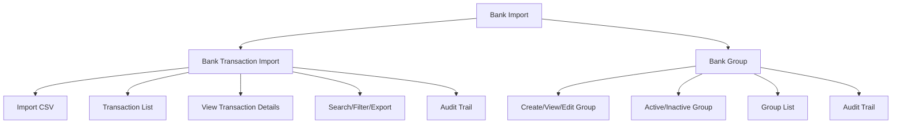

# Bank Import

The **Bank Import** section in Acharya ERP provides a centralized platform for managing all bank-related operations, including importing bank transactions from CSV files and managing bank groups. It enables administrators to import, view, and update bank transactions, create and manage bank groups, and control the active status of all bank entities.

---

## Key Features

- **Bank Transaction Import:** Import bank transactions in bulk using CSV files.
- **Bank Group Management:** Create, view, edit, activate, or deactivate groups for banks (e.g., Term Loans, Cash Credits).
- **Transaction Listing:** View all imported bank transactions with advanced search, filter, and export options.
- **Active/Inactive Control:** Activate or deactivate bank groups and transactions.
- **Audit Trail:** Track creation, updates, and status changes for all bank records.

---

## Architecture Diagram

- **Bank Transaction Import** handles importing and listing of bank transactions.
- **Bank Group** manages the creation and maintenance of bank groups.
- **Features** such as search, filter, export, and audit trail are available across all sections for efficient management and compliance.

---

## Functional Flow

1. **Import Bank Transactions:**  
   Upload a CSV file containing bank transactions. Map columns as required and import data in bulk.

2. **View and Manage Transactions:**  
   View the list of all imported transactions. Use search, filter, and export tools for reporting and analysis.

3. **Create and Manage Bank Groups:**  
   Add new bank groups, edit details, and activate or deactivate as needed.

4. **Audit Trail:**  
   Track all changes, including creation, updates, and status changes, for compliance and transparency.

---

## Field Specifications

### Bank Transaction Import

| Field             | Description                              |
| ----------------- | ---------------------------------------- |
| Type              | Import type (e.g., School)               |
| School            | School/Institute name                    |
| Bank              | Bank name                                |
| Fee Type          | Type of fee associated with transaction  |
| CSV File          | File containing transaction data         |
| Import Start Row  | Row number to start import               |
| Import End Row    | Row number to end import                 |
| Download Sample   | Download a sample CSV template           |

**CSV Columns Example:**

| transaction_no | cheque_dd_no | amount | transaction_date |
| -------------- | ------------ | ------ | --------------- |
| YES-1          | YES-10       | 100    | 14/05/2023      |
| ...            | ...          | ...    | ...             |

### Bank Transaction List

| Field            | Description                          |
| ---------------- | ------------------------------------ |
| Imported Date    | Date when transaction was imported    |
| Transaction Date | Date of the actual transaction       |
| Pay Id           | Payment identifier                   |
| Reference No     | Reference number from bank           |
| Type             | Transaction type (e.g., College Fees)|
| School           | School/Institute name                |
| Bank             | Bank name                            |
| Amount           | Transaction amount                   |
| Balance          | Account balance after transaction    |
| View             | View transaction details             |
| Enter USD        | Enter USD equivalent if applicable   |
| Created By       | User who imported the transaction    |
| Active           | Indicates if the transaction is active|

### Bank Group

| Field        | Description                          |
| ------------ | ------------------------------------ |
| Group Name   | Name of the bank group               |
| Created By   | User who created the group           |
| Created Date | Date of creation                     |
| Update       | Edit group details                   |
| Active       | Indicates if the group is active     |

---

## Usage

- **Import Transactions:** Go to the Bank Import section, select the required options, upload your CSV file, and import transactions in bulk.
- **View Transactions:** Use the transaction list to view, search, filter, and export all imported transactions.
- **Manage Groups:** Use the Group section to create, edit, activate, or deactivate bank groups for better organization.

---
