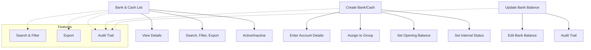
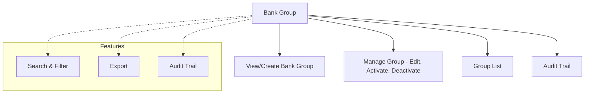

# Bank Master

The **Bank Master** module in Acharya ERP provides a centralized platform for managing all bank and cash accounts. It enables administrators to create, view, and update bank and cash records, manage account details, update balances, manage bank groups, and control the active status of all bank entities.

---

## Key Features

- **Bank & Cash Management:** Create, view, edit, activate, or deactivate bank and cash accounts.
- **Bank Group Management:** Create, view, edit, activate, or deactivate groups for banks (e.g., Term Loans, Cash Credits).
- **Account Details:** Maintain detailed information for each bank/cash account, including group, branch, account number, IFSC, SWIFT code, and opening balance.
- **Balance Management:** Update and track current bank and cash balances.
- **Active/Inactive Control:** Activate or deactivate bank, cash, and bank group accounts.
- **Search, Filter, and Export:** Use advanced tools to search, filter, and export bank/cash and group data for reporting or analysis.
- **Audit Trail:** Track creation, updates, and status changes for all bank, cash, and group records.

---

## Architecture Diagram

#### 1. Bank & Cash Management

#### 2. Bank Group Management

- **Bank & Cash Management** covers listing, creating, updating, and managing bank/cash accounts.
- **Bank Group Management** covers viewing, creating, editing, activating, or deactivating bank groups.
- **Features** such as search, filter, export, and audit trail are available for efficient management and compliance.

---

## Functional Flow

1. **View Bank & Cash List:**  
   See all existing bank and cash accounts with details like account name, number, IFSC, SWIFT, balances, and status.

2. **Create Bank or Cash Account:**  
   Add new bank or cash accounts by entering group, bank name, branch, account details, opening balance, and internal status.

3. **Update Bank Balance:**  
   Update the current balance for any bank or cash account as needed.

4. **Bank Group Management:**  
   - **View/Create Bank Group:** View all existing bank groups and create new ones.
   - **Manage Group:** Edit group details, activate or deactivate groups, and view group list.

5. **Search, Filter, and Export:**  
   Use search and filter tools to quickly locate records. Export data for reporting or analysis.

6. **Audit Trail:**  
   Track all changes, including creation, updates, and status changes, for compliance and transparency.

---

## Field Specifications

### Bank/Cash Account

| Field          | Description                              |
| -------------- | ---------------------------------------- |
| Group Name     | Group to which the account belongs       |
| Bank           | Name of the bank or 'Cash'               |
| Short Name     | Abbreviated name for the account         |
| Branch Name    | Name of the bank branch                  |
| Account Name   | Name of the account holder               |
| Account Number | Bank account number                      |
| IFSC Code      | Bank IFSC code                           |
| Swift Code     | Bank SWIFT code                          |
| Opening Balance| Initial balance at account creation      |
| Bank Balance   | Current balance (can be updated)         |
| School         | Associated school/institute              |
| Internal Status| Indicates if the account is internal     |
| Created By     | User who created the account             |
| Created Date   | Date of creation                         |
| Update         | Edit account details or balance          |
| Active         | Indicates if the account is active       |

### Bank Group

#### View/Create Bank Group

| Field        | Description                          |
| ------------ | ------------------------------------ |
| Group Name   | Name of the bank group               |
| Created By   | User who created the group           |
| Created Date | Date of creation                     |

#### Manage Group

| Field        | Description                          |
| ------------ | ------------------------------------ |
| Update       | Edit group details                   |
| Active       | Indicates if the group is active     |

---

## Usage

- **View Accounts:** Use the Bank Master list to view all bank and cash accounts with their details and balances.
- **Create Account:** Click "Create" to add a new bank or cash account, filling in all required fields.
- **Update Balance:** Use the update option to modify the current balance of any account.
- **Manage Status:** Activate or deactivate accounts as needed for operational control.
- **Bank Group:** Use the Bank Group section to view, create, edit, activate, or deactivate bank groups.
- **Search & Export:** Utilize search, filter, and export features for efficient data management and reporting.

---
