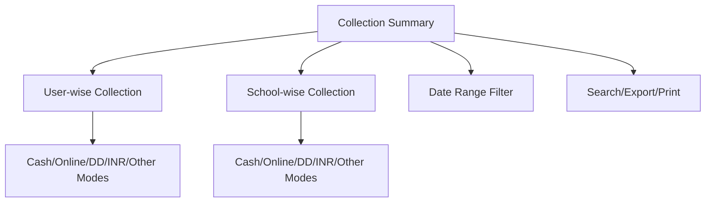

# Collection Summary

The **Collection Summary** section in Acharya ERP provides a consolidated view of all fee collections, allowing users to analyze the amount collected by each user (accountant) and by each school. The summary breaks down collections by payment modes such as Cash, Online, DD, and others.

---

## Key Features

- **User-wise Collection:** View total amount collected by each user (accountant), with breakdowns by payment mode (Cash, Online, DD, INR, etc.).
- **School-wise Collection:** View total amount collected by each school, with payment mode breakdowns.
- **Date Range Filter:** Filter collections by custom date range to analyze collections for a specific period.
- **Search and Export:** Search for specific users or schools and export the summary for reporting or analysis.
- **Detailed Columns:** See columns for each payment mode, total receipts, payments, and closing balances.
- **Print Option:** Print the collection summary directly from the interface.

---

## Architecture Diagram

---

## Functional Flow

1. **Select Date Range:**  
   Choose the desired date range to filter the collection data.

2. **View User-wise Collection:**  
   See the amount collected by each user (accountant), broken down by payment mode and with closing balances.

3. **View School-wise Collection:**  
   See the amount collected by each school, with payment mode breakdowns and closing balances.

4. **Search, Export, and Print:**  
   Use the search bar to find specific users or schools. Export or print the summary for reporting or compliance.

---

## Field Specifications

| Field           | Description                                 |
|-----------------|---------------------------------------------|
| Name/Inst       | User (accountant) name or School/Institute  |
| Receipt_Total   | Total amount collected                      |
| DD              | Amount collected via Demand Draft           |
| Online          | Amount collected via Online/RTGS            |
| INR             | Amount collected in INR (cash)              |
| INR1            | Additional INR collection (if applicable)   |
| Payment         | Other payments (if any)                     |
| Closing         | Closing balance after all collections       |

---

## Usage

- **User Tab:** View and analyze collections by each user (accountant).
- **School Tab:** View and analyze collections by each school.
- **Filter:** Use date range and search to focus on specific data.
- **Export/Print:** Export or print the summary for further analysis or reporting.

---
