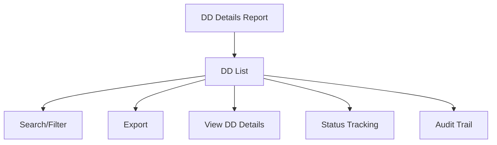

# DD Details Report

The **DD Details Report** section in Acharya ERP provides a comprehensive listing of all Demand Drafts (DDs) submitted to the college by students. This report displays detailed information for each DD transaction, including student, bank, receipt, and clearance details. The data can be filtered, searched, and exported for analysis or compliance.

---

## Key Features

- **DD Listing:** View all DDs submitted by students with complete transaction details.
- **Search and Filter:** Search and filter DD records by DD number, date, bank, student, school, receipt type, and clearance status.
- **Export:** Export the DD details report for further analysis or reporting.
- **Status Tracking:** Track the clearance status and remarks for each DD.
- **Audit Trail:** View who created or modified each DD record and when.

---

## Architecture Diagram

---

## Functional Flow

1. **View DD List:**  
   See all DD transactions with columns for DD number, date, bank, amount, receipt type, receipt number, receipt date, student, school, deposited bank, cleared status, cleared date, and remarks.

2. **Search and Filter:**  
   Use search and filter tools to locate specific DDs by number, date, bank, student, school, or status.

3. **Export:**  
   Export the filtered DD report for reporting or compliance.

4. **Status Tracking:**  
   Track the clearance status, cleared date, and remarks for each DD.

5. **Audit Trail:**  
   View who created or modified each DD record and the corresponding dates.

---

## Field Specifications

| Field             | Description                                              |
|-------------------|---------------------------------------------------------|
| DD No             | Demand Draft number                                     |
| DD Date           | Date of the DD                                          |
| DD Bank           | Name of the bank issuing the DD                         |
| Amount            | DD amount                                               |
| Receipt Type      | Type of receipt (e.g., General, Bulk)                   |
| Receipt No        | Associated fee receipt number                           |
| Receipt Date      | Date of the fee receipt                                 |
| Student           | Student name or ID                                      |
| School            | School/Institute short name                             |
| Deposited Bank    | Bank where DD is deposited                              |
| Cleared Status    | Whether the DD is cleared (Yes/No)                      |
| Cleared Date      | Date when DD was cleared                                |              |

---

## Usage

- **View:** Review all DD transactions submitted by students, including clearance and deposit details.
- **Search/Filter:** Use the search and filter options to focus on specific DDs, banks, students, or statuses.
- **Export:** Export the DD details report for compliance, reconciliation, or audit purposes.

---
