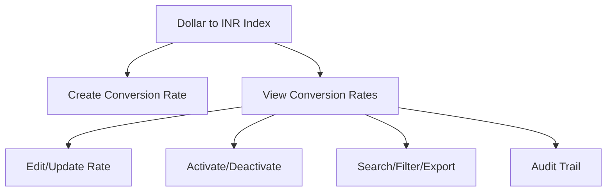

# Dollar to INR Conversion Rate

The **Dollar to INR Conversion Rate** module in Acharya ERP allows users to manage and track the conversion rate between US Dollars (USD) and Indian Rupees (INR) for financial transactions. This ensures accurate currency conversion for fee receipts, payments, and reports involving foreign currency.

---

## Key Features

- **Create Conversion Rate:** Add a new conversion rate by specifying the dollar value (default 1), INR equivalent, and the effective date.
- **Conversion Rate Listing:** View all historical and current conversion rates with details such as dollar value, INR value, date, created by, and status.
- **Edit Conversion Rate:** Update existing conversion rates as needed.
- **Active/Inactive Control:** Activate or deactivate conversion rates.
- **Search, Filter, and Export:** Search, filter, and export conversion rate data for reporting or analysis.
- **Audit Trail:** Track creation, updates, and status changes for all conversion rate records.

---

## Architecture Diagram

---

## Functional Flow

1. **Create Conversion Rate:**  
   Click "Create", enter the dollar value (usually 1), INR equivalent, and the effective date, then save.

2. **View Conversion Rates:**  
   See a list of all conversion rates with columns for dollar, INR, date, created by, created date, update, and active status.

3. **Edit/Update Rate:**  
   Update the INR value or date for any existing conversion rate as needed.

4. **Activate/Deactivate:**  
   Set conversion rates as active or inactive to control which rates are used in calculations.

5. **Search, Filter, and Export:**  
   Use search and filter tools to find specific rates. Export the list for reporting.

---

## Field Specifications

| Field        | Description                              |
|--------------|------------------------------------------|
| Dollar       | Dollar value (usually 1)                 |
| INR          | Equivalent INR value                     |
| Date         | Effective date of the conversion rate    |
| Created By   | User who created the entry               |
| Created Date | Date of creation                         |
| Update       | Edit conversion rate details             |
| Active       | Indicates if the rate is active          |

---

## Usage

- **Create:** Click "Create", enter the dollar, INR, and date, then save to add a new conversion rate.
- **View/Edit:** Use the list to view, search, filter, export, or update conversion rates.
- **Status:** Activate or deactivate rates as needed for accurate financial calculations.

---
