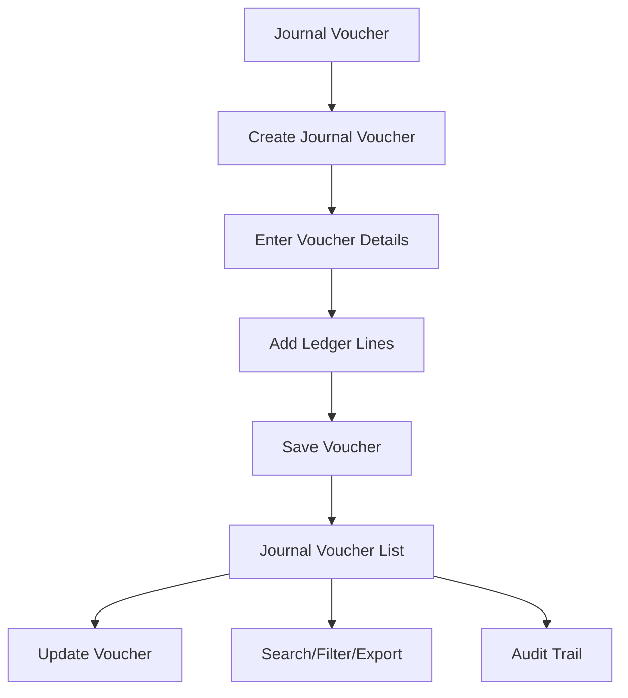

# Journal Voucher

The **Journal Voucher** section in Acharya ERP allows users to create and manage journal vouchers for recording non-cash transactions and internal adjustments. Users can enter all required details for a journal voucher, save it, and view or update the list of created vouchers.

---

## Key Features

- **Create Journal Voucher:** Enter all required details such as school, department, date, payee, ledger accounts, debit/credit amounts, PO reference, and remarks.
- **Ledger Entry:** Add multiple ledger lines with debit and credit values for each account.
- **Voucher Listing:** View a list of all created journal vouchers with details like status, vendor, school, department, amount, type, creator, date, and remarks.
- **Update Voucher:** Edit or update existing journal vouchers as needed.
- **Search, Filter, and Export:** Search, filter, and export the list of journal vouchers for reporting or analysis.
- **Audit Trail:** Track creation, updates, and status changes for all journal vouchers.

---

## Architecture Diagram

---

## Functional Flow

1. **Create Journal Voucher:**  
   - Select the school and department.
   - Enter the date, payee, and remarks.
   - Add one or more ledger lines, specifying the ledger account, PO reference (if any), and debit/credit amounts.
   - Click "Create" to save the voucher.

2. **View Journal Voucher List:**  
   - See all created journal vouchers with columns for status, vendor, school, department, amount, type, creator, date, and remarks.

3. **Update Voucher:**  
   - Click the update/edit icon to modify voucher details as needed.

4. **Search, Filter, and Export:**  
   - Use search and filter tools to locate specific vouchers. Export the list for reporting.

5. **Audit Trail:**  
   - Track all actions (creation, updates) for compliance and transparency.

---

## Field Specifications

### Journal Voucher Entry

| Field         | Description                                  |
|---------------|----------------------------------------------|
| School        | School/Institute name                        |
| Department    | Department name                              |
| Date          | Voucher date                                 |
| Pay To        | Payee/vendor name                            |
| Inter School  | Indicates if inter-school transaction        |
| Ledger        | Ledger account for entry                     |
| PO Reference  | Purchase order reference (if any)            |
| Debit         | Debit amount for the ledger                  |
| Credit        | Credit amount for the ledger                 |
| Remarks       | Additional notes or description              |

### Journal Voucher List

| Field        | Description                                   |
|--------------|-----------------------------------------------|
| Status       | Voucher status                                |
| Vendor       | Payee/vendor name                             |
| School       | School/Institute name                         |
| Dept         | Department name                               |
| Amount       | Total voucher amount                          |
| Type         | Voucher type (e.g., DIRECT-JV, GRN-JV)        |
| Created By   | User who created the voucher                  |
| Created Date | Date of voucher creation                      |
| Remarks      | Remarks or description                        |
| Update       | Edit voucher details                          |

---

## Usage

- **Create:** Fill in all required fields and add ledger lines, then click "Create" to save the journal voucher.
- **View/Edit:** Use the list to view or update existing journal vouchers.
- **Search/Export:** Use search, filter, and export features for efficient management and reporting.

---
