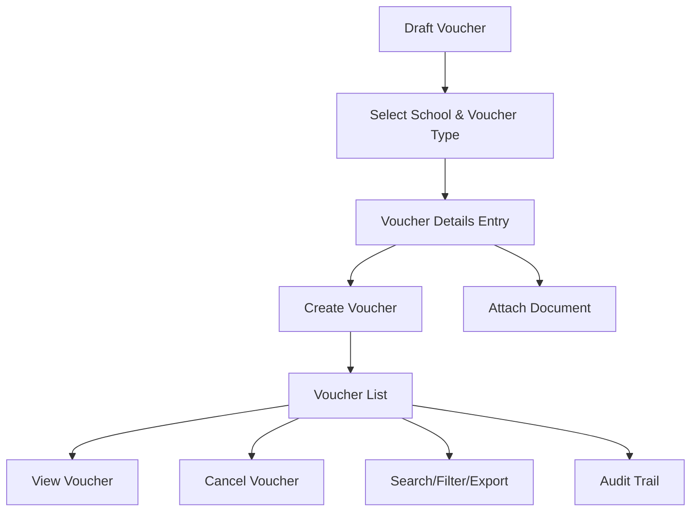

# Draft Voucher

The **Draft Voucher** section in Acharya ERP enables users to create, manage, and process various types of vouchers for financial transactions. The workflow consists of selecting the school and voucher type, entering voucher details, and managing the list of created vouchers with options to view or cancel.

---

## Key Features

- **Voucher Type Selection:** Choose from multiple voucher types (Journal Voucher, Payment Voucher, Fund Transfer, Contra Voucher, Salary JV, Consultant JV).
- **School Selection:** Select the relevant school/institute for which the voucher is being created.
- **Voucher Creation:** Enter all required details for the selected voucher type, including payment information, payee, bank, amount, remarks, and attachments.
- **Voucher Listing:** View all created vouchers with details and status.
- **Voucher Actions:** View or cancel vouchers as needed.
- **Attachment Upload:** Attach supporting documents (PDF, less than 2MB) to a voucher.
- **Search, Filter, and Export:** Search, filter, and export voucher data for reporting or analysis.
- **Audit Trail:** Track creation, updates, and cancellations for all vouchers.

---

## Architecture Diagram

---

## Functional Flow

1. **Select School & Voucher Type:**  
   - Choose the school/institute.
   - Select the voucher type from available options (Journal Voucher, Payment Voucher, Fund Transfer, Contra Voucher, Salary JV, Consultant JV).

2. **Enter Voucher Details:**  
   - Fill in all required fields based on the voucher type (see field specifications below).
   - Attach supporting documents if needed.

3. **Create Voucher:**  
   - Save the voucher as a draft. The voucher will appear in the voucher list.

4. **Manage Vouchers:**  
   - View all created vouchers with their details and status.
   - Cancel vouchers if not required.
   - View voucher details and attached documents.

5. **Search, Filter, and Export:**  
   - Use search and filter tools to locate specific vouchers.
   - Export voucher data for reporting or compliance.

6. **Audit Trail:**  
   - Track all actions (creation, cancellation) for transparency and compliance.

---

## Field Specifications

### Voucher Selection

| Field        | Description                                 |
|--------------|---------------------------------------------|
| School       | School/Institute for which voucher is created|
| Voucher Type | Type of voucher (Journal, Payment, etc.)    |

### Voucher Details (Payment Voucher Example)

| Field           | Description                                  |
|-----------------|----------------------------------------------|
| School          | School/Institute name                        |
| Date            | Voucher date                                 |
| Bank            | Bank name                                    |
| Cheque No.      | Cheque number (if applicable)                |
| Pay To          | Payee name                                   |
| Department      | Department (if applicable)                   |
| Is Online       | Indicates if payment is online (Yes/No)      |
| Inter School    | Inter-school transfer (if applicable)        |
| Vendor          | Vendor name                                  |
| PO Reference    | Purchase order reference                     |
| JV No           | Journal voucher number                       |
| JV School       | Journal voucher school                       |
| JV FC Year      | Financial year for JV                        |
| Debit           | Debit amount                                 |
| Remarks         | Additional notes or description              |
| Attachment      | Supporting PDF document (less than 2MB)      |

### Voucher List

| Field         | Description                                  |
|---------------|----------------------------------------------|
| Verify        | Verification status                          |
| Attachment    | View attached document                       |
| Amount        | Voucher amount                               |
| Pay To        | Payee name                                   |
| School        | School/Institute name                        |
| Created By    | User who created the voucher                 |
| Created Date  | Date of voucher creation                     |
| Remarks       | Remarks or description                       |
| Cancel        | Option to cancel the voucher                 |
| View          | View voucher details                         |

---

## Technical Terms Explained

- **Voucher:** A document recording a financial transaction, used for accounting and audit purposes.
- **Journal Voucher:** Used for non-cash adjustments and internal transfers.
- **Payment Voucher:** Used for making payments to vendors, employees, or other parties.
- **Fund Transfer:** Used for transferring funds between accounts or schools.
- **Contra Voucher:** Used for transactions involving both cash and bank accounts (e.g., cash deposit to bank).
- **Salary JV:** Journal voucher for salary-related transactions.
- **Consultant JV:** Journal voucher for consultant payments.
- **Debit:** Amount to be debited from the account.
- **Attachment:** Supporting document (e.g., invoice, bill) uploaded as PDF.
- **Cancel:** Action to void a voucher before approval.

---

## Usage

- **Step 1:** Select the school and voucher type.
- **Step 2:** Enter all required voucher details and attach documents if needed.
- **Step 3:** Create the voucher. It will appear in the voucher list.
- **Step 4:** View or cancel vouchers as required. Use search and export features for reporting.

---
- **Step 3:** Create the voucher. It will appear in the voucher list.
- **Step 4:** Approve, view, or cancel vouchers as required. Use search and export features for reporting.

---
