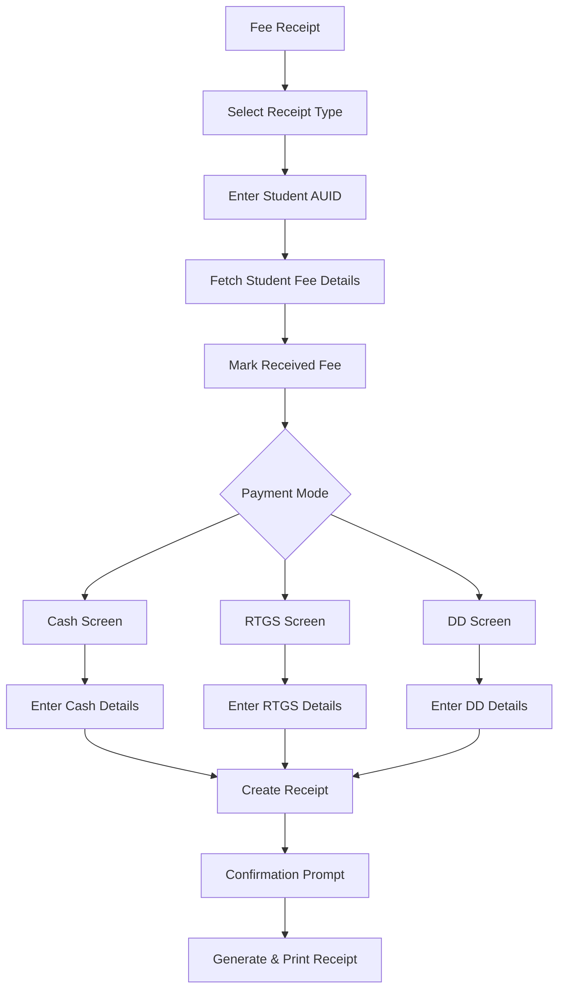

# Fee Receipt

The **Fee Receipt** section in Acharya ERP enables users to generate and manage student fee receipts based on different receipt types. The process involves selecting a receipt type, entering the student's AUID, viewing the student's fee details, marking the received fee (by Cash, RTGS, or DD), and generating the official fee receipt.

---

## Key Features

- **Receipt Type Selection:** Choose from various receipt types (e.g., College-General, College-Bulk, Hostel-General, Exam, etc.).
- **Student Lookup:** Enter the student's AUID to fetch and display their fee details.
- **Dynamic Fee Entry:** View and enter received fee details for each fee component and semester.
- **Multiple Payment Modes:** Mark received fee by Cash, RTGS, or DD. The transaction entry screen adapts based on the selected mode.
- **Transaction Details:** Enter payment-specific details such as cheque/DD number, date, bank, amount, narration, etc.
- **Receipt Generation:** Create and print an official fee receipt after confirming the transaction.
- **Confirmation Prompt:** System prompts for confirmation before generating the receipt.
- **Audit Trail:** Track receipt creation and updates for compliance.

---

## Architecture Diagram

---

## Functional Flow

1. **Select Receipt Type:**  
   Choose the required receipt type from the dropdown (e.g., College-General, Hostel-Bulk, Exam, etc.).

2. **Enter Student AUID:**  
   Input the student's AUID to fetch their academic and fee details.

3. **View Fee Details:**  
   The system displays all fee components, amounts due, and semester-wise breakdown.

4. **Mark Received Fee:**  
   Enter the amount received for each fee component. Select the payment mode (Cash, RTGS, DD).

5. **Enter Transaction Details:**  
   - For **Cash**: Enter received amount and narration.
   - For **RTGS**: Enter transaction number, date, bank, amount, and narration.
   - For **DD**: Enter DD/cheque number, date, bank, amount, and narration.

6. **Create Receipt:**  
   Click "Create" to proceed. A confirmation dialog appears.

7. **Confirm and Generate Receipt:**  
   Confirm the action to generate and print the official fee receipt.

---

## Field Specifications

### Receipt Type Selection

| Field         | Description                        |
| ------------- | ---------------------------------- |
| Receipt Type  | Type of receipt to be generated    |

### Student Lookup

| Field | Description                |
|-------|----------------------------|
| AUID  | Unique student identifier  |

### Fee Details

| Field         | Description                        |
|---------------|------------------------------------|
| Fee Component | Name of the fee (e.g., Tuition)    |
| Semester      | Semester for which fee is due      |
| Amount Due    | Amount to be received              |
| Amount Paid   | Amount received                    |

### Payment Details

| Field             | Description                                 |
|-------------------|---------------------------------------------|
| Received In       | Currency (INR/USD)                          |
| Transaction Type  | Cash, RTGS, or DD                           |
| Transaction No    | Transaction/Reference number (RTGS/DD)      |
| Transaction Date  | Date of transaction                         |
| Bank              | Bank name (for RTGS/DD)                     |
| DD/Cheque No      | DD/Cheque number (for DD)                   |
| DD Amount         | Amount on DD (for DD)                       |
| Received Amount   | Amount received                             |
| Narration         | Remarks or description                      |
| Deposited Bank    | Bank where amount is deposited              |

---

## Usage

- **Step 1:** Select the receipt type from the dropdown.
- **Step 2:** Enter the student's AUID to fetch and display their fee details.
- **Step 3:** Enter the received fee details and select the payment mode.
- **Step 4:** Fill in the required transaction details based on the payment mode.
- **Step 5:** Click "Create" and confirm to generate and print the fee receipt.

---
