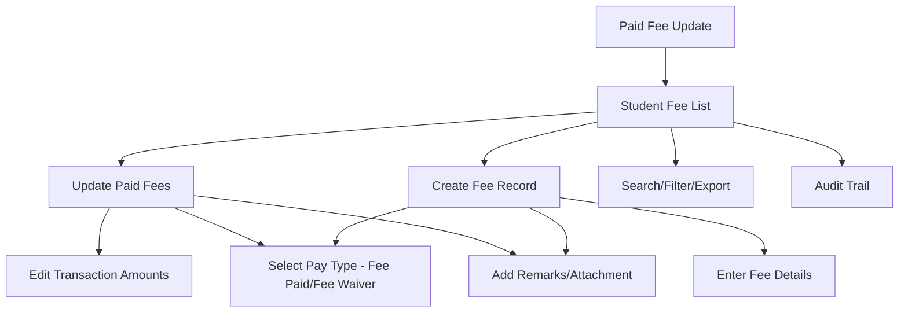

# Paid Fee Update

The **Paid Fee Update** section in Acharya ERP allows users to view and manage the total fees paid by students across their entire course duration. Users can update existing fee payment records or create new records for students whose fee details are not yet available, specifying payment amounts as either "Fee Paid" or "Fee Waiver".

---

## Key Features

- **Student Fee Listing:** View a list of all students with their total fees paid for the entire course duration.
- **Update Paid Fees:** Update the fee payment details for any student, including semester-wise or year-wise breakdowns.
- **Create Fee Record:** If a student's fee details are missing, create a new fee record and enter all transaction amounts.
- **Pay Type Selection:** Specify each transaction as "Fee Paid" or "Fee Waiver".
- **Remarks and Attachments:** Add remarks and upload supporting documents (PDF, less than 2MB) for each update or creation.
- **Search, Filter, and Export:** Search and filter students by AUID, name, or other criteria. Export the list for reporting or analysis.
- **Audit Trail:** Track who created or updated each fee record and when.

---

## Architecture Diagram

---

## Functional Flow

1. **View Student Fee List:**  
   See all students with columns for AUID, name, total amount paid, pay type, remarks, created/modified by, and active status.

2. **Update Paid Fees:**  
   - Click the edit icon for a student to update their fee payment details.
   - Enter or modify transaction amounts for each semester/year.
   - Select the pay type ("Fee Paid" or "Fee Waiver") for each transaction.
   - Add remarks and upload supporting documents if needed.

3. **Create Fee Record:**  
   - If a student's fee details are not available, click "Create" to add a new record.
   - Enter the student's AUID and fill in all required fee details and transaction amounts.
   - Specify pay type, remarks, and attach documents as needed.

4. **Search, Filter, and Export:**  
   - Use search and filter tools to locate specific students or fee records.
   - Export the list for reporting or compliance.

5. **Audit Trail:**  
   - Track all actions (creation, updates) for transparency and compliance.

---

## Field Specifications

| Field         | Description                                  |
|---------------|----------------------------------------------|
| AUID          | Student's unique ID                          |
| Name          | Student's name                               |
| Total Amount  | Total fees paid for all course duration      |
| View Amount   | View detailed breakdown of paid amounts      |
| Remarks       | Remarks for the fee update                   |
| Pay Type      | "Fee Paid" or "Fee Waiver"                   |
| Created By    | User who created the fee record              |
| Modified By   | User who last updated the record             |
| Actions       | Edit or update the fee record                |
| Active        | Indicates if the record is active            |

---

## Usage

- **View:** Review all students and their total paid fees.
- **Update:** Edit fee payment details for any student, including transaction breakdowns and pay type.
- **Create:** Add new fee records for students without existing details.
- **Search/Export:** Use search, filter, and export features for efficient management and reporting.

---
