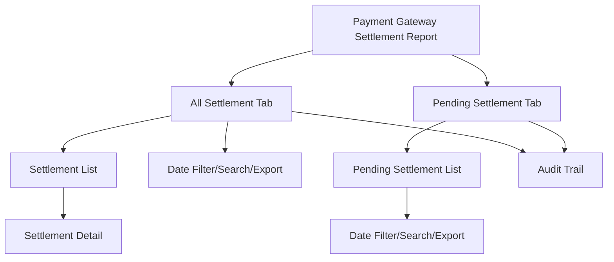

# Payment Gateway Settlement Report

The **Payment Gateway Settlement Report** section in Acharya ERP provides a comprehensive view of all settlements processed through the Razorpay payment gateway. This report is fetched directly from the gateway API and allows users to track both completed and pending settlements, filter by date, and export settlement data for reconciliation and compliance.

---

## Key Features

- **Settlement Listing:** View all settlements processed by Razorpay, including settlement date, settlement ID, amount, receipt amount, uniform amount, add-on amount, pending amount, and related details.
- **Pending Settlement:** View settlements that are still pending and not yet settled to the bank.
- **Settlement Detail:** Drill down into each settlement to see transaction-level details such as reference number, transaction number, settlement UTR, and amount.
- **Date Filter:** Filter settlements by a specific date to focus on relevant transactions.
- **Tabs for All/Pending Settlements:** Switch between "All Settlement" and "Pending Settlement" tabs for quick access.
- **Search, Filter, and Export:** Search, filter, and export settlement data for reporting or reconciliation.
- **Audit Trail:** Track when settlements were fetched and by whom for compliance.

---

## Architecture Diagram

---

## Functional Flow

1. **View All Settlements:**  
   - Go to the "All Settlement" tab to see all settlements with columns for settlement date, settlement ID, settlement amount, receipt amount, uniform amount, add-on amount, and pending amount.
   - Click on a settlement to view transaction-level details (reference number, transaction number, settlement UTR, amount).

2. **View Pending Settlements:**  
   - Switch to the "Pending Settlement" tab to see settlements that are not yet settled to the bank.
   - Filter by settlement date to focus on pending settlements for a specific day.

3. **Search, Filter, and Export:**  
   - Use search and filter tools to locate specific settlements or transactions.
   - Export the settlement data for reconciliation or reporting.

4. **Audit Trail:**  
   - Track when settlement data was fetched and by whom for compliance and transparency.

---

## Field Specifications

### Settlement List

| Field             | Description                                  |
|-------------------|----------------------------------------------|
| Settlement Date   | Date of the settlement                       |
| Settlements       | Settlement ID or reference                   |
| Settlement Amount | Total amount settled by the gateway          |
| Receipt Amount    | Total receipt amount included in settlement  |
| Uniform Amount    | Uniform-related amount (if any)              |
| Add On Amount     | Add-on charges or adjustments (if any)       |
| Pending Amount    | Amount still pending for settlement          |

### Settlement Detail

| Field           | Description                                  |
|-----------------|----------------------------------------------|
| Reference No    | Payment gateway reference/order number        |
| Transaction No  | Payment gateway transaction number            |
| Settlement UTR  | Unique Transaction Reference for settlement   |
| Amount          | Amount for the transaction                    |

---

## Usage

- **View Settlements:** Use the "All Settlement" tab to review all completed settlements and drill down for transaction details.
- **Pending Settlements:** Use the "Pending Settlement" tab to monitor settlements that are yet to be credited to the bank.
- **Filter by Date:** Select a settlement date to focus on relevant records.
- **Search/Export:** Use search and export features for reconciliation, reporting, or compliance.

---
