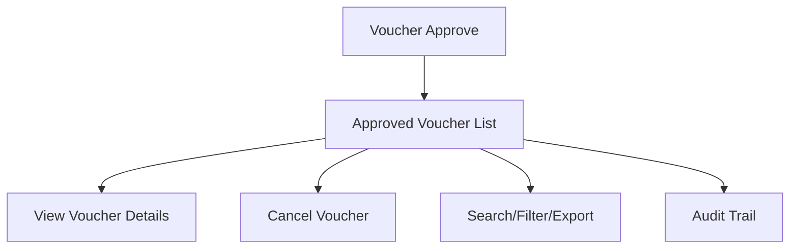

# Voucher Approve

The **Voucher Approve** section in Acharya ERP displays a list of all verified (approved) payment vouchers. Users can review voucher details and have the option to cancel any approved voucher if required.

---

## Key Features

- **Approved Voucher Listing:** View all verified (approved) payment vouchers with details such as amount, vendor/payee, school, creator, date, remarks, and status.
- **View Voucher Details:** Click to view full details of each approved voucher, including attachments and transaction information.
- **Cancel Voucher:** Cancel an approved voucher if necessary, with confirmation and remarks.
- **Search, Filter, and Export:** Search, filter, and export the list of approved vouchers for reporting or analysis.
- **Audit Trail:** Track who approved, cancelled, or updated each voucher.

---

## Architecture Diagram

---

## Functional Flow

1. **View Approved Voucher List:**  
   See all verified payment vouchers with columns for amount, vendor/payee, school, creator, date, remarks, and cancel option.

2. **View Voucher Details:**  
   Click on a voucher to view all details, including attachments and transaction information.

3. **Cancel Voucher:**  
   Use the cancel option to void an approved voucher, providing remarks and confirmation.

4. **Search, Filter, and Export:**  
   Use search and filter tools to locate specific vouchers. Export the list for reporting.

5. **Audit Trail:**  
   Track all actions (approval, cancellation, updates) for compliance and transparency.

---

## Field Specifications

| Field         | Description                                  |
|---------------|----------------------------------------------|
| Approve       | Approval status (Verified)                   |
| Attachment    | View attached document                       |
| Amount        | Voucher amount                               |
| Vendor/Payee  | Vendor or payee name                         |
| School        | School/Institute name                        |
| Created By    | User who created the voucher                 |
| Created Date  | Date of voucher creation                     |
| Remarks       | Remarks or description                       |
| Cancel        | Option to cancel the voucher                 |

---

## Usage

- **View:** Review all approved payment vouchers and their details.
- **Cancel:** Cancel an approved voucher if required, with confirmation and remarks.
- **Search/Export:** Use search, filter, and export features for efficient management and reporting.

---
