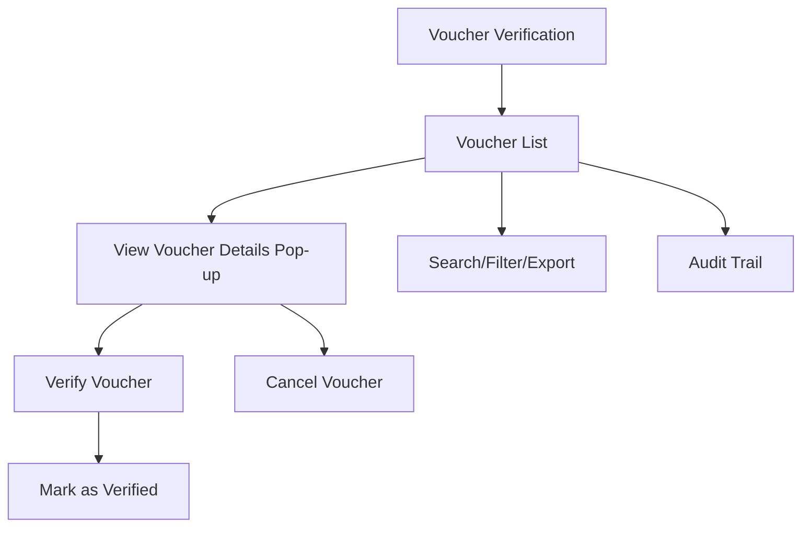

# Voucher Verification

The **Voucher Verification** section in Acharya ERP displays a list of all payment vouchers that have been created and are pending verification. Users can view, approve (verify), or cancel payment vouchers directly from this section.

---

## Key Features

- **Voucher Listing:** View all created payment vouchers with details such as amount, payee, school, creator, date, remarks, and status.
- **View Voucher Details:** Click on any voucher to open a pop-up with full voucher details, including debit/credit entries, narration, and attachments.
- **Verify Voucher:** Approve (verify) a payment voucher by clicking the "Verify" button in the details pop-up. Verified vouchers are marked as "Verified" in the list.
- **Cancel Voucher:** Cancel a payment voucher if it is not required.
- **Search, Filter, and Export:** Search, filter, and export the voucher list for reporting or analysis.
- **Audit Trail:** Track who verified, cancelled, or updated each voucher.

---

## Architecture Diagram

---

## Functional Flow

1. **View Voucher List:**  
   See all payment vouchers with columns for verification status, attachment, amount, payee, school, creator, date, remarks, and cancel option.

2. **View Voucher Details:**  
   Click on a voucher to open a pop-up showing all details, including voucher number, date, particulars, debit/credit amounts, narration, and attachments.

3. **Verify Voucher:**  
   In the pop-up, click the "Verify" button to approve the voucher. The voucher will be marked as "Verified" in the list.

4. **Cancel Voucher:**  
   Use the cancel option to void a voucher before it is verified.

5. **Search, Filter, and Export:**  
   Use search and filter tools to locate specific vouchers. Export the list for reporting.

6. **Audit Trail:**  
   Track all actions (verification, cancellation, updates) for compliance and transparency.

---

## Field Specifications

| Field         | Description                                  |
|---------------|----------------------------------------------|
| Verify        | Verification status (Verified/Pending)        |
| Attachment    | View attached document                       |
| Amount        | Voucher amount                               |
| Pay To        | Payee name                                   |
| School        | School/Institute name                        |
| Created By    | User who created the voucher                 |
| Created Date  | Date of voucher creation                     |
| Remarks       | Remarks or description                       |
| Cancel        | Option to cancel the voucher                 |

**Voucher Details Pop-up:**

| Field         | Description                                  |
|---------------|----------------------------------------------|
| Voucher No    | Unique voucher number                        |
| FC Year       | Financial year                               |
| Date          | Voucher date                                 |
| Particulars   | Debit/Credit entries                         |
| Debit (Rs)    | Debit amount                                 |
| Credit (Rs)   | Credit amount                                |
| Narration     | Transaction narration                        |
| Attachment    | Supporting document (if any)                 |
| Verify Button | Button to approve/verify the voucher         |

---

## Usage

- **View:** Review all payment vouchers and their statuses.
- **Verify:** Click on a voucher, review details, and click "Verify" to approve. Verified vouchers are marked accordingly.
- **Cancel:** Cancel vouchers if not required before verification.
- **Search/Export:** Use search, filter, and export features for efficient management and reporting.

---
