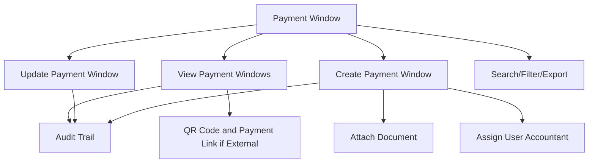

# Payment Window

The **Payment Window** section in Acharya ERP allows users to manage all payment window configurations for fee collection. Users can view the list of existing payment windows, filter and search through them, and create or update payment windows as required.

---

## Key Features

- **Payment Window Listing:** View all payment windows with details such as school, type, fee heads, date range, amount, status, remarks, QR code, payment link, and assigned user.
- **Create Payment Window:** Add a new payment window by specifying required details like school, type, fee heads, date range, amount, remarks, status, external status, and assign responsible user(s).
- **Assign User:** Assign one or more employees (e.g., accountants) responsible for payment collection for each window.
- **Auto-generated QR Code & Payment Link:** If "External Status" is selected, the system generates a QR code and payment link for each payment window, enabling external users to make payments easily.
- **Edit/Update Payment Window:** Update existing payment window details as needed.
- **Search and Filter:** Search and filter payment windows by school, type, date, status, user, and other criteria.
- **Export:** Export the list of payment windows for reporting or analysis.
- **Attachment Upload:** Attach supporting documents (PDF, less than 2MB) to a payment window if required.
- **Audit Trail:** Track creation, updates, and status changes for each payment window.

---

## Architecture Diagram

---

## Functional Flow

1. **View Payment Windows:**  
   View all existing payment windows with their details, status, assigned user(s), and (if external) QR code and payment link.

2. **Create Payment Window:**  
   Click "Create", fill in the required fields (school, type, fee heads, date range, amount, remarks, status, etc.), assign the responsible user(s), select "External Status" if needed, and optionally upload a PDF document. Save to add the new window. If "External Status" is selected, a QR code and payment link are auto-generated.

3. **Edit/Update Payment Window:**  
   Select a payment window from the list and update its details as needed.

4. **Search, Filter, and Export:**  
   Use the search and filter tools to quickly find specific payment windows. Export the list for reporting.

5. **Audit Trail:**  
   Track all actions (creation, update, status changes) for compliance and transparency.

---

## Field Specifications

| Field           | Description                                  |
|-----------------|----------------------------------------------|
| School          | School/Institute for which window is created |
| Type            | Payment window type (e.g., BULK, INDIVIDUAL) |
| From Date       | Start date of the payment window             |
| To Date         | End date of the payment window               |
| Fee Heads       | Applicable fee heads for this window         |
| Amount          | Amount to be paid                            |
| Remarks         | Additional notes or description              |
| Fixed           | Is the amount fixed (Yes/No)                 |
| External Status | Indicates if window is for external use      |
| QR Code         | Auto-generated QR code for payment (if external) |
| Link            | Auto-generated payment link (if external)    |
| User            | Employee(s) responsible for payment collection (e.g., accountant) |
| Attachment      | Supporting PDF document (less than 2MB)      |
| Status/Active   | Indicates if the window is active            |
| Created By      | User who created the window                  |
| Created Date    | Date of creation                             |
| Update          | Edit window details                          |

---

## Usage

- **View:** Review all payment windows and their statuses. For external payment windows, use the QR code or payment link for payment collection.
- **Create:** Click "Create", fill in all required fields, assign responsible user(s), select "External Status" if needed, and save to add a new payment window.
- **Edit:** Update existing payment window details as necessary.
- **Search/Export:** Use search, filter, and export features for efficient management and reporting.

---
