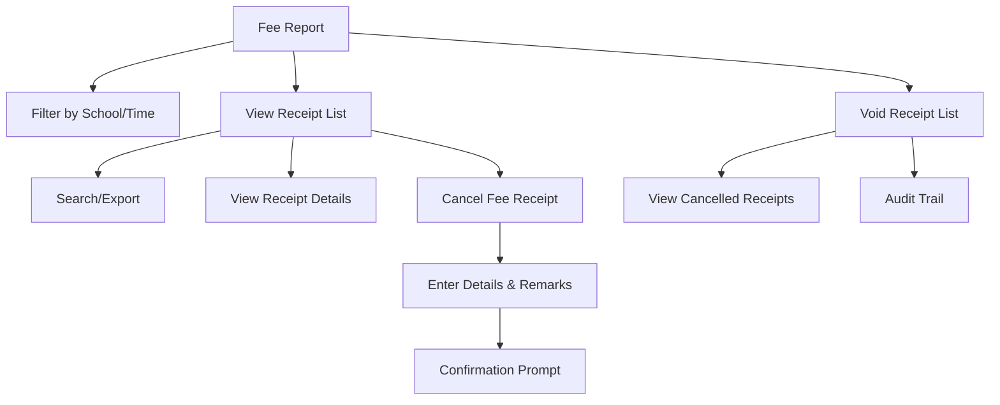

# Reciept Report

The **Receipt Report** section in Acharya ERP provides a comprehensive overview of all student fee receipts and cancellations. It allows users to view, filter, and export fee receipt data, as well as manage and track cancelled (void) receipts for audit and compliance.

---

## Key Features

- **Fee Receipt Listing:** View all generated fee receipts with details such as type, receipt number, date, AUID, student name, payment mode, and amount.
- **Filtering:** Filter receipts by school and by time period (Today, 1 Week, 1 Month, 6 Months, Custom Date).
- **Search and Export:** Search for specific receipts and export the list for reporting or analysis.
- **Cancel/Void Fee Receipt:** Cancel a fee receipt by entering the required details and remarks, with confirmation before finalizing the cancellation.
- **Void Receipt Listing:** View all cancelled (void) fee receipts with details and cancellation remarks.
- **Audit Trail:** Track who created, cancelled, or updated each receipt.

---

## Architecture Diagram

---

## Functional Flow

1. **View Fee Receipts:**  
   - Select the school and time filter to view relevant fee receipts.
   - See receipt details such as type, receipt number, date, AUID, student name, payment mode (Cash, DD, Online), bank, transaction reference, and amount.

2. **Search and Export:**  
   - Use the search bar to find specific receipts.
   - Export the filtered list for reporting.

3. **Cancel Fee Receipt:**  
   - Search and select the receipt to be cancelled using filters (financial year, school, receipt number).
   - Review the receipt's details, including student info, fee heads, amounts, and payment mode.
   - Enter the mandatory cancellation remarks and confirm the action in the prompt to void the receipt.

4. **Void Receipt List:**  
   - All cancelled receipts are listed with details such as type, receipt number, date, student info, paid amount, cancellation remarks, cancelled date, and cancelled by.

---

## Field Specifications

### Fee Receipt List

| Field           | Description                              |
|-----------------|------------------------------------------|
| Type            | Receipt type (e.g., GEN, Hostel)         |
| School          | School/Institute name                    |
| Receipt No      | Unique receipt number                    |
| Date            | Date of receipt generation               |
| AUID            | Student's unique ID                      |
| Name            | Student's name                           |
| Cash            | Amount received in cash                  |
| DD              | Amount received by DD                    |
| Online          | Amount received online/RTGS              |
| Bank            | Bank name (if applicable)                |
| Transaction Ref | Transaction reference number             |
| Trn Date        | Transaction date                         |
| Print           | Option to print the receipt              |

### Cancel Fee Receipt

| Field           | Description                              |
|-----------------|------------------------------------------|
| Financial Year  | Academic/financial year                  |
| School          | School/Institute name                    |
| Receipt No      | Receipt number to be cancelled           |
| AUID            | Student's unique ID                      |
| Name            | Student's name                           |
| DOA             | Date of admission                        |
| Template        | Fee template                             |
| Heads           | Fee heads/components                     |
| Sem             | Semester                                 |
| Total           | Total fee amount                         |
| Remarks         | Reason for cancellation (mandatory)      |

### Void Receipt List

| Field             | Description                              |
|-------------------|------------------------------------------|
| Type              | Receipt type                             |
| Receipt No        | Cancelled receipt number                 |
| Date              | Original receipt date                    |
| AUID              | Student's unique ID                      |
| Name              | Student's name                           |
| Paid              | Amount paid                              |
| Transaction Date  | Date of original transaction             |
| Cancelled Remarks | Reason for cancellation                  |
| Cancelled Date    | Date of cancellation                     |
| Cancelled By      | User who cancelled the receipt           |

---

## Usage

- **View Receipts:** Use filters to view and analyze all fee receipts for a school or time period.
- **Export Data:** Export the filtered list for reporting or compliance.
- **Cancel/Void Receipt:** Cancel a receipt by entering the required details and confirming the action. Cancelled receipts appear in the Void Receipt List for tracking and audit.