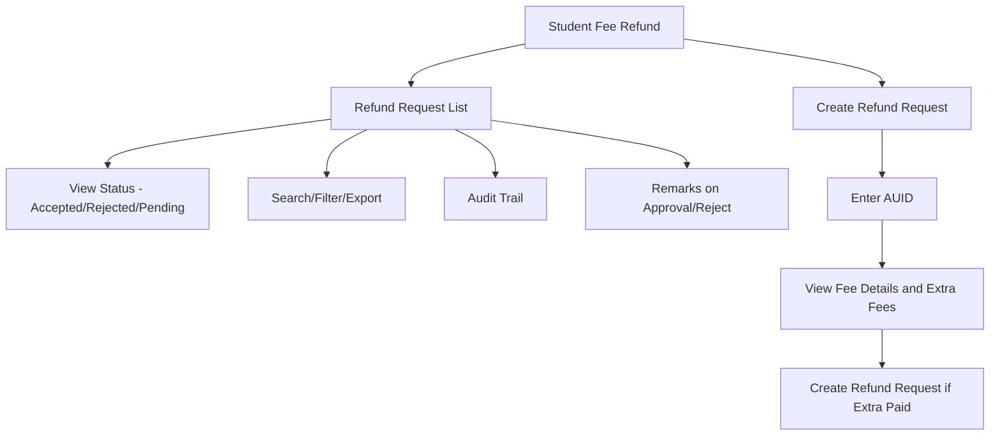

# Student Fee Refund

The **Student Fee Refund** section in Acharya ERP allows users to manage and process student fee refund requests. Users can view the list of all refund requests, check their status (accepted, rejected, or pending), and create new refund requests for students who have paid excess fees.

---

## Key Features

- **Refund Request Listing:** View all student fee refund requests with details such as AUID, student name, school, voucher head, amount, receipt number, created by, created date, and status (Accepted, Rejected, Pending).
- **Create Refund Request:** Click the "Create" button, enter the student's AUID, and view all fee details, including any extra fees paid to the institute. If extra fees are found, a refund request can be created.
- **Status Tracking:** Track the status of each refund request (Accepted, Rejected, Pending).
- **Remarks:** Enter remarks when approving or rejecting a refund request.
- **Search, Filter, and Export:** Search and filter refund requests by AUID, student name, school, status, or date. Export the list for reporting or analysis.
- **Audit Trail:** Track who created, approved, or rejected each refund request and when.

---

## Architecture Diagram

---

## Functional Flow

1. **View Refund Request List:**  
   See all refund requests with columns for AUID, student name, school, voucher head, amount, receipt number, created by, created date, and status.

2. **Create Refund Request:**  
   - Click "Create" and enter the student's AUID.
   - The system displays the student's fee details and highlights any extra fees paid.
   - If extra fees are found, fill in the required details and submit the refund request.

3. **Status Tracking:**  
   - Each refund request shows its current status: Pending, Accepted, or Rejected.
   - Approvers can enter remarks when accepting or rejecting a request.

4. **Search, Filter, and Export:**  
   - Use search and filter tools to locate specific refund requests.
   - Export the list for reporting or compliance.

5. **Audit Trail:**  
   - Track all actions (creation, approval, rejection) for transparency and compliance.

---

## Field Specifications

| Field         | Description                                  |
|---------------|----------------------------------------------|
| Status        | Status of the refund request (Accepted/Rejected/Pending) |
| AUID          | Student's unique ID                          |
| Name          | Student's name                               |
| Receipt No    | Fee receipt number                           |
| Amount        | Refund amount                                |
| School        | School/Institute name                        |
| Voucher Head  | Fee head for which refund is requested       |
| Created By    | User who created the refund request          |
| Created Date  | Date of refund request creation              |
| Remarks       | Remarks entered during approval/rejection    |

---

## Usage

- **View:** Review all refund requests and their statuses.
- **Create:** Click "Create", enter the AUID, and submit a refund request if extra fees are found.
- **Approve/Reject:** Approvers can accept or reject requests and enter remarks.
- **Search/Export:** Use search, filter, and export features for efficient management and reporting.

---
