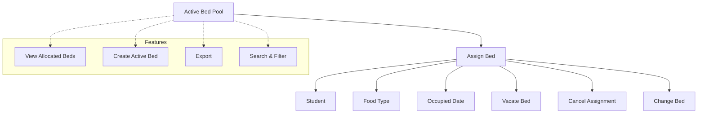

# Bed Assignment

The **Bed Assignment** module in Acharya ERP provides a centralized interface for managing hostel bed allocations. It allows administrators to view, assign, update, and manage student bed assignments efficiently, including food preferences and occupancy details.

---

## Key Features

- **View Allocated Beds:** See all currently assigned beds, with student and bed details.
- **Create Active Bed:** Add new active beds for allocation.
- **Assign Bed:** Allocate a specific bed to a student, capturing AUID, expected joining date, and remarks.
- **Assign Food Type:** Set or update the food preference (Veg/Non-Veg) for each student.
- **Change Reporting/Occupied Date:** Update the date when a student is expected to or has actually occupied the bed.
- **Vacate Bed:** Mark a bed as vacated, recording comments and vacate date.
- **Cancel Assignment:** Cancel a bed assignment, with remarks and optional document upload.
- **Change Bed:** Move a student from one bed to another, maintaining assignment and fee template history.

---

## Architecture Diagram

---

This module ensures a seamless workflow for hostel administrators, from initial bed creation to assignment, updates, and eventual vacating or cancellation, with all actions tracked and auditable.

---

## Functional Flow

1. **View Allocated Beds:**  
   Access the list of all active bed assignments, filter by academic year, school, or block, or occupancy type and review student and bed details.

2. **Create Active Bed:**  
   Add a new bed to the active pool by specifying academic year, block, floor, and fee template.

3. **Assign Bed:**  
   Select an available bed and assign it to a student by entering AUID, expected date of joining, and remarks.

4. **Assign Food Type:**  
   Update the food type for a student (Veg/Non-Veg) via the food type dialog.

5. **Change Reporting/Occupied Date:**  
   Edit the reporting/occupied date for a student's bed assignment.

6. **Vacate Bed:**  
   Mark a bed as vacated by entering comments and the vacate date.

7. **Cancel Assignment:**  
   Cancel a bed assignment, providing student and warden remarks and uploading a supporting PDF if required.

8. **Change Bed:**  
   Move a student to a different bed, selecting the new fee template, room, and bed.

---

## Field Specifications

| Field                    | Type   | Required | Description                             |
| ------------------------ | ------ | -------- | --------------------------------------- |
| Academic Year            | Select | Yes      | Academic year for the bed assignment    |
| Block Name               | Select | Yes      | Hostel block                            |
| Hostel Floor             | Select | Yes      | Floor within the block                  |
| Fee Template             | Select | Yes      | Fee template applied to the bed         |
| AUID                     | Text   | Yes      | Student's unique ID                     |
| Expected Date of Joining | Date   | Yes      | Expected date of joining for assignment |
| Reporting/Occupied Date  | Date   | Yes      | Actual date of occupancy                |
| Food Type                | Select | Yes      | Veg / Non-Veg                           |
| Remarks                  | Text   | No       | Additional comments                     |
| Vacate Date              | Date   | Yes      | Date when bed is vacated                |
| Cancel Remarks           | Text   | No       | Reason for cancellation                 |
| PDF Attachment           | File   | No       | Supporting document for cancellation    |

---
