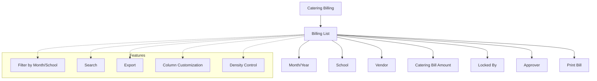

# Catering Billing

The **Catering Billing** section in Acharya ERP provides a consolidated view of all catering bills generated for various schools and departments. Users can view detailed billing information, filter bills by month and school, and print individual bills for record-keeping or audit purposes.

---

## Key Features

- **View Catering Bills:** See a list of all catering bills with details such as month/year, school, vendor, catering bill amount, locked by, approver, and print option.
- **Filter & Search:** Filter bills by month/year and school for focused review. Use search to quickly locate specific bills.
- **Print Bill:** Print or download individual catering bills for documentation or audit.
- **Column Customization & Density:** Adjust visible columns and table density for better readability.
- **Export:** Export billing data for reporting or reconciliation.

---

## Architecture Diagram

- The main view displays a list of all catering bills with key details.
- Users can filter and search bills by month/year and school.
- Each bill can be printed for documentation.
- Features such as export, column customization, and density control are available for efficient management.

---

## Functional Flow

1. **View Catering Bills:**  
   Access the list of all catering bills, with fields such as month/year, school, vendor, bill amount, locked by, approver, and print option.

2. **Filter & Search:**  
   Use filters and search to narrow down the list by month/year or school.

3. **Print Bill:**  
   Click the print icon to generate a printable version of the catering bill.

4. **Export & Customize View:**  
   Export billing data as needed. Adjust columns and table density for better readability.

---

## Field Specifications

| Field         | Description                        |
| ------------- | ---------------------------------- |
| Month/Year    | Billing period (month and year)    |
| School        | Name of the school/institute       |
| Vendor        | Name of the catering vendor        |
| Catering Bill | Amount of the catering bill        |
| Locked By     | User who locked/finalized the bill |
| Approver      | User who approved the bill         |
| Print         | Option to print/download the bill  |
