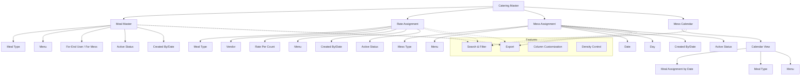

# Catering Master

The **Catering Master** section in Acharya ERP provides a centralized platform for managing all aspects of institutional catering, including meal menu creation, rate assignment, mess menu scheduling, and a graphical mess calendar. This module ensures efficient planning, assignment, and tracking of meals for both institute and hostel mess operations.

---

## Key Features

- **Meal Master:** View and manage the list of meal menus for end users (institute) or mess. Add new meal menus specifying meal type, menu items, and applicability (for institute or mess).
- **Rate Assignment:** Assign and view rates for each meal type. Link meal types to vendors, set rates per count, and manage rate history.
- **Mess Assignment:** Assign meal menus to specific dates for the mess. Track which menu is scheduled for each day, with details on meal type, menu, date, day, creator, and status.
- **Mess Calendar:** Visualize assigned mess meals in a calendar view, allowing users to see the meal schedule for each day, week, or month.

---

## Architecture Diagram

- **Meal Master:** Manage meal types and menus for institute or mess, with status and creator tracking.
- **Rate Assignment:** Assign rates to meal types, link to vendors, and manage rate history.
- **Mess Assignment:** Schedule meal menus for specific dates and track assignment details.
- **Mess Calendar:** Visualize all mess meal assignments in a calendar format for easy planning and review.
- **Features:** Search, filter, export, column customization, and density control are available across all sections.

---

## Functional Flow

1. **Manage Meal Master:**  
   Add or update meal menus for institute or mess, specifying meal type, menu, and applicability.

2. **Assign Meal Rates:**  
   Assign or update rates for each meal type, linking to vendors and setting rate per count.

3. **Assign Mess Menu:**  
   Schedule meal menus for specific dates in the mess, recording all relevant details.

4. **View Mess Calendar:**  
   Use the calendar view to see all assigned meals for the mess by day, week, or month.

5. **Search, Filter, and Export:**  
   Use advanced tools to quickly find, filter, and export catering data as needed.

---

## Field Specifications

### Meal Master

| Field        | Description                                 |
| ------------ | ------------------------------------------- |
| Meal Type    | Name/type of the meal (e.g., Lunch, Snacks) |
| For End User | Yes/No (applicable for institute)           |
| For Mess     | Yes/No (applicable for mess)                |
| Menu         | List of menu items                          |
| Created By   | User who created the entry                  |
| Created Date | Date of creation                            |
| Update       | Edit meal menu details                      |
| Active       | Indicates if the meal menu is active        |

### Rate Assignment

| Field          | Description                     |
| -------------- | ------------------------------- |
| Meal Type      | Name/type of the meal           |
| Vendor Name    | Name of the vendor              |
| Rate Per Count | Rate assigned per meal          |
| Menu           | Menu items covered by the rate  |
| Created By     | User who assigned the rate      |
| Created Date   | Date of rate assignment         |
| Update         | Edit rate assignment            |
| Active         | Indicates if the rate is active |

### Mess Assignment

| Field        | Description                             |
| ------------ | --------------------------------------- |
| Mess Type    | Type of meal assigned (e.g., Breakfast) |
| Menu         | Menu items assigned                     |
| Date         | Date of meal assignment                 |
| Day          | Day of the week                         |
| Created By   | User who assigned the meal              |
| Created Date | Date of assignment                      |
| Update       | Edit mess assignment                    |
| Active       | Indicates if the assignment is active   |

### Mess Calendar

| Field     | Description           |
| --------- | --------------------- |
| Date      | Date of the meal      |
| Meal Type | Type of meal assigned |
| Menu      | Menu items assigned   |
