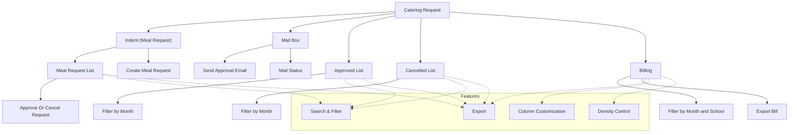

# Catering Request

The **Catering Request** section in Acharya ERP enables users to request catering services for events or departmental needs. This module supports the full workflow from meal request (indent) to approval, notification, and billing, ensuring efficient and transparent management of catering operations.

---

## Key Features

- **Indent (Meal Request):** Users can request meals by specifying meal type, date, time, event, delivery place, and quantity. View the list of all meal requests with their status.
- **Approval & Cancellation:** Administrators can approve or cancel meal requests, adding remarks as needed.
- **Mail Box:** Admins can send email notifications to users, informing them of approval and expected meal delivery time.
- **Approved List:** View all approved meal requests, filterable by month, with details such as meal type, count, date, time, event, and status.
- **Cancelled List:** View all cancelled meal requests, filterable by month, with cancellation reasons and status.
- **Billing:** View and export billing details for catering services, filterable by month and school, including rate, quantity, total, and feedback.
- **Search, Filter, and Export:** Use advanced tools to search, filter, and export catering request data for reporting or analysis.
- **Column Customization & Density:** Adjust visible columns and table density for better readability.

---

## Architecture Diagram

- **Indent:** Users create meal requests, which are listed for admin review. Admins can approve or cancel requests.
- **Mail Box:** Admins notify users of approval and delivery details via email.
- **Approved/Cancelled Lists:** Track all approved and cancelled meal requests, filterable by month.
- **Billing:** View and export billing details by month and school.
- **Features:** Search, filter, export, column customization, and density control are available for efficient management.

---

## Functional Flow

1. **Create Meal Request (Indent):**

   - User submits a meal request specifying meal type, date, time, event, delivery place, and quantity.
   - The request appears in the meal request list with status "Pending."

2. **Approve or Cancel Request:**

   - Admin reviews requests, approves or cancels them, and adds remarks as needed.
   - Approved requests move to the approved list; cancelled requests to the cancelled list.

3. **Mail Box Notification:**

   - Admin sends an email to the requester upon approval, including meal details and delivery time.

4. **View Approved/Cancelled Lists:**

   - Filter and review all approved or cancelled meal requests by month.

5. **Billing:**

   - View and export billing details for catering services, filterable by month and school.

6. **Search, Filter, and Export:**
   - Use search and filter tools to quickly find specific requests or bills. Export data as needed.

---

## Field Specifications

| Field            | Description                                 |
| ---------------- | ------------------------------------------- |
| Meal Type        | Type of meal requested (e.g., Coffee/Tea)   |
| Meal Count       | Number of meals requested                   |
| Meal Date        | Date of the meal                            |
| Meal Time        | Time of the meal                            |
| Delivery Place   | Location for meal delivery                  |
| Event            | Event or purpose for the meal               |
| Vendor Name      | Name of the catering vendor                 |
| Indents By       | User who requested the meal                 |
| School           | School/department requesting the meal       |
| Dept             | Department name                             |
| Indents Date     | Date the request was made                   |
| Status           | Request status (Pending/Approved/Cancelled) |
| Approved Date    | Date of approval                            |
| Approved By      | Admin who approved the request              |
| Cancelled Date   | Date of cancellation                        |
| Cancelled By     | Admin who cancelled the request             |
| Cancelled Reason | Reason for cancellation                     |
| Email Status     | Status of email notification                |
| Rate             | Rate per meal                               |
| Total            | Total amount for the request                |
| Feedback         | User feedback on the meal                   |
