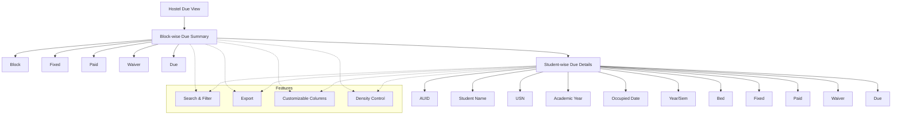

# Hostel Due View

The **Hostel Due View** module in Acharya ERP provides a consolidated view of hostel fee dues, allowing administrators to monitor outstanding amounts at both block and student levels. It supports sorting, filtering, and drill-down from block-wise summaries to individual student details.

---

## Key Features

- **Block-wise Due Summary:** View total fixed, paid, waiver, and due amounts for each hostel block.
- **Student-wise Due Details:** Click on a block to see a detailed list of students with their respective dues.
- **Search & Filter:** Quickly locate blocks or students using search and filter tools.
- **Export:** Export due data for reporting or reconciliation.
- **Customizable Columns & Density:** Adjust visible columns and table density for better readability.

---

## Architecture Diagram

- The main view starts with a **Block-wise Due Summary** showing fixed, paid, waiver, and due amounts for each block.
- Clicking a block drills down to **Student-wise Due Details** for that block, displaying all relevant student and fee fields.
- Features such as search, filter, export, customizable columns, and density control are available at both summary and detail levels.

---

## Functional Flow

1. **View Block-wise Dues:**  
   The main screen displays a summary table with each block's total fixed, paid, waiver, and due amounts.
2. **Drill Down to Student Details:**  
   Click on any block row to open a detailed view listing all students in that block, along with their AUID, name, USN, academic year, occupied date, year/semester, bed, fixed, paid, waiver, and due amounts.
3. **Search, Filter, and Export:**  
   Use the search bar and filters to refine results. Export data as needed for further analysis.

---

## Field Specifications

### Block-wise View

| Field  | Description                                |
| ------ | ------------------------------------------ |
| Block  | Name of the hostel block                   |
| Fixed  | Total fixed fee amount for the block       |
| Paid   | Total amount paid by students in the block |
| Waiver | Total waiver amount granted                |
| Due    | Total outstanding due amount               |

### Student-wise View

| Field         | Description                            |
| ------------- | -------------------------------------- |
| AUID          | Student's unique ID                    |
| Student       | Student's name                         |
| USN           | University Serial Number               |
| AcYear        | Academic year                          |
| Occupied Date | Date when the student occupied the bed |
| Year/Sem      | Student's year and semester            |
| Bed           | Assigned bed code                      |
| Fixed         | Fixed fee amount for the student       |
| Paid          | Amount paid by the student             |
| Waiver        | Waiver amount granted to the student   |
| Due           | Outstanding due amount for the student |
