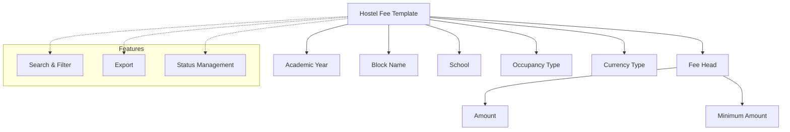

# Hostel Fee Template

The **Hostel Fee Template** module in Acharya ERP enables the configuration and management of hostel fee structures for different academic years, blocks, occupancy types, and schools. It supports detailed fee breakdowns, currency selection, and flexible template management for efficient hostel fee administration.

---

## Key Features

- Define hostel fee templates for various combinations of academic year, block, occupancy type, and school.
- Add multiple fee heads (e.g., Hostel Accommodation, Mess Charges, Laundry Fee) with specific amounts and minimum amounts.
- Support for multiple currencies (INR, USD).
- Manage, update, and activate/deactivate templates as needed.

---

## Architecture Diagram

### Architecture Explanation

The diagram above shows the structure of the Hostel Fee Template module:

- **Hostel Fee Template** is the central entity, linked to Academic Year, Block Name, School, Occupancy Type, and Currency Type.
- Each template contains one or more **Fee Heads**, each with its own Amount and Minimum Amount.
- **Features** such as Search & Filter, Export, and Status Management are available for efficient administration and reporting.

---

## Functional Flow

### Creating a Hostel Fee Template

1. Navigate to **Hostel Fee Template > Create**.
2. Select the **Academic Year**, **Block Name**, **School**, **Occupancy Type**, and **Currency Type**.
3. Add one or more **Fee Heads** with their respective **Amount** and **Minimum Amount**.
4. Click **Submit** to save the template.

---

## Field Specifications

| Field          | Type   | Required | Description                                      |
| -------------- | ------ | -------- | ------------------------------------------------ |
| Academic Year  | Select | Yes      | Academic year for which the template applies     |
| Block Name     | Select | Yes      | Hostel block associated with the template        |
| School         | Select | Yes      | School(s) to which the template applies          |
| Occupancy Type | Select | Yes      | Room occupancy type (Single/Double/Triple/Quad)  |
| Currency Type  | Radio  | Yes      | INR or USD                                       |
| Fee Head       | Select | Yes      | Type of fee (e.g., Accommodation, Mess, Laundry) |
| Amount         | Number | Yes      | Fee amount for the selected head                 |
| Minimum Amount | Number | Yes      | Minimum payable amount for the fee head          |
