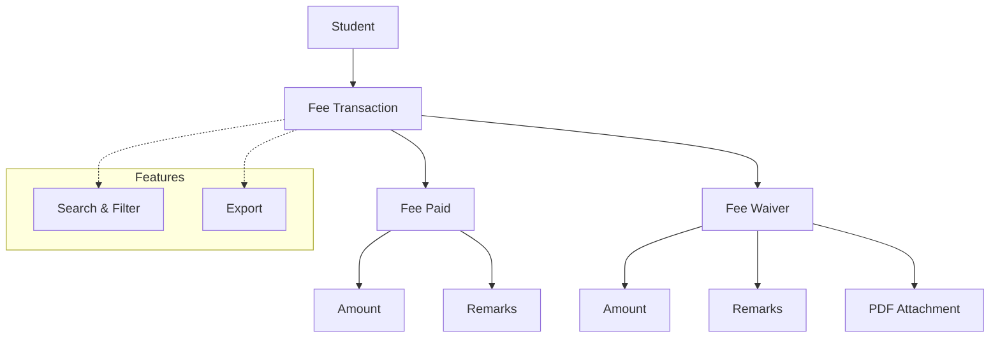

# Hostel Fee Update

The **Hostel Fee Update** module in Acharya ERP allows administrators to view and manage hostel fee transactions for students. Users can review all fee payments and waivers, as well as submit new fee payments or process fee waivers directly from this section.

---

## Key Features

- **View Fee Transactions:** See a list of all hostel fee payments and waivers for each student.
- **Submit New Fee:** Record new fee payments for students, specifying amount and remarks.
- **Waive Fee:** Process and record fee waivers for students, including amount, remarks, and supporting documents.
- **Search & Filter:** Quickly locate student fee records using search and filter tools.
- **Export:** Export fee transaction data for reporting or reconciliation.

---

## Architecture Diagram

### Architecture Explanation

The diagram above shows the structure of the Hostel Fee Update module:

- **Student** is linked to multiple **Fee Transactions**.
- Each **Fee Transaction** can be either a **Fee Paid** or a **Fee Waiver**.
- Both transaction types record the amount and remarks; waivers can also include a PDF attachment.
- **Features** such as Search & Filter and Export are available for efficient management and reporting.

---

## Functional Flow

1. **View Fee Records:**  
   Access the list of students with their fee payment and waiver history. Use filters to narrow down by academic year, student, or block.

2. **Submit New Fee:**

   - Select the student and academic year.
   - Choose "Fee Paid" as the pay type.
   - Enter the amount and remarks.
   - Optionally, upload supporting documents.
   - Submit to record the payment.

3. **Waive Fee:**
   - Select the student and academic year.
   - Choose "Waiver" as the pay type.
   - Enter the waiver amount and remarks.
   - Optionally, upload a PDF as supporting evidence.
   - Submit to process the waiver.

---

## Field Specifications

| Field          | Type   | Required | Description                                |
| -------------- | ------ | -------- | ------------------------------------------ |
| Pay Type       | Radio  | Yes      | Select "Fee Paid" or "Waiver"              |
| Academic Year  | Select | Yes      | Academic year for the transaction          |
| AUID           | Text   | Yes      | Student's unique ID                        |
| Total Amount   | Number | Yes      | Amount paid or waived                      |
| Remarks        | Text   | No       | Additional comments or reason for waiver   |
| PDF Attachment | File   | No       | Supporting document for waiver (if needed) |

---
